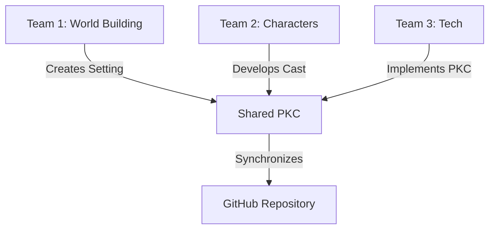

# The Great Convergence: A BBS Hackathon Journey

## Prologue: The Call to Adventure

It was the dawn of the BBS Hackathon 2025, and thirty bright minds gathered with a singular purpose: to weave together a story that would transcend individual contributions and become something greater than the sum of its parts. The challenge? To create "The Prologue of Spacetime" using the PKC Toolchain, where every word, every line of code, and every decision would be tracked, versioned, and woven into a cohesive narrative.

## Chapter 1: Divergence - The Chaos of Creation (Day 1)

### The Digital Campfire
As the hackathon commenced, the room buzzed with energy. Teams formed naturally, each drawn to different aspects of the story. Some focused on world-building, others on character development, while a few dove deep into the technical implementation of the PKC system.



### The First Conflict
By midday, a challenge emerged. Multiple versions of the story began to diverge. The PKC system showed its first true test as conflicting changes needed resolution. The teams realized they needed a better system to manage their collaborative workflow.

## Chapter 2: Convergence - The Race Against Time (Day 2)

### The Midnight Realization
As the clock struck midnight, a hush fell over the room. The realization dawned: they weren't just competing for prizes—they were racing against time to unify their stories. The GitHub repository became their battleground, with pull requests flying like messages in a bottle across the digital sea.

### The Great Compilation
Teams gathered around screens, their faces illuminated by the blue glow of code editors. The PKC system showed its true power as it tracked every contribution, ensuring no idea was lost. The challenge wasn't just technical—it was about finding the soul of their collective story.

## Chapter 3: Demonstration - The Story Comes Alive (Final Day)

### The Final Sprint
As the presentation time approached, the teams transformed from coders to storytellers. They rehearsed their parts, each team member ready to share their chapter of the journey. The PKC system had done its job—every contribution was accounted for, every credit properly attributed.

### The Grand Finale
The final presentation wasn't just a demonstration of technology; it was a performance. Thirty voices rose together, each telling their part of the story:

1. **The Technologists** showed how the PKC system enabled seamless collaboration
2. **The Writers** shared how the story evolved through collective imagination
3. **The Designers** demonstrated the visual journey of their digital creation
4. **The Coordinators** explained how they managed the chaos of collaboration

## Epilogue: Beyond the Hackathon

As the event concluded, something remarkable happened. The students didn't just walk away with prizes—they left with something more valuable: a living, breathing learning community. The PKC system they built wasn't just for the hackathon; it became the foundation for ongoing collaboration.

### The Ripple Effect
- **Continuous Learning**: Weekly PKC meetups were scheduled
- **Knowledge Sharing**: A mentorship program emerged between participants
- **Future Projects**: Teams formed to tackle real-world problems using their new skills

## Technical Implementation

### PKC Workflow
```yaml
workflow:
  - name: Story Contribution
    steps:
      - fork: Create personal story branch
      - edit: Make changes using PKC web interface
      - commit: Save with descriptive messages
      - pr: Create pull request for review
      - review: Team discussion and feedback
      - merge: Integrate into main story

  - name: Version Control
    tools:
      - GitHub: For code and document versioning
      - MinIO: For asset storage and versioning
      - Overlay VPN: For secure team collaboration
```

### Key Learnings
1. **Collaboration Over Competition**: The true power emerged when teams worked together
2. **Version Control is Life**: Proper Git workflow saved countless hours
3. **Document Everything**: Clear documentation made complex systems manageable
4. **The Human Element**: Technology enabled, but people made it happen

## The Story Continues...

This isn't the end—it's just the beginning. The BBS Hackathon 2025 showed us that when technology meets human creativity, and when competition gives way to collaboration, amazing things can happen. The PKC system continues to grow, the learning community thrives, and the story of "The Prologue of Spacetime" evolves with each new contributor.

As the participants left the venue, they knew they weren't just part of a hackathon—they had become part of something much larger. The convergence had begun.

---
*Document compiled using PKC Toolchain and BMAD method on 2025-09-29*