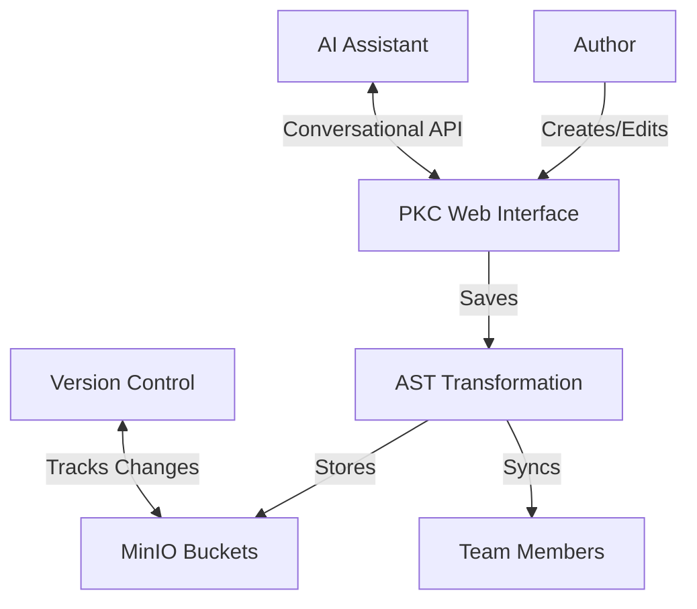

# BBS Hackathon: Prologue of Spacetime

## Executive Summary

This document outlines our approach to the BBS Hackathon challenge, where we'll create an interactive storytelling experience using the PKC (Personal Knowledge Container) Toolchain. Our project, "Prologue of Spacetime," will demonstrate how conversational programming techniques, combined with the BMAD method and SpecKit, can transform document processing into an engaging, collaborative experience.

## 1. Project Vision

### 1.1 Core Objective
To create an interactive, version-controlled storytelling platform where:
- Stories are represented as structured data (YAML/JSON AST)
- Content is editable through a unified PKC web interface
- Changes are tracked and synchronized across distributed teams
- AI-assisted content generation and refinement is seamlessly integrated

### 1.2 Key Innovations
1. **Unified Interface**: All authoring and collaboration happens within the PKC web interface
2. **Structured Content**: Stories are stored as Abstract Syntax Trees (ASTs) for maximum flexibility
3. **Version Control**: Every change is tracked as a data asset in MinIO buckets
4. **Team Collaboration**: Secure sharing through Overlay VPN with fine-grained access control
5. **AI Integration**: Conversational programming interfaces for content creation and refinement

## 2. Technical Architecture

### 2.1 System Components

#### 2.1.1 Frontend Layer
- **PKC Web Interface**: Single-page application for story authoring and collaboration
- **AST Visual Editor**: Interactive editor for the document's abstract syntax tree
- **Conversational Interface**: AI-powered chat interface for content generation and refinement

#### 2.1.2 Backend Services
- **PKC Core**: Manages document storage and versioning
- **AST Processing Engine**: Handles transformations between formats
- **AI Integration Layer**: Interfaces with language models for content generation

#### 2.1.3 Storage Layer
- **MinIO Buckets**: Versioned storage for story assets
- **Distributed File System**: For collaborative editing and synchronization
- **Metadata Store**: Tracks relationships between story versions and assets

### 2.2 Data Flow



## 3. Implementation Plan

### 3.1 Phase 1: Foundation (Week 1)
1. **Setup Development Environment**
   - Deploy PKC Toolchain
   - Configure MinIO buckets
   - Set up Overlay VPN

2. **Core Functionality**
   - Implement basic AST structure for stories
   - Create web interface for story editing
   - Set up version control integration

### 3.2 Phase 2: Enhancement (Week 2)
1. **AI Integration**
   - Add conversational programming interface
   - Implement content generation features
   - Add style and tone adjustment tools

2. **Collaboration Features**
   - Real-time collaboration
   - Comment and review system
   - Access control and permissions

### 3.3 Phase 3: Polish & Launch (Week 3)
1. **User Experience**
   - Refine interface based on feedback
   - Add tutorials and documentation
   - Performance optimization

2. **Deployment**
   - Set up production environment
   - Migrate data
   - Conduct user testing

## 4. Technical Specifications

### 4.1 AST Structure
```yaml
story:
  metadata:
    title: "Prologue of Spacetime"
    authors: []
    version: "1.0.0"
    created: "2025-09-29T13:30:00+08:00"
    modified: "2025-09-29T13:30:00+08:00"
  
  scenes:
    - id: scene_1
      title: "The Beginning"
      content: "Once upon a time..."
      metadata:
        characters: []
        location: ""
        time: ""
      
    - id: scene_2
      title: "The Discovery"
      content: "And then they found..."
      metadata:
        characters: []
        location: ""
        time: ""
```

### 4.2 API Endpoints

| Endpoint | Method | Description |
|----------|--------|-------------|
| `/api/v1/stories` | GET | List all stories |
| `/api/v1/stories` | POST | Create new story |
| `/api/v1/stories/{id}` | GET | Get story details |
| `/api/v1/stories/{id}` | PUT | Update story |
| `/api/v1/stories/{id}/versions` | GET | List versions |
| `/api/v1/ai/generate` | POST | Generate content |

## 5. Success Metrics

1. **User Engagement**
   - Number of active users
   - Average session duration
   - Content creation rate

2. **System Performance**
   - API response time
   - Sync latency
   - Error rates

3. **Content Quality**
   - User satisfaction scores
   - Content reuse rate
   - Collaboration metrics

## 6. Future Roadmap

### 6.1 Short-term (Next 3 months)
- Add support for multimedia content
- Implement advanced AI features
- Enhance collaboration tools

### 6.2 Medium-term (3-6 months)
- Mobile app development
- Offline support
- Plugin system for extensions

### 6.3 Long-term (6-12 months)
- Advanced analytics dashboard
- Integration with other tools
- Community features

## 7. Conclusion

The "Prologue of Spacetime" project represents an innovative approach to collaborative storytelling, powered by the PKC Toolchain and enhanced with conversational programming techniques. By treating stories as structured, versioned data assets, we enable new forms of creative expression and collaboration.

This implementation aligns with Prof. Ben's vision of a unified, AI-assisted authoring environment where content creation becomes more accessible, collaborative, and powerful.

---
*Document generated using the BMAD method and SpecKit tools on 2025-09-29*