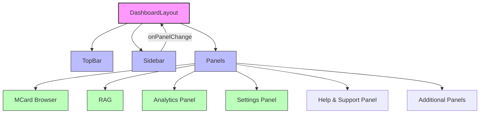

# PKC Components Documentation

## Overview

The PKC is built using a modular component architecture that promotes reusability, maintainability, and separation of concerns. This document outlines the structure and responsibilities of each component in the PKC.

## Component Architecture

## Component Breakdown

### 1. DashboardLayout (`DashboardLayout.tsx`)

The root component that orchestrates the layout structure. It manages the overall page structure and state management for the dashboard.

**Key Responsibilities:**
- Manages the responsive layout (mobile/desktop)
- Controls the sidebar's open/close state
- Handles panel switching logic
- Provides context to child components

**Props:**
- `title`: Title of the dashboard (default: "PKC Dashboard")

### 2. TopBar (`TopBar.tsx`)

The fixed header component that remains visible at all times.

**Key Features:**
- Displays the application title
- Contains user profile/authentication controls
- Mobile menu toggle button
- Responsive design for all screen sizes

**Props:**
- `title`: Application title
- `children`: Optional children components (e.g., menu toggle button)

### 3. Sidebar (`Sidebar.tsx`)

The navigation sidebar that allows users to switch between different panels.

**Key Features:**
- Collapsible for mobile view
- Highlights the active panel
- Smooth transitions and animations
- Responsive design

**Props:**
- `activePanel`: Currently active panel
- `onPanelChange`: Callback when a panel is selected
- `className`: Additional CSS classes

### 4. Panels (`Panels.tsx`)

Container component that renders the currently active panel based on user selection.

**Key Features:**
- Manages panel switching
- Loads panel components
- Handles panel-specific layouts

### 5. Panel Components

#### MCard Browser

#### RAG

#### Analytics Panel

#### Settings Panel

#### Help & Support Panel

#### Additional Panels