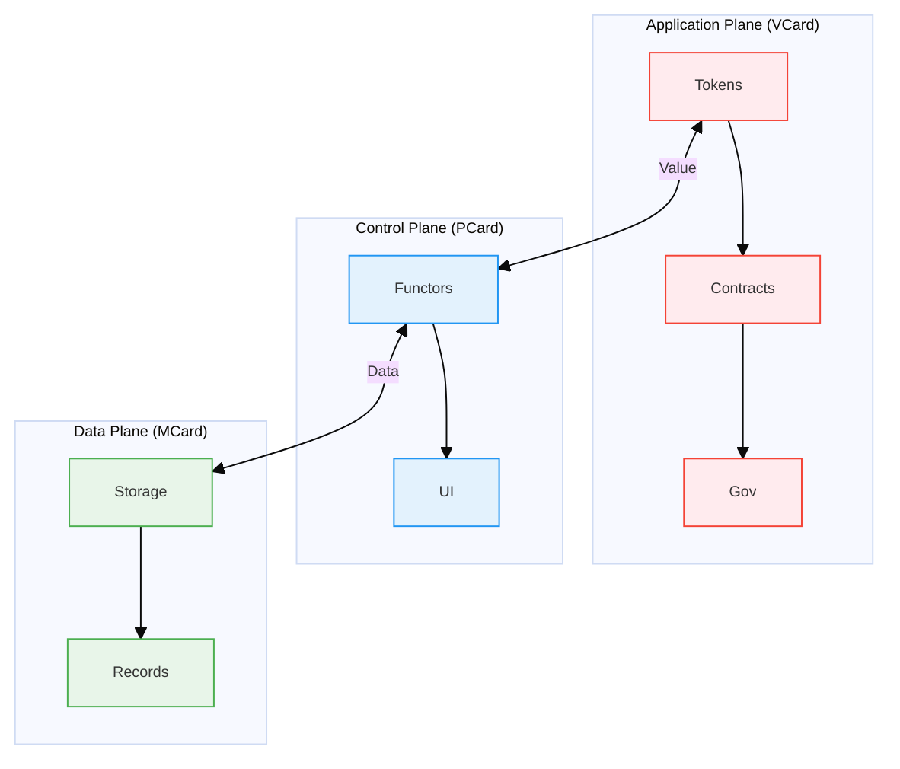

# MVP Cards: The Triadic Foundation of PKC Architecture

The MVP Cards framework introduces a formal system that elevates the [[Personal Knowledge Container]] (PKC) as a software product into a scale-free [[Progressive Knowledge Container]] operating system, establishing a unified framework where data gains both social and physical meaning through computational trinitarianism. This triadic architecture implements a rigorous mathematical structure based on polynomial functors and content-addressable storage, creating three complementary card types that form a complete computational ecosystem for knowledge representation, manipulation, and exchange across personal, social, and physical dimensions.

## Overview: The Three-Plane Architecture

Inspired by [[Software-Defined Networking]] ([[SDN]]) principles in [[operating system]] literature, the PKC architecture organizes computational capabilities into three distinct but interconnected planes, each addressing different aspects of meaning and representation:

| Plane | Component | Core Function | Meaning Dimension | Mathematical Foundation |
|-------|-----------|---------------|-------------------|------------------------|
| **Data Plane** | [[MCard]] | Atomic knowledge storage | **Physically Meaningful**: Grounded in concrete, verifiable data with cryptographic integrity | Linear Polynomial Functors |
| **Control Plane** | [[PCard]] | Recursive composition | **Mediating Meaning**: Transforms between physical and social meaning through composition | Recursive Polynomial Functors |
| **Application Plane** | [[VCard]] | Value representation | **Socially Meaningful**: Embeds cultural, economic, and contextual value systems | Modularized Value Systems |

This triadic structure creates a complete computational stack where:
- **MCard** provides the immutable, content-addressable foundation
- **PCard** enables compositional knowledge transformation
- **VCard** facilitates value exchange and economic coordination

## 1. MCard: The Atomic Knowledge Foundation

**MCard** ([[Monadology|Monadic]] Card) serves as the fundamental, atomic, and immutable knowledge unit that forms the backbone of the entire PKC system. It implements the **Data Plane** of the architecture.

### 1.1 Core Structure and Properties

Each MCard encapsulates three primary attributes:

```typescript
interface MCard {
  content: Blob;          // SQLite BLOB type, dynamically interpreted as string or binary media data
  content_hash: string;   // Cryptographic hash (SHA-256) for identity
  g_time: string;        // Global timestamp for versioning
}
```

### 1.2 Mathematical Foundation: Linear Polynomial Functors

MCard represents the **linear case** of polynomial functors, functioning as a list of triplets that form the base case for all knowledge representation in PKC. This linear structure enables:

- **Content-Addressable Identity**: Each MCard is uniquely identified by its cryptographic hash, creating a **physically meaningful** reference system
- **Immutable Storage**: Content cannot be altered without generating a new hash, ensuring **temporal consistency** of physical meaning
- **Atomic Compositionality**: MCards serve as indivisible building blocks that maintain their **semantic integrity** across compositions
- **Cryptographic Verification**: Tamper-proof integrity through hash validation, establishing **trust in physical representation**

### 1.3 Key Capabilities

1. **Conflict-Free Replicated Data Types (CRDTs)**
   - Implements state-based [[CRDT]] (G-Set) for eventual consistency
   - Enables offline-first scenarios with automatic conflict resolution
   - Supports distributed knowledge management without coordination

2. **Vector Representation**
   - Stores content as high-dimensional vectors for semantic similarity
   - Enables machine learning operations through vector algebra
   - Supports semantic zooming and efficient knowledge retrieval

3. **Formal Properties**
   - **Order-Preservation**: Global immutable timeline through `g_time`
   - **Composability**: Deterministic composition through cryptographic hashes
   - **Measurability**: Quantitative similarity measures via vector operations
   - **Irreducibility**: Smallest indivisible unit of knowledge

### 1.4 Role in the Cubical Logic Model (CLM)

MCard serves as the storage substrate for [[Cubical Logic Model]]'s three-dimensional representation:
- Each [[Cubical Logic Model]] ([[CLM]]) dimension ([[Abstract Specification]], [[Concrete Implementation]], [[Balanced Expectations]]) is stored as a separate MCard
- CLM-typed manifest MCards synthesize complete function views by storing hash references
- Execution history is captured as immutable MCard events in a Merkle DAG structure

## 2. PCard: The Recursive Composition Engine

**[[PCard]] (Polynomial Functor Card)** implements the **Control Plane** of the PKC architecture, composing and representing computable functions exclusively through **MCard hash values** to ensure complete information integrity and prevent contamination. PCard constructs dependency graphs as polynomial functors, where **each function component is referenced only by its cryptographic hash rather than direct content access**. This hash-based composition provides recursive, compositional capabilities for knowledge transformation and user interaction in the format of [[representable functors]], a.k.a. [[Polynomial Functors]]. Since all functional programming types can be represented in terms of **[[Sum Types]]** and **[[Product Types]]**, this framework provides a **sound and complete approach** to represent functions of any kind. Using this polynomial functor representation with hash-based references, we can conduct comprehensive testing and manage proofs and execution histories with MCard's immutable storage system while maintaining strict information isolation.

### 2.1 Core Architecture: Recursive Polynomial Functors

PCard extends MCard's linear structure with recursive polynomial functors, enabling the representation of complex hierarchical data:

```typescript
interface PCard extends MCard { // Inherited all properties and data manipulation functionalities from MCard
  // PCard-specific properties
  polynomial_structure: PolynomialFunctor;
  ui_components: WebComponent[];
  transformation_rules: TransformationRule[];
}
```

### 2.2 Mathematical Foundation: Polynomial Functors

PCard models computation as polynomial functors that mediate between physical and social meaning:

$$F(X) = \sum _{i} A_i × X^{B_i}$$

Where each term represents a **meaning transformation pathway**:
- $A_i$: **Social grounding** in terms of whether the $X$ participates with this $i$th terms
- $B_i$: **Input Domain** the possible input types for this $i$th term
- $X$: The **meaning space** the function $X$ under investigation

Where:
- $X$ represents the "function" being tested and studied, and the category of types and transformations
- $A_i$ encodes possible output types for each computational branch
- $B_i$ captures input structure and dependencies
- Each term represents a distinct computational pathway

### 2.3 Key Capabilities

1. **Recursive Layout Representation**
   - UI layouts as polynomial functor trees that **preserve physical meaning** while enabling **social interpretation**
   - Hierarchical organization with lattice properties that maintain **semantic consistency** across scales
   - Support for joins, meets, and morphisms that respect **cultural and contextual boundaries**

2. **Cubical Logic Model Integration**
   - **Language-Agnostic Version Control**: Store CLM data to precisely version control functions across multiple languages (HTML, JavaScript, CSS, Python, etc.) with their complete behavioral context
   - **Behavioral Annotation**: Maintain comprehensive test suites and execution records that document function behavior over time
   - **Knowledge Preservation**: Create a living knowledge base where each function is accompanied by its test cases, usage examples, and performance characteristics
   - **Cross-Language Interoperability**: Enable seamless function sharing and reuse between different programming environments while preserving semantic meaning
   - **Conversational Programming**: Support real-time feedback and interactive exploration of function behavior through natural language interfaces

3. **Compositional Transformation**
   - Function composition as polynomial multiplication
   - Sum types as polynomial addition
   - Derivatives for symbolic analysis

### 2.4 MCard-PCard Duality

PCard and MCard form a powerful complementary relationship:

- **MCard**: Linear data structures, backend processing, immutable storage
- **PCard**: Recursive structures, interactive presentation, dynamic rendering
- **Unified Data Flow**: Seamless transformation between linear and recursive representations
- **Performance Optimization**: MCard handles computation, PCard manages UI

## 3. VCard: The Value Exchange Layer

**[[VCard]] (Value-Carrying Card)** implements the **[[Application Plane]]**, introducing explicit value representation and economic coordination within the PKC ecosystem.

### 3.1 Core Structure: Modular Value Systems

```typescript
interface VCard extends PCard {
  // Value-specific properties
  valueType: 'token' | 'right' | 'access' | 'reputation' | 'custom';
  owner: string;        // Current owner's cryptographic identity
  transferable: boolean; // Transfer permissions
  
  // Value determination
  valueFunction?: string; // Dynamic value calculation
  metadata?: {
    supply?: number;      // For fungible tokens
    decimals?: number;    // Precision for decimal values
    properties?: Record<string, any>; // Custom properties
  };
  
  // Transfer rules and history
  transferRules?: TransferRules;
  history: TransactionHistory[];
}
```

### 3.2 Value Production Modes

Inspired by [[Carliss Baldwin]]'s work on modularity, VCard embodies three fundamental modes that bridge physical and social meaning:

1. **Value Seeking**: Actively searching for and creating new sources of **socially recognized value** grounded in **physically verifiable data**
2. **Value Seeing**: Recognizing and validating potential value by **interpreting physical patterns** through **culturally specific lenses**  
3. **Value Delivery**: Facilitating the transfer and realization of value across **social networks** while maintaining **cryptographic proof** of physical origin

### 3.3 Economic Primitives

1. **Sovereign Value Exchange**
   - Transactions between independent data owners that respect **social contracts** while maintaining **physical audit trails**
   - Cryptographic proof of ownership that establishes **trust in physical reality**
   - Immutable transaction records that create **socially recognized history**

2. **Modular Value Composition**
   - Encapsulated functionality as value units
   - Standardized interfaces for value exchange
   - Compositional innovation through recombination

3. **Network Effects**
   - Value increases with network participation
   - Liquidity through ease of transfer
   - Metcalfe's Law applied to knowledge networks

## 4. Architectural Integration: Bridging Physical and Social Meaning

The MVP Cards framework creates a complete computational stack that bridges physical reality with social meaning through the integration of its three components:



### 4.1 Data Flow Architecture

The three-plane architecture enables sophisticated data flow patterns:

1. **Storage to Presentation (MCard → PCard)**
   - Linear data structures transformed into recursive UI components
   - Content-addressable references enable efficient lazy loading
   - Polynomial functor operations maintain mathematical consistency

2. **Presentation to Value (PCard → VCard)**
   - Interactive components generate value through user engagement
   - Computational capabilities packaged as tradable assets
   - UI interactions create measurable economic outcomes

3. **Value to Storage (VCard → MCard)**
   - Economic transactions generate new immutable records
   - Value exchanges create provenance trails
   - Market dynamics influence knowledge creation incentives

### 4.2 Cross-Plane Interactions

1. **Consistency Guarantees**
   - All three planes maintain referential integrity through content hashing
   - Changes propagate deterministically across the stack
   - Formal verification ensures correctness of transformations

2. **Performance Optimization**
   - MCard handles bulk data operations and complex computations
   - PCard manages responsive UI updates and user interactions
   - VCard coordinates economic incentives and resource allocation

3. **Scalability Properties**
   - Horizontal scaling through distributed MCard storage
   - Vertical scaling through PCard component composition
   - Economic scaling through VCard network effects

## 5. Implementation Patterns and Best Practices

### 5.1 MCard Implementation Patterns

1. **Content Design**
   ```typescript
   // Well-structured MCard content
   const mcardContent = {
     type: 'knowledge_unit',
     data: {
       concept: 'polynomial_functor',
       definition: '...',
       examples: [...],
       relationships: [hash1, hash2, hash3]
     },
     metadata: {
       domain: 'mathematics',
       complexity: 'intermediate',
       prerequisites: [prereq_hash1, prereq_hash2]
     }
   };
   ```

2. **Hash-Based Composition**
   - Use content hashes as stable references
   - Enable lazy loading of related content
   - Support efficient deduplication

### 5.2 PCard Implementation Patterns

1. **Recursive Component Design**
   ```typescript
   // PCard component with recursive structure
   interface KnowledgeExplorer extends PCard {
     content: {
       root_concept: string;
       children: KnowledgeExplorer[];
       visualization: VisualizationConfig;
     };
   }
   ```

2. **Polynomial Functor Operations**
   - Implement composition through functor multiplication
   - Use sum types for alternative representations
   - Apply derivatives for sensitivity analysis

### 5.3 VCard Implementation Patterns

1. **Value Type Design**
   ```typescript
   // Reputation-based VCard
   const reputationCard: VCard = {
     valueType: 'reputation',
     owner: user_public_key,
     content: {
       domain: 'machine_learning',
       score: 85,
       endorsements: [endorsement_hashes],
       contributions: [contribution_hashes]
     },
     transferRules: {
       conditions: 'peer_validation_required',
       fees: [{ type: 'percentage', amount: 0.05, recipient: 'network' }]
     }
   };
   ```

2. **Economic Mechanism Design**
   - Implement fair value distribution
   - Create incentive alignment
   - Support complex economic primitives

## 6. Use Cases and Applications

### 6.1 Knowledge Management Systems

- **MCard**: Store individual knowledge artifacts with provenance
- **PCard**: Create interactive knowledge exploration interfaces
- **VCard**: Implement reputation systems for knowledge contributors

### 6.2 Collaborative Research Platforms

- **MCard**: Version control for research artifacts and datasets
- **PCard**: Interactive visualization of research relationships
- **VCard**: Fair attribution and funding distribution mechanisms

### 6.3 Educational Technology

- **MCard**: Immutable learning content with adaptive metadata
- **PCard**: Personalized learning path visualization
- **VCard**: Skill certification and achievement tokens

### 6.4 Decentralized Autonomous Organizations

- **MCard**: Governance proposals and decision records
- **PCard**: Interactive voting and discussion interfaces
- **VCard**: Governance tokens and voting rights

## 7. Future Directions and Research Opportunities

### 7.1 Advanced Mathematical Foundations

1. **Higher-Order Functors**
   - Extend polynomial functors to higher categories
   - Implement dependent types for more expressive representations
   - Explore connections to homotopy type theory

2. **Quantum Computing Integration**
   - Adapt polynomial functors for quantum computation
   - Implement quantum-resistant cryptographic hashing
   - Explore quantum advantage in knowledge processing

### 7.2 AI and Machine Learning Integration

1. **Neural-Symbolic Integration**
   - Combine symbolic polynomial functors with neural networks
   - Implement differentiable programming over MCard structures
   - Create hybrid AI systems with formal guarantees

2. **Large Language Model Integration**
   - Use LLMs for automatic MCard content generation
   - Implement conversational interfaces for PCard interaction
   - Create AI-assisted value assessment for VCards

### 7.3 Scalability and Performance

1. **Distributed Systems**
   - Implement sharding strategies for large MCard collections
   - Create efficient consensus mechanisms for VCard transactions
   - Optimize PCard rendering for large-scale deployments

2. **Edge Computing**
   - Deploy PKC components on edge devices
   - Implement offline-first synchronization protocols
   - Create adaptive quality-of-service mechanisms

## Conclusion: A Universal Semiotic System for the Internet of Everything

The MVP Cards framework represents a **triadic organization of data types** that are **immutable, computable, and cryptographically distinguishable** for the broadest set of applications. This framework provides a **small, yet expressive vocabulary** that supports the functional divisions of **Software-Defined Networking**, which was designed to be highly data-driven and scale-free to support **Internet of Everything** infrastructures.

By presenting MVP Cards as a **user-friendly vocabulary**, we share with the world a **generic semiotic system** that engages users with **interactive and conversational components** while managing **behavioral accountability** with minimal barrier to entry. This creates a system that is **potentially highly intuitive, yet compositionally coherent**.

The triadic structure of MCard-PCard-VCard transcends traditional computational boundaries by providing:

- **Universal Data Representation**: Immutable, content-addressable storage that works across all media types and computational contexts
- **Compositional Expressiveness**: Polynomial functor-based transformations that maintain mathematical rigor while enabling intuitive interaction
- **Economic Coordination**: Value-carrying mechanisms that align individual contributions with collective intelligence

This comprehensive approach enables the creation of knowledge systems that seamlessly integrate human creativity with computational power, supporting everything from personal knowledge management to large-scale distributed systems. The MVP Cards framework serves as both a **theoretical foundation** and a **practical vocabulary** for building the next generation of knowledge-intensive applications.

As we advance toward an increasingly connected world, the need for systems that can bridge human understanding and machine computation becomes paramount. The MVP Cards framework provides this bridge, creating new possibilities for how we create, share, and value knowledge in the age of ubiquitous computing and artificial intelligence.

# References

## Core Concepts
- [[Agentic Trinitarianism]]
- [[Miner-Trader-Coder Triad]]
- [[Computational Trinitarianism]]
- [[Curry-Howard-Lambek Isomorphism]]

## Related Documents
```dataview 
Table title as Title, authors as Authors
where contains(subject, "MVP Cards") or 
      contains(subject, "PKC") or
      contains(subject, "MCard") or
      contains(subject, "PCard") or
      contains(subject, "VCard") or
      contains(subject, "Miner") or
      contains(subject, "Coder") or
      contains(subject, "Trader")
sort title, authors, modified
```

## Further Reading
- [[Computational Trinitarianism]] by Robert Harper
- [[Category Theory for Programmers]] by Bartosz Milewski
- [[Proofs and Types]] by Jean-Yves Girard
- [[The Little Typer]] by Daniel P. Friedman and David Thrane Christiansen