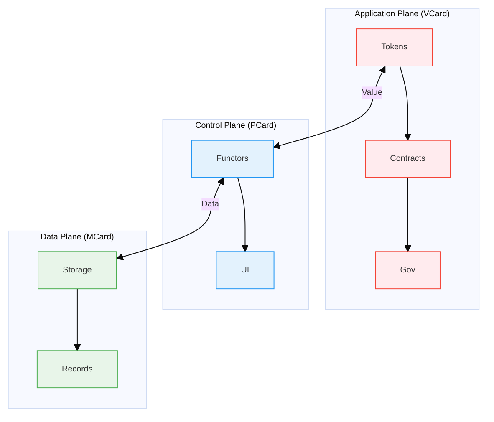

# MVP Cards: The Triadic Foundation of PKC Architecture

The MVP Cards framework introduces a formal system that elevates the [[Personal Knowledge Container]] (PKC) as a software product into a scale-free [[Progressive Knowledge Container]] operating system, establishing a unified framework where data gains both social and physical meaning through computational trinitarianism. This triadic architecture implements a rigorous mathematical structure based on polynomial functors and content-addressable storage, creating three complementary card types that form a complete computational ecosystem for knowledge representation, manipulation, and exchange across personal, social, and physical dimensions.

## Overview: The Three-Plane Architecture

Inspired by [[Software-Defined Networking]] ([[SDN]]) principles in [[operating system]] literature, the PKC architecture organizes computational capabilities into three distinct but interconnected planes, each addressing different aspects of meaning and representation:

| Plane | Component | Core Function | Meaning Dimension | Mathematical Foundation |
|-------|-----------|---------------|-------------------|------------------------|
| **Data Plane** | [[MCard]] | Atomic knowledge storage | **Physically Meaningful**: Grounded in concrete, verifiable data with cryptographic integrity | Linear Polynomial Functors |
| **Control Plane** | [[PCard]] | Recursive composition | **Mediating Meaning**: Transforms between physical and social meaning through composition | Recursive Polynomial Functors |
| **Application Plane** | [[VCard]] | Value representation | **Socially Meaningful**: Embeds cultural, economic, and contextual value systems | Modularized Value Systems |

This triadic structure creates a complete computational stack where:
- **MCard** provides the immutable, content-addressable foundation
- **PCard** enables compositional knowledge transformation
- **VCard** facilitates value exchange and economic coordination

## 1. MCard: The Atomic Knowledge Foundation and Data Substrate

**MCard** ([[Monadology|Monadic]] Card) serves as the fundamental, atomic, and immutable knowledge unit that forms the backbone of the entire PKC system. It implements the **Data Plane** of the architecture, providing the universal data substrate upon which all PKC operations are built.

### 1.1 Core Structure and Properties

Each MCard encapsulates three primary attributes:

```typescript
interface MCard {
  content: Blob;          // SQLite BLOB type, dynamically interpreted as string or binary media data
  content_hash: string;   // Cryptographic hash (SHA-256) for identity
  g_time: string;        // Global timestamp for versioning
}
```

### 1.2 Mathematical Foundation: Linear Polynomial Functors

MCard represents the **linear case** of polynomial functors, functioning as a list of triplets that form the base case for all knowledge representation in PKC. This linear structure enables:

- **Content-Addressable Identity**: Each MCard is uniquely identified by its cryptographic hash, creating a **physically meaningful** reference system
- **Immutable Storage**: Content cannot be altered without generating a new hash, ensuring **temporal consistency** of physical meaning
- **Atomic Compositionality**: MCards serve as indivisible building blocks that maintain their **semantic integrity** across compositions
- **Cryptographic Verification**: Tamper-proof integrity through hash validation, establishing **trust in physical representation**

### 1.3 Web Presentation and Performance Optimization

MCard content can be efficiently presented through the web using embedded database technologies:

- **Local-First Caching**: Embedded SQLite database instances store and index MCards locally for immediate access
- **Response Time Optimization**: Intelligent caching strategies prioritize frequently accessed MCards
- **Transportation Efficiency**: Differential synchronization minimizes data transfer across the network
- **Content Delivery Acceleration**: Edge caching of MCards based on access patterns and geographic distribution
- **Progressive Loading**: MCards load in priority order based on viewport visibility and user interaction patterns

```typescript
interface MCacheConfig {
  storage_quota: number;      // Maximum local storage size in MB
  cache_strategy: 'lru' | 'lfu' | 'ttl' | 'prioritized';
  prefetch_patterns: {
    on_page_load: boolean;    // Prefetch linked MCards on page load
    on_hover: boolean;        // Prefetch on UI element hover
    predictive: boolean;      // Use ML to predict next needed MCards
  };
  expiration_policy: {
    max_age_ms: number;       // Maximum cache age
    check_updates: boolean;   // Periodically check for updates
  };
}
```

### 1.4 Key Capabilities

1. **Conflict-Free Replicated Data Types (CRDTs)**
   - Implements state-based [[CRDT]] (G-Set) for eventual consistency
   - Enables offline-first scenarios with automatic conflict resolution
   - Supports distributed knowledge management without coordination

2. **Vector Representation**
   - Stores content as high-dimensional vectors for semantic similarity
   - Enables machine learning operations through vector algebra
   - Supports semantic zooming and efficient knowledge retrieval

3. **Formal Properties**
   - **Order-Preservation**: Global immutable timeline through `g_time`
   - **Composability**: Deterministic composition through cryptographic hashes
   - **Measurability**: Quantitative similarity measures via vector operations
   - **Irreducibility**: Smallest indivisible unit of knowledge
   - **Reproducibility**: Following Eelco Dolstra's purely functional deployment model ^[Dolstra, E. "The Purely Functional Software Deployment Model." PhD Thesis, Utrecht University, 2006.], MCard ensures:
     - **Deterministic Builds**: Content-addressable storage guarantees bit-for-bit reproducible knowledge structures
     - **Immutable Dependencies**: Hash-based references prevent dependency conflicts and version drift
     - **Atomic Operations**: Knowledge state changes are atomic and rollback-safe, similar to NixOS system configurations
     - **Functional Configuration**: Knowledge structures expressed as pure functions enable declarative specifications and compositional reasoning

### 1.5 Role in the Cubical Logic Model (CLM)

MCard serves as the storage substrate for [[Cubical Logic Model]]'s three-dimensional representation:
- Each [[Cubical Logic Model]] ([[CLM]]) dimension ([[Abstract Specification]], [[Concrete Implementation]], [[Balanced Expectations]]) is stored as a separate MCard
- CLM-typed manifest MCards synthesize complete function views by storing hash references
- Execution history is captured as immutable MCard events in a Merkle DAG structure

## 2. PCard: The Conversational Programming Engine

**PCard** ([[Polynomial]] Card) serves as the **Control Plane** that enables **Conversational Programming** with mathematical rigor. It systematically accumulates knowledge through formal validation, storing all content as hash-indexed MCard references to maintain immutability and cryptographic verification. Unlike traditional function composition systems, PCard creates an interactive testing environment similar to Conversational Programming or Vibe Coding, where users continuously explore and expand the behavior space of functions through incremental test case accumulation.

### 2.1 Core Architecture: Interactive Testing Through Polynomial Functors

PCard transforms function development from a one-time activity into an **ongoing conversation with the code**, where each interaction builds upon previous knowledge while maintaining mathematical rigor through polynomial functor structures. This conversational approach is powered by three mutually orthogonal components that work in concert:

1. **AbstractSpecification (Social Identity)**: Captures the human-readable description of function behavior, enabling rapid social understanding and design intent communication
2. **ConcreteImplementation (Physical Execution)**: The actual source code and execution runtime, represented as polynomial functors that can be dynamically explored and tested
3. **BalancedExpectations (Interactive Validation Repository)**: A hash-indexed content filtering and search mechanism that relates test cases and execution records to specific functions while allowing conversational exploration sessions to incrementally accumulate knowledge

```typescript
interface PCard extends MCard { 
  // Inherited all properties and data manipulation functionalities from MCard
  
  // Conversational Programming Features
  abstractSpecHash: string;           // Social identity: human-readable function description
  concreteImplHash: string;          // Physical execution: REPL-like interactive runtime
  balancedExpectationsHash: string;  // Interactive validation repository
  
  // Interactive Testing Structure
  validationRepository: {
    polynomial: {
      coefficients: string[];  // Test case MCard hashes (each test case is a coefficient)
      exponents: number[];     // Execution counts (how many times each test case ran)
    };
    testCaseAccumulator: string[];     // Growing collection of test case hashes
    executionAccumulator: string[];    // Complete execution history
    explorationInsights: string[];     // Pattern recognition and optimization insights
  };
  
  // Conversational Session Management
  lastValidationUpdate: string;       // Timestamp of last testing session
  explorationStrategies: string[];    // Available testing strategies
  collaborativeContributions: {       // Multi-user testing contributions
    contributors: string[];
    testCasesPerContributor: Map<string, string[]>;
    insightsPerContributor: Map<string, string[]>;
  };
}
```

### 2.2 Conversational Programming Foundation

PCard's polynomial functor structure powers an interactive testing environment where:

- **Interactive Exploration**: Users iteratively supply new test cases and input combinations to probe edge cases, boundary conditions, and performance characteristics
- **Continuous Knowledge Capture**: Each test case and input combination is stored as an immutable MCard, with the PCard maintaining references to this growing body of validation data
- **Structured Growth**: The polynomial's coefficients represent distinct test scenarios, while exponents capture variations in input values, creating a systematic way to organize and retrieve test cases
- **Persistent Context**: The PCard serves as a stable reference point that accumulates knowledge over time, enabling conversational continuity across testing sessions

This approach transforms testing from a one-time activity into an ongoing conversation with the code, annotated by a specific **PCard**. Each interaction builds upon previous knowledge while maintaining a clean separation between the function's interface (PCard) and its validation corpus (referenced MCards).

### 2.3 Systematic Knowledge Accumulation

The hash-based retrieval system ensures that all test data remains efficiently accessible and verifiable, even as the test suite grows in size and complexity through conversational exploration. The polynomial functor structure maintains **syntactic stability**, allowing new test cases and execution records to accumulate incrementally without requiring changes to the PCard's core structure or hash value.

This creates a comprehensive knowledge accumulation system where:

1. **Progressive Learning**: Each testing session builds upon previous knowledge, creating increasingly comprehensive understanding
2. **Collaborative Intelligence**: Multiple users contribute test cases and insights, creating collective wisdom about function behavior  
3. **Pattern Recognition**: The system identifies common patterns across test runs, enabling optimization and knowledge transfer
4. **Cross-Function Learning**: Insights gained from one function can be applied to similar functions through pattern matching
5. **Conversational Continuity**: Testing sessions maintain context across time, enabling long-term exploration strategies

### 2.4 Integration with Astro Islands Architecture

PCard seamlessly integrates with modern web development through Astro Islands:

- **Component Generation**: Each PCard can generate interactive Astro components for web interfaces
- **Selective Hydration**: Only components requiring interactivity are hydrated on the client
- **Hash-Based Composition**: PCards compose through cryptographic hash references, ensuring integrity
- **Performance Optimization**: Static generation with dynamic islands provides optimal loading performance

### 2.5 Key Capabilities for Conversational Programming

1. **Interactive Testing Manager**
   - Create and execute test cases through conversational interfaces
   - Real-time feedback on function behavior and performance
   - Adaptive testing strategies based on previous results

2. **Knowledge Accumulation System**
   - Systematic collection of test cases, execution records, and insights
   - Cross-session continuity for long-term exploration
   - Collaborative testing with multiple contributors

3. **Pattern Recognition Engine**
   - Automatic identification of testing patterns and optimization opportunities
   - Performance profiling and bottleneck detection
   - Failure analysis and edge case discovery

4. **Exploration Strategy Framework**
   - Boundary testing strategies for edge case discovery
   - Performance exploration for optimization insights
   - Adaptive strategies that evolve based on results

### 2.6 Mathematical Foundations of PCard's Polynomial Structure

PCard represents computational structures as polynomial functors of the form: $F(X) = Σ (A_i × X^{B_i})$, where $X$ represents a **category of types** (not individual values), and each term $A_i × X^{B_i}$ represents a computational pathway. Here:

- $X$ is a **functor signature** that is the hash value that represents the function or interest, or the **category** of all possible input/output type transformations
- $A_i$ encodes the possible output types for each computational branch
- $B_i$ captures the input structure (arity, type relationships, dependencies)
- The exponentiation $X^{B_i}$ represents the functor action on type structures

This is called a **functor** (not merely a function) because it operates on categories of types and preserves compositional structure. The three components of PCard (Abstract Specification, Concrete Implementation, and Balanced Expectations) provide multiple, independent views of the same computation, enabling cross-validation and operational interpretability. Unlike functions that map values to values, functors map:
- **Objects** (types) to objects (types)
- **Morphisms** (type transformations) to morphisms (type transformations)
- **Composition** (how types combine) to composition (how transformed types combine)

### 2.7 Hash-Based Validation Repository

The polynomial functor structure enables a hash-based retrieval system that creates an upgradeable validation repository where:

- **Test Case Association**: New test cases are dynamically associated with existing PCard instances through hash-based references
- **Execution Record Accumulation**: Each test execution creates an immutable MCard record linked to the PCard
- **Knowledge Reuse**: Similar functions can share and reuse validation data, maximizing learning efficiency
- **Instance Stability**: The PCard hash remains stable while its associated validation corpus grows over time

This approach prevents the proliferation of similar PCard instances while enabling continuous knowledge accumulation and systematic function exploration. The polynomial structure ensures this knowledge accumulation is both **syntactically stable** (the mathematical form remains consistent) and **semantically rich** (each term carries meaningful computational information).

### 2.8 Conversational Programming Components in Detail

PCard models computation as an interactive testing environment where each component supports conversational exploration and systematic knowledge accumulation. This structure enables users to engage in ongoing conversations with their code through incremental test case development.

#### 2.8.1 AbstractSpecification: Social Identity Layer

Represents the **conversational interface** of the function - the human-readable description that enables social understanding and collaborative development:

**Conversational Programming Features:**
- **Natural Language Interface**: Users can describe function behavior in plain language, making it accessible to non-technical stakeholders
- **Collaborative Documentation**: Multiple users can contribute to and refine the specification through conversational interaction
- **Intent Preservation**: The social meaning of the function is preserved across all testing and exploration sessions
- **Contextual Understanding**: Rich context about the function's purpose enables more effective testing strategies

**Interactive Testing Support:**
- **Goal-Driven Exploration**: Test cases are generated based on the stated goals and success criteria
- **Specification Evolution**: The specification can evolve based on insights gained through testing sessions
- **Social Validation**: The specification serves as a communication tool for validating understanding across team members

#### 2.8.2 ConcreteImplementation: Interactive Execution Layer

Represents the **executable reality** that can be dynamically explored through conversational testing sessions:

**Conversational Programming Features:**
- **REPL-like Interaction**: Users can interactively explore function behavior through immediate execution and feedback
- **Dynamic Testing Environment**: The implementation supports real-time testing with immediate results
- **Execution Memory**: All test executions are recorded, creating a growing knowledge base about function behavior

#### 2.8.3 BalancedExpectations: Test Validation Repository

Represents the **knowledge accumulation layer** that enables systematic exploration and validation of function behavior:

**Conversational Programming Features:**
- **Interactive Testing Manager**: Allows users to create and execute test cases through conversational interfaces
- **Adaptive Exploration Strategies**: Testing approaches evolve based on previous results and observed patterns
- **Knowledge Accumulation System**: Systematically collects test cases, execution records, and insights
- **Pattern Recognition Engine**: Automatically identifies testing patterns and optimization opportunities

## 3. VCard: The Value Exchange Layer

**[[VCard]] (Value-Carrying Card)** implements the **[[Application Plane]]**, introducing explicit value representation and economic coordination within the PKC ecosystem.

### 3.1 Core Structure: Modular Value Systems

```typescript
interface VCard extends PCard {
  // Value-specific properties
  valueType: 'token' | 'right' | 'access' | 'reputation' | 'custom';
  owner: string;        // Current owner's cryptographic identity
  transferable: boolean; // Transfer permissions
  
  // Value determination
  valueFunction?: string; // Dynamic value calculation
  metadata?: {
    supply?: number;      // For fungible tokens
    decimals?: number;    // Precision for decimal values
    properties?: Record<string, any>; // Custom properties
  };
  
  // Transfer rules and history
  transferRules?: TransferRules;
  history: TransactionHistory[];
}
```

### 3.2 Value Production Modes

Inspired by [[Carliss Baldwin]]'s work on modularity, VCard embodies three fundamental modes that bridge physical and social meaning:

1. **Value Seeking**: Actively searching for and creating new sources of **socially recognized value** grounded in **physically verifiable data**
2. **Value Seeing**: Recognizing and validating potential value by **interpreting physical patterns** through **culturally specific lenses**  
3. **Value Delivery**: Facilitating the transfer and realization of value across **social networks** while maintaining **cryptographic proof** of physical origin

### 3.3 Economic Primitives

1. **Sovereign Value Exchange**
   - Transactions between independent data owners that respect **social contracts** while maintaining **physical audit trails**
   - Cryptographic proof of ownership that establishes **trust in physical reality**
   - Immutable transaction records that create **socially recognized history**

2. **Modular Value Composition**
   - Encapsulated functionality as value units
   - Standardized interfaces for value exchange
   - Compositional innovation through recombination

3. **Network Effects**
   - Value increases with network participation
   - Liquidity through ease of transfer
   - Metcalfe's Law applied to knowledge networks

## 4. Architectural Integration: Bridging Physical and Social Meaning

The MVP Cards framework creates a complete computational stack that bridges physical reality with social meaning through the integration of its three components:



### 4.1 Data Flow Architecture

The three-plane architecture enables sophisticated data flow patterns:

1. **Storage to Presentation (MCard → PCard)**
   - Linear data structures transformed into recursive UI components
   - Content-addressable references enable efficient lazy loading
   - Polynomial functor operations maintain mathematical consistency

2. **Presentation to Value (PCard → VCard)**
   - Interactive components generate value through user engagement
   - Computational capabilities packaged as tradable assets
   - UI interactions create measurable economic outcomes

3. **Value to Storage (VCard → MCard)**
   - Economic transactions generate new immutable records
   - Value exchanges create provenance trails
   - Market dynamics influence knowledge creation incentives

### 4.2 Cross-Plane Interactions

1. **Consistency Guarantees**
   - All three planes maintain referential integrity through content hashing
   - Changes propagate deterministically across the stack
   - Formal verification ensures correctness of transformations

2. **Performance Optimization**
   - MCard handles bulk data operations and complex computations
   - PCard manages responsive UI updates and user interactions
   - VCard coordinates economic incentives and resource allocation

3. **Scalability Properties**
   - Horizontal scaling through distributed MCard storage
   - Vertical scaling through PCard component composition
   - Economic scaling through VCard network effects

## 5. Implementation Patterns and Best Practices

### 5.1 MCard Implementation Patterns

1. **Content Design**
   ```typescript
   // Well-structured MCard content
   const mcardContent = {
     type: 'knowledge_unit',
     data: {
       concept: 'polynomial_functor',
       definition: '...',
       examples: [...],
       relationships: [hash1, hash2, hash3]
     },
     metadata: {
       domain: 'mathematics',
       complexity: 'intermediate',
       prerequisites: [prereq_hash1, prereq_hash2]
     }
   };
   ```

2. **Hash-Based Composition**
   - Use content hashes as stable references
   - Enable lazy loading of related content
   - Support efficient deduplication

### 5.2 PCard Implementation Patterns

1. **Recursive Component Design**
   ```typescript
   // PCard component with recursive structure
   interface KnowledgeExplorer extends PCard {
     content: {
       root_concept: string;
       children: KnowledgeExplorer[];
       visualization: VisualizationConfig;
     };
   }
   ```

2. **Polynomial Functor Operations**
   - Implement composition through functor multiplication
   - Use sum types for alternative representations
   - Apply derivatives for sensitivity analysis

### 5.3 VCard Implementation Patterns

1. **Value Type Design**
   ```typescript
   // Reputation-based VCard
   const reputationCard: VCard = {
     valueType: 'reputation',
     owner: user_public_key,
     content: {
       domain: 'machine_learning',
       score: 85,
       endorsements: [endorsement_hashes],
       contributions: [contribution_hashes]
     },
     transferRules: {
       conditions: 'peer_validation_required',
       fees: [{ type: 'percentage', amount: 0.05, recipient: 'network' }]
     }
   };
   ```

2. **Economic Mechanism Design**
   - Implement fair value distribution
   - Create incentive alignment
   - Support complex economic primitives

## 6. Use Cases and Applications

### 6.1 Knowledge Management Systems

- **MCard**: Store individual knowledge artifacts with provenance
- **PCard**: Create interactive knowledge exploration interfaces
- **VCard**: Implement reputation systems for knowledge contributors

### 6.2 Collaborative Research Platforms

- **MCard**: Version control for research artifacts and datasets
- **PCard**: Interactive visualization of research relationships
- **VCard**: Fair attribution and funding distribution mechanisms

### 6.3 Educational Technology

- **MCard**: Immutable learning content with adaptive metadata
- **PCard**: Personalized learning path visualization
- **VCard**: Skill certification and achievement tokens

### 6.4 Decentralized Autonomous Organizations

- **MCard**: Governance proposals and decision records
- **PCard**: Interactive voting and discussion interfaces
- **VCard**: Governance tokens and voting rights

## 7. Future Directions and Research Opportunities

### 7.1 Advanced Mathematical Foundations

1. **Higher-Order Functors**
   - Extend polynomial functors to higher categories
   - Implement dependent types for more expressive representations
   - Explore connections to homotopy type theory

2. **Quantum Computing Integration**
   - Adapt polynomial functors for quantum computation
   - Implement quantum-resistant cryptographic hashing
   - Explore quantum advantage in knowledge processing

### 7.2 AI and Machine Learning Integration

1. **Neural-Symbolic Integration**
   - Combine symbolic polynomial functors with neural networks
   - Implement differentiable programming over MCard structures
   - Create hybrid AI systems with formal guarantees

2. **Large Language Model Integration**
   - Use LLMs for automatic MCard content generation
   - Implement conversational interfaces for PCard interaction
   - Create AI-assisted value assessment for VCards

### 7.3 Scalability and Performance

1. **Distributed Systems**
   - Implement sharding strategies for large MCard collections
   - Create efficient consensus mechanisms for VCard transactions
   - Optimize PCard rendering for large-scale deployments

2. **Edge Computing**
   - Deploy PKC components on edge devices
   - Implement offline-first synchronization protocols
   - Create adaptive quality-of-service mechanisms

## Conclusion: A Universal Semiotic System for the Internet of Everything

The MVP Cards framework represents a **triadic organization of data types** that are **immutable, computable, and cryptographically distinguishable** for the broadest set of applications. This framework provides a **small, yet expressive vocabulary** that supports the functional divisions of **Software-Defined Networking**, which was designed to be highly data-driven and scale-free to support **Internet of Everything** infrastructures.

By presenting MVP Cards as a **user-friendly vocabulary**, we share with the world a **generic semiotic system** that engages users with **interactive and conversational components** while managing **behavioral accountability** with minimal barrier to entry. This creates a system that is **potentially highly intuitive, yet compositionally coherent**.

The triadic structure of MCard-PCard-VCard transcends traditional computational boundaries by providing:

- **Universal Data Representation**: Immutable, content-addressable storage that works across all media types and computational contexts
- **Compositional Expressiveness**: Polynomial functor-based transformations that maintain mathematical rigor while enabling intuitive interaction
- **Economic Coordination**: Value-carrying mechanisms that align individual contributions with collective intelligence

This comprehensive approach enables the creation of knowledge systems that seamlessly integrate human creativity with computational power, supporting everything from personal knowledge management to large-scale distributed systems. The MVP Cards framework serves as both a **theoretical foundation** and a **practical vocabulary** for building the next generation of knowledge-intensive applications.

As we advance toward an increasingly connected world, the need for systems that can bridge human understanding and machine computation becomes paramount. The MVP Cards framework provides this bridge, creating new possibilities for how we create, share, and value knowledge in the age of ubiquitous computing and artificial intelligence.

# References

## Core Concepts
- [[Agentic Trinitarianism]]
- [[Miner-Trader-Coder Triad]]
- [[Computational Trinitarianism]]
- [[Curry-Howard-Lambek Isomorphism]]

## Related Documents
```dataview 
Table title as Title, authors as Authors
where contains(subject, "MVP Cards") or 
      contains(subject, "PKC") or
      contains(subject, "MCard") or
      contains(subject, "PCard") or
      contains(subject, "VCard") or
      contains(subject, "Miner") or
      contains(subject, "Coder") or
      contains(subject, "Trader")
sort title, authors, modified
```

## Further Reading
- [[Computational Trinitarianism]] by Robert Harper
- [[Category Theory for Programmers]] by Bartosz Milewski
- [[Proofs and Types]] by Jean-Yves Girard
- [[The Little Typer]] by Daniel P. Friedman and David Thrane Christiansen