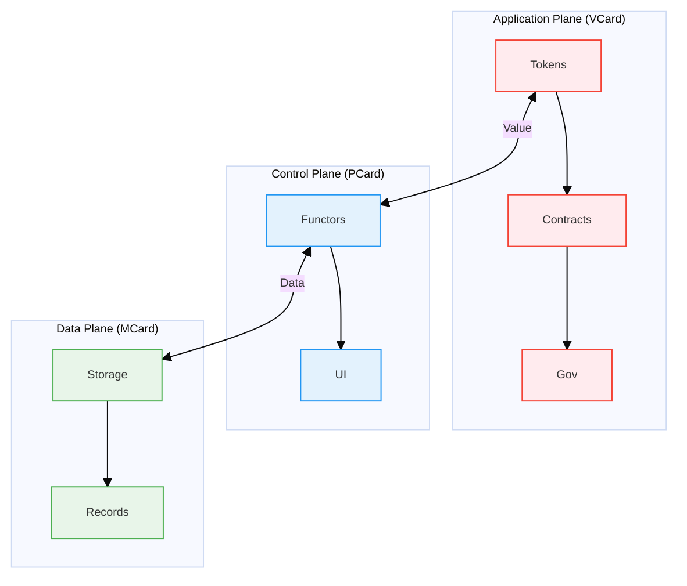

# MVP Cards: The Triadic Foundation of PKC Architecture

The MVP Cards framework introduces a formal system that elevates the [[Personal Knowledge Container]] (PKC) as a software product into a scale-free [[Progressive Knowledge Container]] operating system, establishing a unified framework where data gains both social and physical meaning through computational trinitarianism. This triadic architecture is designed as a **technology-agnostic guide** that is intentionally not bound to any particular technology, enabling it to accommodate any hardware and software technology solutions. By functioning as a **functionally pure operating system**, the MVP Cards framework can continuously evolve beyond any known lifecycle of specific technologies or products, ensuring long-term sustainability and adaptability.

The system implements a rigorous mathematical structure based on polynomial functors and content-addressable storage, creating three complementary card types that form a complete computational ecosystem for knowledge representation, manipulation, and exchange across personal, social, and physical dimensions.

## Overview: The Three-Plane Architecture

Inspired by [[Software-Defined Networking]] ([[SDN]]) principles in [[operating system]] literature, the PKC architecture organizes computational capabilities into three distinct but interconnected planes, each addressing different aspects of meaning and representation:

### Architectural Components and Meaning Dimensions

The PKC architecture establishes a clear separation of concerns across three planes, where each component serves a specific role in the knowledge representation ecosystem. This layered approach ensures that data, functionality, and value are properly encapsulated while maintaining well-defined interfaces between layers.

| Plane | Component | Core Function | Meaning Dimension |
|-------|-----------|---------------|-------------------|
| **Data Plane** | [[MCard]] | Atomic knowledge storage and unified data namespace | **Physically Meaningful**: Grounded in concrete, verifiable data with cryptographic integrity |
| **Control Plane** | [[PCard]] | Recursive composition and function identification | **Mediating Meaning**: Transforms between physical and social meaning through composition |
| **Application Plane** | [[VCard]] | Boundary enforcement for value exchange through arithmetic logic | **Socially Meaningful**: Embeds cultural, economic, and contextual value systems with mathematically-assessable security guarantees |

### Mathematical Foundation and Implementation Details

The MVP Card system is built on rigorous mathematical foundations that enable theoretical soundness and completeness. Each component implements specific polynomial structures and inheritance patterns that together create a comprehensive categorical framework for knowledge representation and manipulation.

| Plane | Mathematical Foundation | Polynomial Structure | Inheritance Structure | Global Identity |
|-------|------------------------|---------------------|----------------------|---------------|
| **Data Plane** | Linear Polynomial Functors | Base storage layer | Base class | Content hash |
| **Control Plane** | $F(X) = \sum_i (A_i \times X^{B_i})$ | Single function with multiple test cases | Extends [[MCard]] | Function hash as global namespace identifier |
| **Application Plane** | $F(X_j) = \sum_{ij} (A_i \times X_j^{B_i})$ | Multi-stage auth/authz functions composed with transaction functions | Extends both [[PCard]] and [[MCard]] | Multi-function composition hash |

This triadic structure creates a complete computational stack where:
- **[[MCard]]** provides the immutable, content-addressable foundation and unified data namespace for tokenized assets
- **[[PCard]]** enables compositional knowledge transformation through polynomial functors and uniquely identifies functions using content hash values in a global namespace
- **[[VCard]]** ensures the boundaries of value exchange through arithmetic logic, inheriting from both [[MCard]] (for storage) and [[PCard]] (for polynomial assessment), with mathematically-quantifiable security guarantees

## 1. MCard: The Atomic Knowledge Foundation and Data Substrate

**MCard** ([[Monadology|Monadic]] Card) serves as the fundamental, atomic, and immutable knowledge unit that forms the backbone of the entire PKC system. It implements the **Data Plane** of the architecture, providing the universal data substrate upon which all PKC operations are built. As the unified data namespace, each MCard represents a tokenized data asset with a unique hash identity, providing a systematic mechanism for identifying and computing with these tokens. This explicit hash-based identity system enables PCard and VCard to operate exclusively with well-defined, cryptographically verifiable tokens, enhancing validation capabilities through formalized properties.

### 1.1 Core Structure and Properties

Each MCard encapsulates three primary attributes:

```typescript
interface MCard {
  content: Blob;          // SQLite BLOB type, dynamically interpreted as string or binary media data
  content_hash: string;   // Cryptographic hash (SHA-256) for identity
  g_time: string;        // Global timestamp for versioning
}
```

### 1.2 Mathematical Foundation: Linear Polynomial Functors

MCard represents the **linear case** of polynomial functors, functioning as a list of triplets that form the base case for all knowledge representation in PKC. This linear structure enables:

- **Content-Addressable Identity**: Each MCard is uniquely identified by its cryptographic hash, creating a **physically meaningful** reference system where every asset functions as a computable token with an explicit identity
- **Immutable Storage**: Content cannot be altered without generating a new hash, ensuring **temporal consistency** of physical meaning
- **Atomic Compositionality**: MCards serve as indivisible building blocks that maintain their **semantic integrity** across compositions
- **Cryptographic Verification**: Tamper-proof integrity through hash validation, establishing **trust in physical representation**

### 1.3 Web Presentation and Performance Optimization

MCard content can be efficiently presented through the web using embedded database technologies:

- **Local-First Caching**: Embedded SQLite database instances store and index MCards locally for immediate access
- **Response Time Optimization**: Intelligent caching strategies prioritize frequently accessed MCards
- **Transportation Efficiency**: Differential synchronization minimizes data transfer across the network
- **Content Delivery Acceleration**: Edge caching of MCards based on access patterns and geographic distribution
- **Progressive Loading**: MCards load in priority order based on viewport visibility and user interaction patterns

```typescript
interface MCacheConfig {
  storage_quota: number;      // Maximum local storage size in MB
  cache_strategy: 'lru' | 'lfu' | 'ttl' | 'prioritized';
  prefetch_patterns: {
    on_page_load: boolean;    // Prefetch linked MCards on page load
    on_hover: boolean;        // Prefetch on UI element hover
    predictive: boolean;      // Use ML to predict next needed MCards
  };
  expiration_policy: {
    max_age_ms: number;       // Maximum cache age
    check_updates: boolean;   // Periodically check for updates
  };
}
```

### 1.4 Key Capabilities

1. **Conflict-Free Replicated Data Types (CRDTs)**
   - Implements state-based [[CRDT]] (G-Set) for eventual consistency
   - Enables offline-first scenarios with automatic conflict resolution
   - Supports distributed knowledge management without coordination

2. **Vector Representation**
   - Stores content as high-dimensional vectors for semantic similarity
   - Enables machine learning operations through vector algebra
   - Supports semantic zooming and efficient knowledge retrieval

3. **Formal Properties**
   - **Order-Preservation**: Global immutable timeline through `g_time`
   - **Composability**: Deterministic composition through cryptographic hashes
   - **Measurability**: Quantitative similarity measures via vector operations
   - **Irreducibility**: Smallest indivisible unit of knowledge
   - **Reproducibility**: Following Eelco Dolstra's purely functional deployment model ^[Dolstra, E. "The Purely Functional Software Deployment Model." PhD Thesis, Utrecht University, 2006.], MCard ensures:
     - **Deterministic Builds**: Content-addressable storage guarantees bit-for-bit reproducible knowledge structures
     - **Immutable Dependencies**: Hash-based references prevent dependency conflicts and version drift
     - **Atomic Operations**: Knowledge state changes are atomic and rollback-safe, similar to NixOS system configurations
     - **Functional Configuration**: Knowledge structures expressed as pure functions enable declarative specifications and compositional reasoning

### 1.5 Role in the Cubical Logic Model (CLM)

MCard serves as the storage substrate for [[Cubical Logic Model]]'s three-dimensional representation:
- Each [[Cubical Logic Model]] ([[CLM]]) dimension ([[Abstract Specification]], [[Concrete Implementation]], [[Balanced Expectations]]) is stored as a separate MCard
- CLM-typed manifest MCards synthesize complete function views by storing hash references
- Execution history is captured as immutable MCard events in a Merkle DAG structure

## 2. PCard: The Conversational Programming Engine

**PCard** ([[Polynomial]] Card) serves as the **Control Plane** that enables **Conversational Programming** with mathematical rigor based on [[Polynomial Representation of Categorical Structures|Polynomial Functors]]. It systematically accumulates knowledge through formal validation, storing all content as hash-indexed [[MCard]] references to maintain immutability and cryptographic verification.

Unlike traditional function composition systems, [[PCard]] creates an interactive testing environment where users continuously explore and expand the behavior space of functions through incremental test case accumulation. The detailed implementation architecture is covered in [[PCard Architecture]].

### 2.1 Core Architecture: Interactive Testing Through Polynomial Functors

[[PCard]] transforms function development from a one-time activity into an **ongoing conversation with the code**, where each interaction builds upon previous knowledge while maintaining mathematical rigor through [[Polynomial Representation of Categorical Structures|polynomial functor structures]].

This conversational approach is powered by three mutually orthogonal components that work in concert:

1. **AbstractSpecification (Social Identity)**: Captures human-readable function behavior descriptions
2. **ConcreteImplementation (Physical Execution)**: Actual source code and execution runtime as polynomial functors
3. **BalancedExpectations (Interactive Validation Repository)**: Hash-indexed content filtering and search mechanism for test case accumulation

The detailed implementation structure and token-based architecture are covered in [[PCard Architecture]].

### 2.2 Conversational Programming Foundation

[[PCard]]'s [[Polynomial Representation of Categorical Structures|polynomial functor structure]] powers an interactive testing environment where:

- **Interactive Exploration**: Users iteratively supply new test cases and input combinations
- **Continuous Knowledge Capture**: Each test case is stored as an immutable [[MCard]]
- **Structured Growth**: Polynomial coefficients and exponents organize test scenarios systematically
- **Persistent Context**: [[PCard]] serves as a stable reference point for knowledge accumulation

This transforms testing from a one-time activity into an ongoing conversation with the code. The detailed token-based implementation is covered in [[PCard Architecture]].

### 2.3 Systematic Knowledge Accumulation

The hash-based retrieval system ensures efficient access to test data as it grows through conversational exploration. The [[Polynomial Representation of Categorical Structures|polynomial functor structure]] maintains **syntactic stability**, allowing incremental accumulation without structural changes.

This creates a comprehensive knowledge accumulation system featuring:

1. **Progressive Learning**: Each session builds upon previous knowledge
2. **Collaborative Intelligence**: Multiple users contribute test cases and insights
3. **Pattern Recognition**: Common patterns enable optimization and knowledge transfer
4. **Cross-Function Learning**: Insights apply to similar functions through pattern matching
5. **Conversational Continuity**: Sessions maintain context across time

Detailed implementation mechanisms are covered in [[PCard Architecture]].

### 2.4 Integration with Modern Web Architecture and Security

[[PCard]] seamlessly integrates with modern web development frameworks and security systems:

- **Component Generation**: Each [[PCard]] generates interactive web components
- **Selective Hydration**: Only interactive components are hydrated on the client
- **Hash-Based Composition**: [[PCard]]s compose through cryptographic hash references
- **Performance Optimization**: Static generation with dynamic islands
- **Security Integration**: Polynomial composition with local authentication containers
- **Modular Security**: Support for HSMs, biometric auth, and hardware tokens

Detailed integration patterns are covered in [[PCard Architecture]].

### 2.5 Key Capabilities for Conversational Programming

1. **Interactive Testing Manager**: Conversational interfaces for test case creation and execution
2. **Knowledge Accumulation System**: Systematic collection with cross-session continuity
3. **Pattern Recognition Engine**: Automatic identification of testing patterns and optimization opportunities
4. **Information-Theoretic Analysis**: Cross-entropy and KL divergence measurements (detailed in [[Cross Entropy and PCard]])

Implementation details for these capabilities are covered in [[PCard Architecture]].

4. **Exploration Strategy Framework**
   - Boundary testing strategies for edge case discovery
   - Performance exploration for optimization insights
   - Adaptive strategies that evolve based on results

### 2.6 Mathematical Foundations of PCard's Polynomial Structure

PCard represents computational structures as polynomial functors of the form: $F(X) = Σ (A_i × X^{B_i})$, where $X$ represents a **uniquely identified function** (via its content hash in a global namespace), and each term $A_i × X^{B_i}$ represents a computational pathway. Here:

- $X$ is a **functor signature** that is the hash value that represents the function or interest, or the **category** of all possible input/output type transformations
- $X$ is the uniquely identified function with a global content hash value as its identity
- $A_i$ represents both the output type and semantic decorator (providing meaning context) for each computational pathway
- $B_i$ represents the tested input structure used to validate the function's behavior
- $X^{B_i}$ represents the function application with specific inputs
- Each term $A_i × X^{B_i}$ represents a specific computational pathway with associated semantic meaning structures

This is called a **functor** (not merely a function) because it operates on categories of types and preserves compositional structure. The three components of PCard (Abstract Specification, Concrete Implementation, and Balanced Expectations) provide multiple, independent views of the same computation, enabling cross-validation and operational interpretability. Unlike functions that map values to values, functors map:
- **Objects** (types) to objects (types)
- **Morphisms** (type transformations) to morphisms (type transformations)
- **Composition** (how types combine) to composition (how transformed types combine)

**Interactive Testing Support:**
- **Goal-Driven Exploration**: Test cases are generated based on the stated goals and success criteria
- **Specification Evolution**: The specification can evolve based on insights gained through testing sessions
- **Social Validation**: The specification serves as a communication tool for validating understanding across team members

#### 2.8.2 ConcreteImplementation: Execution Repository and Function Identity Layer

Represents the **computational implementation** of the function - the executable code that powers the PCard, uniquely identified by its content hash:

**Conversational Programming Features:**
- **Global Namespace Identity**: Function $X$ is uniquely identified by its content hash in a global namespace
- **Universal Execution Interface**: Supports diverse execution providers from local code to remote APIs
- **Dynamic Testing Environment**: The implementation supports real-time testing with immediate results
- **Execution Memory**: All test executions are recorded, creating a growing knowledge base about function behavior
- **SQLite-Based Storage**: Function identity and behavior are stored efficiently in a simple SQLite table
- **Semantic Embedding**: Vector representation enables assessment of semantic distances between functions

#### 2.8.3 BalancedExpectations: Test Validation Repository

Represents the **knowledge accumulation layer** that enables systematic exploration and validation of function behavior:

**Conversational Programming Features:**
- **Interactive Testing Manager**: Allows users to create and execute test cases through conversational interfaces
- **Adaptive Exploration Strategies**: Testing approaches evolve based on previous results and observed patterns
- **Knowledge Accumulation System**: Systematically collects test cases, execution records, and insights
- **Pattern Recognition Engine**: Automatically identifies testing patterns and optimization opportunities

## 3. VCard: Ensuring Value Exchange Boundaries Through Arithmetic Logic

**[[VCard]] (Value-Carrying Card)** implements the **[[Application Plane]]**, with its **primary purpose being to ensure the boundaries of value exchange** through rigorous arithmetic logic. VCard serves as the boundary enforcement layer within the PKC ecosystem.

**VCard is fundamentally a subclass of both [[PCard]] and [[MCard]]**, inheriting storage capabilities from MCard and polynomial assessment methods from PCard. This dual inheritance enables sophisticated boundary enforcement for value exchange while maintaining the mathematical rigor of polynomial functors and providing security guarantees through arithmetic complexity assessment.

### 3.1 Local Security Container Integration for Boundary Enforcement

**VCard is designed to work with locally-configured authentication and authorization information stored in separate, locally protected information containers**. This modular security architecture enables highly composable security solutions using polynomial expressions to indicate roles and participative positions of value-related functions.

**Security Boundary Assessment Through Arithmetic Logic**:

VCard's boundary enforcement capabilities are deliberately grounded in arithmetic logic, providing:

1. **Quantifiable Security Guarantees**: The computational resources required to breach any security boundary can be precisely calculated
2. **Algorithmic Complexity Assessment**: Security strength is expressed through polynomial complexity (e.g., $O(2^n)$ for brute force attacks)
3. **Resource-Based Security Assessment**: Protection levels are defined by the gap between legitimate computational cost and attack computational cost
4. **Mathematically Provable Properties**: Security guarantees derive from arithmetic principles rather than implementation obscurity

**Recommended Security Technologies for Local Containers**:

**Hardware Security Modules**:
- **Apple Secure Enclave**: Hardware-backed key storage for iOS/macOS
- **Trusted Platform Module (TPM)**: Hardware security chip for cryptographic operations
- **YubiKey/FIDO2**: Hardware authentication tokens
- **Google Titan Security Key**: Hardware-based authentication

**Software Security Libraries**:
- **HashiCorp Vault**: Secrets management and encryption-as-a-service
- **libsodium**: Modern cryptographic library with safe defaults
- **Google Tink**: Multi-language cryptographic library
- **Keychain Services**: Secure credential storage (macOS/iOS)
- **Windows Credential Manager**: Secure credential storage (Windows)

**Authentication Protocols**:
- **WebAuthn/FIDO2**: Passwordless authentication standard
- **OAuth 2.0/OpenID Connect**: Authorization and identity protocols
- **JWT**: Secure token-based authentication

**Security Polynomial Composition for Boundary Enforcement**:

VCard uses polynomial expressions to compose security functions with explicit computational complexity guarantees:

$$
F_{security}(X_j) = \Sigma_{ij} (AuthRole_i \times X_j^{PermissionLevel_i})
$$

**Multi-Stage Authentication and Authorization in $X_j$**:
The subscript $j$ in $X_j$ represents the critical insight that value transactions inherently require multiple sequential security stages:

- $X_1$: Authentication functions (identity verification) with complexity $O(2^{KeySize})$
- $X_2$: Authorization functions (permission validation) with complexity $O(2^{TokenEntropy})$
- $X_3$: Smart contract execution functions with complexity $O(Gas \times Operations)$
- $X_4$: Value assessment functions with complexity $O(log(N))$
- $X_5$: Cross-chain bridge functions with complexity $O(2^{HashSize})$

**Security Boundary Enforcement Metrics**:
- $ComplexityToBreak = O(2^{min(KeySize, \Sigma_{ij} PermissionLevel_i)})$
- $ComputationalResourcesRequired = \Sigma_{j} (HardwareCost_j \times Time_j \times Energy_j)$
- $SecurityGuarantee = 1 - \frac{1}{ComplexityToBreak}$

This enables **mathematically assessable security boundaries** where different authentication methods can be systematically combined with provable security guarantees based on arithmetic principles.

### 3.2 Value Production Modes

Inspired by [[Carliss Baldwin]]'s work on modularity, VCard embodies three fundamental modes that bridge physical and social meaning:

1. **Value Seeking**: Actively searching for and creating new sources of **socially recognized value** grounded in **physically verifiable data**
2. **Value Seeing**: Recognizing and validating potential value by **interpreting physical patterns** through **culturally specific lenses**  
3. **Value Delivery**: Facilitating the transfer and realization of value across **social networks** while maintaining **cryptographic proof** of physical origin

### 3.3 Economic Primitives with Boundary Enforcement

1. **Sovereign Value Exchange with Boundary Enforcement**
   - Transactions between independent data owners that respect **social contracts** while maintaining **physical audit trails**
   - Cryptographic proof of ownership that establishes **trust in physical reality**
   - Immutable transaction records that create **socially recognized history**
   - **Arithmetic security guarantees** that quantify the computational resources required to breach transaction boundaries
   - **Mathematically assessable limits** on value exchange based on polynomial complexity assessment

2. **Modular Value Composition**
   - Encapsulated functionality as value units
   - Standardized interfaces for value exchange
   - Compositional innovation through recombination

3. **Network Effects**
   - Value increases with network participation
   - Liquidity through ease of transfer
   - Metcalfe's Law applied to knowledge networks

## 4. Architectural Integration: Bridging Physical and Social Meaning

The MVP Cards framework creates a complete computational stack that bridges physical reality with social meaning through the integration of its three components:



### 4.1 Data Flow Architecture

The three-plane architecture enables sophisticated data flow patterns:

1. **Storage to Presentation (MCard → PCard)**
   - Linear data structures transformed into recursive UI components
   - Content-addressable references enable efficient lazy loading
   - Polynomial functor operations maintain mathematical consistency

2. **Presentation to Value (PCard → VCard)**
   - Interactive components generate value through user engagement
   - Computational capabilities packaged as tradable assets
   - UI interactions create measurable economic outcomes

3. **Value to Storage (VCard → MCard)**
   - Economic transactions generate new immutable records
   - Value exchanges create provenance trails
   - Market dynamics influence knowledge creation incentives

### 4.2 Cross-Plane Interactions

1. **Consistency Guarantees**
   - All three planes maintain referential integrity through content hashing
   - Changes propagate deterministically across the stack
   - Formal verification ensures correctness of transformations

2. **Performance Optimization**
   - MCard handles bulk data operations and complex computations
   - PCard manages responsive UI updates and user interactions
   - VCard coordinates economic incentives and resource allocation

3. **Scalability Properties**
   - Horizontal scaling through distributed MCard storage
   - Vertical scaling through PCard component composition
   - Economic scaling through VCard network effects

## 5. Implementation Patterns and Best Practices

### 5.1 MCard Implementation Patterns

1. **Content Design**
   ```typescript
   // Well-structured MCard content
   const mcardContent = {
     type: 'knowledge_unit',
     data: {
       concept: 'polynomial_functor',
       definition: '...',
       examples: [...],
       relationships: [hash1, hash2, hash3]
     },
     metadata: {
       domain: 'mathematics',
       complexity: 'intermediate',
       prerequisites: [prereq_hash1, prereq_hash2]
     }
   };
   ```

2. **Hash-Based Composition**
   - Use content hashes as stable references
   - Enable lazy loading of related content
   - Support efficient deduplication

### 5.2 PCard Implementation Patterns

1. **Recursive Component Design**
   ```typescript
   // PCard component with recursive structure
   interface KnowledgeExplorer extends PCard {
     content: {
       root_concept: string;
       children: KnowledgeExplorer[];
       visualization: VisualizationConfig;
     };
   }
   ```

2. **Polynomial Functor Operations**
   - Implement composition through functor multiplication
   - Use sum types for alternative representations
   - Apply derivatives for sensitivity analysis

### 5.3 VCard Implementation Patterns with Security Integration

```typescript
// Example VCard implementations with boundary enforcement through arithmetic logic
class ValueExchangeSystem {
   // Reputation-based VCard with security boundary enforcement
   const reputationCard: VCard = {
     content_hash: "sha256:abc123...",
     g_time: new Date().toISOString(),
     content_type: "application/vcard+reputation",
     
     valueSeekingHash: "sha256:def456...",
     valueSeeingHash: "sha256:ghi789...", 
     valueDeliveryHash: "sha256:jkl012...",
     
     // Security container integration with boundary enforcement
     securityContainerHash: "sha256:sec789...",
     authPolynomial: {
       coefficients: ["sha256:user123", "sha256:admin456"],
       functions: [
         { type: "biometric", strength: 3, complexityClass: "O(2^24)", computationalCost: 16777216 },
         { type: "hardware_token", strength: 4, complexityClass: "O(2^32)", computationalCost: 4294967296 },
         { type: "mfa", strength: 2, complexityClass: "O(2^16)", computationalCost: 65536 }
       ],
       permissionLevels: [1, 2, 3],
       breachComplexity: 4294967296,  // O(2^32) computational operations to breach
       resourceRequirement: 85899345920, // Estimated compute resources required
       boundaryDefinition: "max_value_exchange=100,max_transactions_per_day=10"
     },
     authzPolynomial: {
       coefficients: ["sha256:role123", "sha256:perm456"],
       functions: [
         { type: "read", scope: 1, complexityClass: "O(2^8)", computationalCost: 256 },
         { type: "write", scope: 2, complexityClass: "O(2^16)", computationalCost: 65536 },
         { type: "admin", scope: 3, complexityClass: "O(2^24)", computationalCost: 16777216 }
       ],
       permissionLevels: [1, 2, 3],
       breachComplexity: 16777216,  // O(2^24) computational operations to breach
       resourceRequirement: 33554432, // Estimated compute resources required
       boundaryDefinition: "max_admin_actions=5,max_write_operations=20"
     },
     
     smartContractHash: "sha256:mno345...",
     crossChainBridgeHash: "sha256:pqr678..."
   };
   
   // Security boundary assessment through arithmetic logic
   evaluateSecurityBoundaries(vcard: VCard): SecurityBoundaryAssessment {
     // F_security(X_j) = F_auth(X_j) × F_authz(X_j)
     const authScore = this.evaluateAuthentication(vcard.authPolynomial);
     const authzScore = this.evaluateAuthorization(vcard.authzPolynomial);
     
     // Calculate boundary enforcement metrics based on arithmetic complexity
     const minBreachComplexity = Math.min(
       vcard.authPolynomial.breachComplexity,
       vcard.authzPolynomial.breachComplexity
     );
     
     const totalResourceRequirement = 
       vcard.authPolynomial.resourceRequirement +
       vcard.authzPolynomial.resourceRequirement;
     
     // Security guarantee based on computational complexity
     const securityGuarantee = 1 - (1 / minBreachComplexity);
     
     return {
       overallScore: authScore * authzScore,
       requiredMethods: this.getRequiredSecurityMethods(vcard),
       complianceLevel: this.assessCompliance(authScore, authzScore),
       boundaryEnforcement: {
         minComplexityToBreach: minBreachComplexity,
         totalResourceRequirement,
         estimatedCostToBreak: this.estimateBreachCost(totalResourceRequirement),
         securityGuarantee: Math.min(securityGuarantee * 100, 99.9999) // Cap at six nines reliability
       }
     };
   }
},
     transferRules: {
       conditions: 'peer_validation_required',
       fees: [{ type: 'percentage', amount: 0.05, recipient: 'network' }]
     }
   };
```

## 6. Use Cases and Applications

### 6.1 Knowledge Management Systems

- **MCard**: Store individual knowledge artifacts with provenance
- **PCard**: Create interactive knowledge exploration interfaces
- **VCard**: Implement reputation systems for knowledge contributors

### 6.2 Collaborative Research Platforms

- **MCard**: Version control for research artifacts and datasets
- **PCard**: Create reproducible research workflows and peer review processes
- **VCard**: Fair attribution and funding distribution with multi-factor authentication

### 6.3 Educational Technology

- **MCard**: Store educational content, assessments, and learning materials
- **PCard**: Create adaptive learning pathways and assessment frameworks
- **VCard**: Skill certification with biometric verification and hardware tokens

### 6.4 Decentralized Autonomous Organizations

- **MCard**: Governance proposals and decision records
- **PCard**: Create transparent decision-making processes and consensus mechanisms
- **VCard**: Governance tokens with secure voting using local authentication containers

### 6.5 Key Applications with Security Integration

- **VCard**: Implement reputation systems with hardware-backed identity verification

**Collaborative Research**:
- **MCard**: Store research data, papers, and experimental results
- **PCard**: Create reproducible research workflows and peer review processes
- **VCard**: Fair attribution and funding distribution with multi-factor authentication

**Double Summation ($\sum_{ij}$) Significance**:
- **$i$ dimension**: Iterates over value assessment conditions (Value Seeking, Value Seeing, Value Delivery)
- **$j$ dimension**: Iterates over authentication, authorization, and transaction functions that must be sequentially composed
- **Combined**: Enables systematic boundary enforcement through multi-stage security verification
- **Function Indexing**: The $j$ subscript in $X_j$ explicitly indicates the multi-stage nature of value transactions and hardware tokens

**Educational Platforms**:
- **MCard**: Store educational content, assessments, and learning materials
- **PCard**: Create adaptive learning pathways and assessment frameworks
- **VCard**: Skill certification with biometric verification and hardware tokens

**Governance Systems**:
- **MCard**: Store proposals, voting records, and policy documents
- **PCard**: Create transparent decision-making processes and consensus mechanisms
- **VCard**: Governance tokens with secure voting using local authentication containers

**Security-Enhanced Features**:
- **Hardware-Backed Identity**: Integration with Secure Enclave, TPM, and FIDO2 tokens
- **Composable Authentication**: Polynomial expressions for multi-factor security policies
- **Local Credential Management**: Secure storage using HashiCorp Vault, Keychain, or Credential Manager
- **Zero-Knowledge Proofs**: Privacy-preserving authentication without credential exposure

## 7. Future Directions and Research Opportunities

### 7.1 Advanced Mathematical Foundations

1. **Higher-Order Functors**
   - Extend polynomial functors to higher categories
   - Implement dependent types for more expressive representations
   - Explore connections to homotopy type theory

2. **Quantum Computing Integration**
   - Adapt polynomial functors for quantum computation
   - Implement quantum-resistant cryptographic hashing
   - Explore quantum advantage in knowledge processing

### 7.2 AI and Machine Learning Integration

1. **Neural-Symbolic Integration**
   - Combine symbolic polynomial functors with neural networks
   - Implement differentiable programming over MCard structures
   - Create hybrid AI systems with formal guarantees

2. **Large Language Model Integration**
   - Use LLMs for automatic MCard content generation
   - Implement conversational interfaces for PCard interaction
   - Create AI-assisted value assessment for VCards

### 7.3 Scalability and Performance

1. **Distributed Systems**
   - Implement sharding strategies for large MCard collections
   - Create efficient consensus mechanisms for VCard transactions
   - Optimize PCard rendering for large-scale deployments

2. **Edge Computing**
   - Deploy PKC components on edge devices
   - Implement offline-first synchronization protocols
   - Create adaptive quality-of-service mechanisms

## Conclusion: A Universal Semiotic System for the Internet of Everything

The MVP Cards framework represents a **triadic organization of data types** that are **immutable, computable, and cryptographically distinguishable** for the broadest set of applications. This framework provides a **small, yet expressive vocabulary** that supports the functional divisions of **Software-Defined Networking**, which was designed to be highly data-driven and scale-free to support **Internet of Everything** infrastructures.

By presenting MVP Cards as a **user-friendly vocabulary**, we share with the world a **generic semiotic system** that engages users with **interactive and conversational components** while managing **behavioral accountability** with minimal barrier to entry. This creates a system that is **potentially highly intuitive, yet compositionally coherent**.

The triadic structure of MCard-PCard-VCard transcends traditional computational boundaries by providing:

- **Universal Data Representation**: Immutable, content-addressable storage that works across all media types and computational contexts, where each MCard serves as a tokenized data asset with explicit hash identity
- **Compositional Expressiveness**: Polynomial functor-based transformations that operate exclusively on these tokenized MCard assets, maintaining mathematical rigor while enabling intuitive interaction
- **Economic Coordination**: Value-carrying mechanisms that leverage the unified token system to align individual contributions with collective intelligence, with validation enhanced through formalized properties of these tokenized assets

This comprehensive approach enables the creation of knowledge systems that seamlessly integrate human creativity with computational power, supporting everything from personal knowledge management to large-scale distributed systems. The MVP Cards framework serves as both a **theoretical foundation** and a **practical vocabulary** for building the next generation of knowledge-intensive applications.

# References

## Related Documentation

- [[Polynomial Representation of Categorical Structures]] - Mathematical foundations and theory
- [[PCard Architecture]] - Implementation architecture and token-based systems
- [[Cross Entropy and PCard]] - Information-theoretic applications
- [[MCard]] - Atomic storage foundation
- **VCard**: Boundary enforcement for value exchange through arithmetic logic
- **VCard_Impl.md** - Detailed implementation for boundary enforcement through arithmetic logic
- [[PKC]] - Overall system architecture
      contains(subject, "Trader")
sort title, authors, modified
```

## Further Reading
- [[Computational Trinitarianism]] by Robert Harper
- [[Category Theory for Programmers]] by Bartosz Milewski
- [[Proofs and Types]] by Jean-Yves Girard
- [[The Little Typer]] by Daniel P. Friedman and David Thrane Christiansen