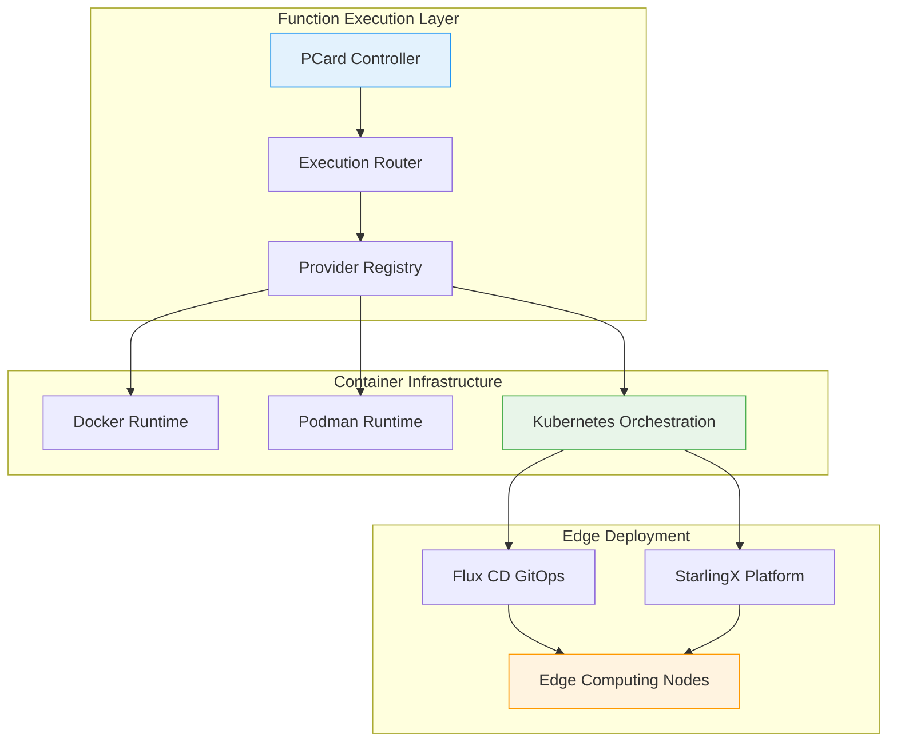

# PCard Architecture: Enabling Conversational Programming Through Polynomial Functors

## Overview

## Overview

The PCard architecture introduces a computational framework specifically designed to enable **Conversational Programming** with mathematical rigor. It systematically accumulates knowledge through formal validation, storing all content as hash-indexed MCard references to maintain immutability and cryptographic verification. 

Unlike traditional function composition systems, PCard creates an interactive testing environment similar to Conversational Programming or Vibe Coding, where users continuously explore and expand the behavior space of functions through incremental test case accumulation. This approach transforms function development from a one-time activity into an **ongoing conversation with the code**, where each interaction builds upon previous knowledge while maintaining mathematical rigor through polynomial functor structures.

This conversational approach is powered by three mutually orthogonal components that work in concert:

1. **AbstractSpecification (Social Identity)**: Captures the human-readable description of function behavior, enabling rapid social understanding and design intent communication

2. **ConcreteImplementation (Physical Execution)**: The actual source code and execution runtime, represented as polynomial functors that can be dynamically explored and tested

3. **BalancedExpectations (Interactive Validation Repository)**: A hash-indexed content filtering and search mechanism that relates test cases and execution records to specific functions while allowing conversational exploration sessions to incrementally accumulate knowledge about these functions

This triadic cross-referencing with hash values provides a compact, yet flexible representation of knowledge that relates human languages, algorithmic behavior, and real-world execution history as sources of validation to construct a body of knowledge in a data-driven **Continuation**. The term Continuation is operationally supported by both CI/CD practices and the mathematical logical concept of continuation as "what to do next," creating a unified framework for progressive knowledge accumulation and validation.

### Conversational Programming Foundation

PCard's polynomial functor structure powers an interactive testing environment where:

- **Interactive Exploration**: Users iteratively supply new test cases and input combinations to probe edge cases, boundary conditions, and performance characteristics
- **Continuous Knowledge Capture**: Each test case and input combination is stored as an immutable MCard, with the PCard maintaining references to this growing body of validation data
- **Structured Growth**: The polynomial's coefficients represent distinct test scenarios, while exponents capture variations in input values, creating a systematic way to organize and retrieve test cases
- **Persistent Context**: The PCard serves as a stable reference point that accumulates knowledge over time, enabling conversational continuity across testing sessions

This approach transforms testing from a one-time activity into an ongoing conversation with the code, annotated by a specific **PCard**. Each interaction builds upon previous knowledge while maintaining a clean separation between the function's interface (PCard) and its validation corpus (referenced MCards).

### Systematic Knowledge Accumulation

The hash-based retrieval system ensures that all test data remains efficiently accessible and verifiable, even as the test suite grows in size and complexity through conversational exploration. The polynomial functor structure maintains **syntactic stability**, allowing new test cases and execution records to accumulate incrementally without requiring changes to the PCard's core structure or hash value.

This creates a **knowledge accumulation system** where:
- Multiple users can contribute test cases to the same PCard function
- Exploration strategies can be shared and reused across similar functions
- Performance insights and failure modes are systematically cataloged
- Cross-function learning enables knowledge transfer between related implementations

PCard represents computational structures as polynomial functors of the form: $F(X) = Σ (A_i × X^{B_i})$, where $X$ represents a **category of types** (not individual values), and each term $A_i × X^{B_i}$ represents a computational pathway. Here:

- $X$ is a **functor parameter** representing the category of all possible input/output type transformations
- $A_i$ encodes the possible output types for each computational branch
- $B_i$ captures the input structure (arity, type relationships, dependencies)
- The exponentiation $X^{B_i}$ represents the functor action on type structures

This is called a **functor** (not merely a function) because it operates on categories of types and preserves compositional structure. The three components of PCard (Abstract Specification, Concrete Implementation, and Balanced Expectations) provide multiple, independent views of the same computation, enabling cross-validation and operational interpretability. Unlike functions that map values to values, functors map:
- **Objects** (types) to objects (types)
- **Morphisms** (type transformations) to morphisms (type transformations)
- **Composition** (how types combine) to composition (how transformed types combine)

This formulation creates a computational algebra where:
- **Function Application as Evaluation**: Substituting values into $X$ becomes a matter of polynomial evaluation
- **Composition as Multiplication**: Chaining functions corresponds to polynomial multiplication
- **Sum Types as Addition**: Alternative computational paths are combined through polynomial addition
- **Derivatives for Analysis**: The polynomial structure allows for symbolic differentiation of function compositions

This arithmetic foundation enables several powerful capabilities:
1. **Computational Scaling**: Functions can be decomposed, distributed, and recomposed while preserving their mathematical properties
2. **Symbolic Manipulation**: The polynomial representation allows for static analysis and optimization of function compositions
3. **Parallelization**: Independent terms in the polynomial can be processed in parallel, enabling efficient distributed computation
4. **Resource Bounding**: The degree of the polynomial provides direct insight into computational complexity and resource requirements

By treating functions as first-class algebraic entities, PCard enables a new paradigm where the construction and transformation of computational elements follows the familiar rules of arithmetic, making complex function manipulation both tractable and scalable.

PCard's EventFactory leverages this mathematical foundation to create a robust system for function representation that integrates with modern programming paradigms, including Model Context Protocol (MCP) and agentic workflow systems. This enables:
- Precise function representation that maintains formal traceability
- Systematic composition of functions while preserving their mathematical properties
- Automated verification of function composition correctness
- Efficient storage and retrieval of function definitions and their dependencies

By grounding PCard in the theory of representable functors and polynomial functors, we establish a rigorous foundation for function representation that spans the entire spectrum from high-level specifications to concrete implementations. This approach enables a new paradigm of function-oriented programming where the mathematical properties of functions are first-class citizens in the development process.

This architecture utilizes MCard for immutable content-addressable storage of all function definitions and their execution traces, with VCard providing cryptographically verified type safety and value classification, ensuring the integrity of the entire function composition graph.

## Core Principles

### 1. Conversational Programming Through Polynomial Structures

The foundation of PCard is the representation of computable knowledge as polynomial functors that enable **conversational programming**: $F(X) = Σ_i A_i × X^{B_i}$. This polynomial structure serves as both a formal mathematical model and an interactive testing framework where:

- **Coefficients as Test Cases**: Each $A_i$ represents a distinct test case or exploration scenario, stored as immutable MCards
- **Exponents as Execution Counts**: Each $B_i$ captures the number of times a test case has been executed, creating a natural accumulation mechanism
- **Interactive Evolution**: The polynomial grows through conversational exploration, with new test cases adding coefficients and repeated executions incrementing exponents

This representation transforms function development into an **ongoing conversation** where users continuously explore function behavior through incremental test case accumulation, with each interaction building upon previous knowledge while maintaining mathematical rigor.

### 2. Systematic Knowledge Accumulation

PCard implements a **knowledge accumulation system** where well-cataloged functions serve as repositories of collective understanding:

- **Persistent Learning**: Each PCard maintains a growing corpus of test cases, execution records, and performance insights
- **Cross-Session Continuity**: Testing sessions build upon previous explorations, enabling progressive refinement of understanding
- **Collaborative Knowledge Building**: Multiple users can contribute test cases and insights to the same PCard function
- **Pattern Recognition**: The system identifies common patterns across test runs, enabling optimization and knowledge transfer

The polynomial structure ensures that this knowledge accumulation is both **syntactically stable** (the mathematical form remains consistent) and **semantically rich** (each term carries meaningful computational information).

### 3. Hash-Based Validation Repository

The hash-based retrieval syntax creates an upgradeable validation repository where:

- **Test Case Association**: New test cases are dynamically associated with existing PCard instances through hash-based references
- **Execution Record Accumulation**: Each test execution creates an immutable MCard record linked to the PCard
- **Knowledge Reuse**: Similar functions can share and reuse validation data, maximizing learning efficiency
- **Instance Stability**: The PCard hash remains stable while its associated validation corpus grows over time

This approach prevents the proliferation of similar PCard instances while enabling continuous knowledge accumulation and systematic function exploration.

## Key Components for Conversational Programming

PCard models computation as an interactive testing environment where each component supports conversational exploration and systematic knowledge accumulation. This structure enables users to engage in ongoing conversations with their code through incremental test case development.

### AbstractSpecification: Social Identity Layer

Represents the **conversational interface** of the function - the human-readable description that enables social understanding and collaborative development:

**Conversational Programming Features:**
- **Natural Language Interface**: Users can describe function behavior in plain language, making it accessible to non-technical stakeholders
- **Collaborative Documentation**: Multiple users can contribute to and refine the specification through conversational interaction
- **Intent Preservation**: The social meaning of the function is preserved across all testing and exploration sessions
- **Contextual Understanding**: Rich context about the function's purpose enables more effective testing strategies

**Interactive Testing Support:**
- **Goal-Driven Exploration**: Test cases are generated based on the stated goals and success criteria
- **Specification Evolution**: The specification can evolve based on insights gained through testing sessions
- **Social Validation**: The specification serves as a communication tool for validating understanding across team members

### ConcreteImplementation: Interactive Execution Layer

Represents the **executable reality** that can be dynamically explored through conversational testing sessions:

**Conversational Programming Features:**
- **REPL-like Interaction**: Users can interactively explore function behavior through immediate execution and feedback
- **Dynamic Testing Environment**: The implementation supports real-time testing with immediate results
- **Execution Memory**: All test executions are recorded, creating a growing knowledge base about function behavior
- **Performance Insights**: Execution data provides insights into performance characteristics and optimization opportunities

**Interactive Testing Support:**
- **Live Exploration**: Users can test different inputs and immediately see results
- **Execution Tracing**: Complete execution traces help users understand function behavior
- **Error Analysis**: Failed executions provide learning opportunities and edge case discovery
- **Optimization Feedback**: Performance data guides optimization efforts

### BalancedExpectations: Interactive Validation Repository

Represents the **knowledge accumulation system** that grows through conversational exploration:

**Conversational Programming Features:**
- **Test Case Conversations**: Each test case represents a "question" asked of the function, with the result being the "answer"
- **Exploration History**: Complete history of all testing conversations and their outcomes
- **Pattern Recognition**: Automatic identification of testing patterns and common exploration paths
- **Collaborative Testing**: Multiple users can contribute test cases and share exploration insights

**Interactive Testing Support:**
- **Hash-Indexed Discovery**: Efficient discovery of relevant test cases and execution records
- **Adaptive Strategies**: Testing strategies that evolve based on previous results and discovered patterns
- **Knowledge Reuse**: Test cases and insights can be reused across similar functions
- **Progressive Validation**: Validation becomes more comprehensive over time through accumulated testing

### Integration for Conversational Flow

These components work together to create a seamless conversational programming experience:

1. **Specification-Driven Exploration**: The AbstractSpecification guides initial testing strategies and exploration goals
2. **Implementation Feedback Loop**: The ConcreteImplementation provides immediate feedback on test cases, enabling rapid iteration
3. **Knowledge Accumulation**: BalancedExpectations captures all insights and patterns, making them available for future exploration
4. **Cross-Session Continuity**: The polynomial structure maintains context across testing sessions, enabling long-term exploration strategies

## Design Methodologies

The PCard architecture is founded on the principle of **Conversational Programming** and integrates methodologies that enable systematic knowledge accumulation through interactive exploration:

### Conversational Programming with Interactive Testing

PCard's architecture is built on a conversational model where each function becomes a **living repository of knowledge** that grows through interactive exploration. The three interconnected aspects work together to enable continuous learning:

- **AbstractSpecification (Social Identity of the Computable Artifact under Investigation)**
  - *Conversational Context*: Natural language descriptions that enable rapid human understanding and social communication about the artifact's purpose
  - *Interactive Goals*: User-defined objectives that evolve through conversational exploration sessions
  - *Collaborative Criteria*: Success metrics that are refined through community interaction and shared understanding
  
  This layer provides the **social meaning** that bridges human understanding with computational execution, enabling multiple users to contribute to and understand the artifact's purpose through natural language interaction.

- **ConcreteImplementation (Physical Execution of the Computable Artifact under Investigation)**
  - *Interactive Runtime*: Execution environments that support conversational testing and real-time exploration
  - *Adaptive Interfaces*: Input/output mechanisms that respond to user exploration patterns and testing strategies
  - *Execution Memory*: Accumulated performance data and execution traces that inform future optimizations
  
  This layer contains the **executable reality** that can be dynamically explored through conversational testing sessions, with each execution contributing to the growing knowledge base about the artifact's behavior.

- **Balanced Expectations (Interactive Validation Repository)**
  - *Test Case Accumulation*: Growing collections of test cases contributed through conversational exploration
  - *Execution Record Archive*: Complete history of all test executions and their outcomes
  - *Pattern Recognition*: Automated identification of testing patterns and performance characteristics
  
  This layer creates a **hash-indexed filtering repository** that enables efficient discovery of relevant test cases and execution records, supporting both individual exploration and collaborative knowledge building.

### Systematic Knowledge Accumulation Framework

This conversational structure creates a powerful framework for systematic knowledge accumulation:

- **Progressive Learning**: Each testing session builds upon previous knowledge, creating increasingly comprehensive understanding
- **Collaborative Intelligence**: Multiple users contribute test cases and insights, creating collective wisdom about function behavior
- **Pattern-Based Optimization**: The system learns from execution patterns to suggest optimizations and identify potential issues
- **Cross-Function Knowledge Transfer**: Insights gained from one function can be applied to similar functions through pattern matching
- **Conversational Continuity**: Testing sessions maintain context across time, enabling long-term exploration strategies

### Interactive Exploration Benefits

This conversational approach with systematic knowledge accumulation creates several key advantages:

- **Reduces Cognitive Load**: Users can explore functions through natural conversation rather than formal testing frameworks
- **Enables Incremental Understanding**: Complex functions can be understood gradually through iterative exploration
- **Facilitates Knowledge Sharing**: Test cases and insights are automatically cataloged and made available to other users
- **Supports Adaptive Testing**: Testing strategies can evolve based on previous results and discovered patterns
- **Maintains Mathematical Rigor**: All conversational interactions are grounded in polynomial functor mathematics, ensuring formal correctness

## Key Components and Polynomial Structure

PCard models computation as a polynomial functor, where each component represents a different "term" in the polynomial expression. This structure draws inspiration from LLM engine design, LangChain, and PythonREPL.


### AbstractSpecification (`abstract_specification.py`)

  

Represents the "what" dimension of the polynomial functor:

  

```python

class AbstractSpecification(MCard, BaseModel):
context: str
goal: str
success_criteria: List[str]
```

  

- **Context**: Defines the operational environment, constraints, and preconditions (BDD "Given")

- **Goal**: States the primary objective (BDD "When")
By encoding BDD principles within these three attributes, AbstractSpecification can define scenarios without additional fields:

```python
# Example AbstractSpecification for Infinite Precision Addition
context = """
Given two arbitrarily large integer numbers represented as strings:
- Numbers can have different lengths
- Numbers can have any number of digits
- Numbers are non-negative integers
"""

goal = "Add the two numbers with arbitrary precision and return the result as a string"

success_criteria = [
    "Adding '123' and '456' should return '579'",
    "Adding '999999999999999999' and '1' should return '1000000000000000000'",
    "Adding '0' and '0' should return '0'"
]

  

## MCard-Powered Execution and Validation

### ConcreteImplementation: Code and Runtime as Content-Addressable Units

The `ConcreteImplementation` class serves as the executable realization of an `AbstractSpecification`, but with a crucial enhancement: it represents both code and runtime environment as content-addressable MCards. This enables PCard to function as a comprehensive function testing and validation platform.

#### Core Structure with MCard Integration

```python
class ConcreteImplementation(PCard, BaseModel):
    inputs: Dict[str, Any]           # Input parameters and their constraints
    outputs: Dict[str, Any]          # Output specifications
    activities: List[Dict[str, Any]] # Executable code segments with runtime requirements
    mcard_references: Dict[str, str] # MCard hashes for code and runtime components
```

Each `ConcreteImplementation` stores its code and runtime specifications as MCards, creating a complete, reproducible execution environment. This allows for:

1. **Deterministic Replay**: Any function execution can be precisely recreated using the stored MCard references
2. **Runtime Environment Control**: The exact execution context (dependencies, versions, system requirements) is captured and versioned
3. **Cross-Platform Validation**: Functions can be validated across different environments by resolving the same MCards
4. **Dependency Management**: All required components are content-addressable and verifiable

The activities field supports TDD by structuring implementation as testable units:

```python
# Example ConcreteImplementation for Infinite Precision Addition

# Inputs with both data parameters and runtime environment
inputs = {
    # Functional input parameters
    "num1": {"type": "string", "pattern": "^\\d+$"},  # Arbitrary length string of digits
    "num2": {"type": "string", "pattern": "^\\d+$"},  # Arbitrary length string of digits
    
    # Runtime environment as a required execution resource
    "runtime": {
        "language": "python",
        "version": "3.10.8",  # Specific Python version for consistent execution
        "dependencies": [
            {"name": "pydantic", "version": "2.0.3"},  # For model validation
            {"name": "cryptography", "version": "41.0.1"},  # For secure hashing
            {"name": "pytest", "version": "7.3.1"}  # For test-driven development
        ],
        "system_requirements": {
            "platform": "cross-platform",  # Works on Linux, macOS, Windows
            "min_memory": "512MB",  # Minimum RAM required
            "storage": "5MB"  # Minimal storage footprint
        },
        "execution_context": {
            "type": "synchronous",  # Execution model
            "threading": False,  # Single-threaded for simplicity
            "environment_variables": {"PYTHONPATH": "${PROJECT_ROOT}/src"}
        }
    }
}

outputs = {"sum": {"type": "string", "pattern": "^\\d+$"}}  # Result as string of digits

activities = [
    {
        "name": "pad_numbers",
        "code": """
            # Pad the shorter number with leading zeros
            max_len = max(len(num1), len(num2))
            return num1.zfill(max_len), num2.zfill(max_len)
        """,
        "requirements": {
            "imports": [],  # No imports needed, using built-in functions
            "complexity": {
                "time": "O(n)",  # Linear time complexity
                "space": "O(n)"  # Linear space complexity
            }
        }
    },
    {
        "name": "add_digits",
        "code": """
            # Add digits right-to-left with carry
            result = []
            carry = 0
            for i in range(len(num1)-1, -1, -1):
                digit_sum = int(num1[i]) + int(num2[i]) + carry
                carry = digit_sum // 10
                result.insert(0, str(digit_sum % 10))
            if carry > 0:
                result.insert(0, str(carry))
            return ''.join(result)
        """,
        "requirements": {
            "imports": [],  # No imports needed, using built-in functions
            "complexity": {
                "time": "O(n)",  # Linear time complexity
                "space": "O(n)"  # Linear space complexity
            }
        }
    }
]

  

### PCard as Reified Polynomial Functor (`balanced_expectations.py`)

  

In the PCard architecture, a fully functional Polynomial Functor achieves its complete representation only when reified as a BalancedExpectations MCard. This reification is essential because it provides the necessary context to validate the logical consistency of the polynomial functor's behavior through concrete test cases and verification mechanisms.

  

#### Why BalancedExpectations is the Complete Realization

  

A polynomial functor in PCard is only fully specified when it can be validated against its intended behavior. The BalancedExpectations MCard serves this purpose by combining:

  

1. **Type Signatures** (from AbstractSpecification)

- Defines the domain and codomain of the functor

- Specifies the structure of valid inputs and outputs

- Establishes the formal contract the functor must satisfy

  

2. **Computational Rules** (from ConcreteImplementation)

- Provides the executable implementation

- Defines the transformation rules between input and output types

- Encodes the algorithmic behavior in a runnable form

  

3. **Validation Framework** (test cases and verification logic)

- Contains concrete test cases that validate the functor's behavior

- Maintains a history of executions and their outcomes

- Enables regression testing and behavior verification

  

#### Validation Through Execution

  

The BalancedExpectations MCard includes an `observations` field that serves as a verifiable log of all executions. Each observation contains:

  

- The exact input values used

- The computed output values

- The success/failure status

- A cryptographic hash linking back to the specific functor version

  

This allows for deterministic verification that the polynomial functor behaves as expected across its entire input domain. The validation is not just theoretical but grounded in actual execution traces that can be independently verified.

  

#### Self-Contained Verification

  

By combining these elements, the BalancedExpectations MCard becomes a self-contained unit where:

  

1. The polynomial functor's behavior is fully specified

2. All necessary validation criteria are explicitly defined

3. The implementation can be verified against its specification
  

### EventFactory: The Universal Function Interpreter

The `EventFactory` serves as PCard's execution core, functioning as a generalized interpreter and virtual machine that can execute any function represented in the PCard format. By leveraging the content-addressable nature of MCards, it provides a unified execution environment that bridges abstract specifications with concrete implementations.

#### Polynomial Functor as Execution Blueprint

For any function `f: A → B`, the EventFactory uses its polynomial functor representation as an execution blueprint:

$$F(X) = Σ (A_i × X^{B_i})$$

Where:
- $A_i$ represents the function's input parameter types and constraints, resolved from MCard content
- $B_i$ represents the computational paths and their conditions, with each path potentially having different runtime requirements
- $X$ represents the domain of possible input values, dynamically mapped to executable code via MCard resolution

This representation allows the EventFactory to:
1. **Dynamically Resolve Dependencies**: Fetch and validate all required code and runtime components using MCard hashes
2. **Optimize Execution Paths**: Analyze and optimize the polynomial terms for efficient execution
3. **Validate Type Safety**: Ensure all operations respect the type constraints defined in the polynomial terms
4. **Generate Test Cases**: Automatically derive test cases that cover all computational paths

#### Execution Model

The EventFactory implements a two-phase execution model:

1. **Preparation Phase**:
   - Resolve all MCard references for code and runtime components
   - Set up the execution environment with the exact dependencies and configurations
   - Validate type constraints and preconditions

2. **Execution Phase**:
   - Map input values to the appropriate computational paths
   - Execute the selected path with runtime monitoring
   - Capture detailed execution traces and performance metrics
   - Validate outputs against expected types and constraints

This architecture makes PCard an ideal platform for function testing and validation, as it provides:
- **Reproducibility**: Every execution is fully specified by its MCard references
- **Transparency**: Complete visibility into the execution environment and code paths
- **Verifiability**: Cryptographic hashes ensure the integrity of all components
- **Scalability**: The polynomial representation allows for efficient parallel execution of independent terms

#### Key Capabilities for Testing and Validation

1. **Universal Function Execution**:
   - Resolves and executes any function represented in the PCard format
   - Handles cross-language function calls through standardized interfaces
   - Manages function composition and dependency injection

2. **Comprehensive Test Generation**:
   - Automatically generates test cases from polynomial terms
   - Supports property-based testing through type constraints
   - Enables mutation testing by varying input parameters

3. **Runtime Analysis and Monitoring**:
   - Tracks resource usage and performance metrics
   - Detects and logs edge cases and boundary conditions
   - Provides detailed execution traces for debugging

4. **Validation and Verification**:
   - Validates function outputs against specifications
   - Verifies runtime behavior matches expected patterns
   - Ensures compliance with security and performance constraints

5. **Cross-Platform Compatibility**:
   - Abstracts away platform-specific details through MCard resolution
   - Ensures consistent behavior across different execution environments
   - Supports function validation across language and system boundaries

```python
class EventFactory:
    def __init__(self, pcard: PCard):
        self.pcard = pcard
        self.hash = pcard.hash  # PCard and BalancedExpectations share the same hash

    def create_event(self, event_name: str, details: Dict[str, Any]) -> ExecutionEvent:
        """Create an execution event with the given details."""
        return ExecutionEvent(
            event_type=f"{event_name}",
            pcard_hash=self.hash,
            details=details
        )

    def _extract_polynomial_terms(self, func: Callable) -> Dict[str, Any]:
        """Extract polynomial terms from a function's signature and implementation."""
        sig = inspect.signature(func)
        source = inspect.getsource(func)
        tree = parse(source)

        class BranchVisitor(NodeVisitor):
            def __init__(self):
                self.branches = []
                self.complexity = 1  # Base complexity
            
            def visit_If(self, node):
                self.branches.append({'condition': ast.unparse(node.test), 'complexity': 1})
                self.complexity += 1
                self.generic_visit(node)
            
            def visit_For(self, node):
                self.complexity += 1
                self.generic_visit(node)
            
            def visit_While(self, node):
                self.complexity += 1
                self.generic_visit(node)

        visitor = BranchVisitor()
        visitor.visit(tree)

        return {
            'input_types': {name: str(param.annotation) for name, param in sig.parameters.items()},
            'output_type': str(sig.return_annotation),
            'branches': visitor.branches,
            'complexity': visitor.complexity,
            'source_hash': self._hash_content(source)
        }

    def execute_function(self, func_name: str, *args, **kwargs) -> Any:
        """Execute a function while maintaining its polynomial functor representation."""
        module_path, _, func_name = func_name.rpartition('.')
        if not module_path:
            raise ImportError(f"Function {func_name} must be fully qualified")
        
        module = __import__(module_path, fromlist=[func_name])
        func = getattr(module, func_name)
        poly_rep = self._extract_polynomial_terms(func)

        # Create and log execution event
        self.create_event(
            event_name=f"execute_{func_name}",
            details={'args': args, 'kwargs': kwargs, 'polynomial_representation': poly_rep}
        )

        try:
            result = func(*args, **kwargs)
            self.create_observation(
                inputs={'args': args, 'kwargs': kwargs, 'input_types': poly_rep['input_types']},
                outputs={'result': result, 'output_type': poly_rep['output_type'], 'complexity': poly_rep['complexity']},
                success=True
            )
            return result
        except Exception as e:
            self.create_observation(
                inputs={'args': args, 'kwargs': kwargs, 'input_types': poly_rep['input_types']},
                outputs={'error': str(e), 'output_type': 'Exception', 'complexity': poly_rep['complexity']},
                success=False
            )
            raise

    def create_observation(self, inputs: Dict[str, Any], outputs: Dict[str, Any], success: bool) -> Dict[str, Any]:
        """Create an observation record for function execution."""
        observation = {
            "pcard_hash": self.hash,
            "result": {"inputs": inputs, "outputs": outputs, "success": success},
            "timestamp": datetime.now().isoformat()
        }
        self.pcard.observations.append(observation)
        return observation

### PCard as Unified Polynomial Functor (`pcard.py`)


The PCard serves as the concrete realization of a polynomial functor, unifying specification, implementation, and validation into a single, content-addressable MCard. Each PCard instance is a self-contained computational unit that maintains its complete execution history and verification state.

  

#### Core Properties:

  

1. **Unified Identity**:

- Inherits from both MCard

- Cryptographic hash serves as its unique identifier

- Combines specification, implementation, and observations

  

2. **Polynomial Functor Structure**:

```python

class PCard(MCard):

# Polynomial coefficients (specification)

specification: AbstractSpecification # Type signatures and constraints

# Polynomial terms (implementation)

implementation: ConcreteImplementation # Computational paths

# Function evaluations (observations)

observations: List[Dict[str, Any]] # Recorded executions

# Derived polynomial properties

complexity: Dict[str, float] # Time/space complexity terms

invariants: List[Callable] # Mathematical invariants

```

  

3. **Execution Model**:

```python

def execute(self, inputs: Dict[str, Any]) -> Dict[str, Any]:

# 1. Create polynomial representation of this execution

poly_rep = self._get_polynomial_representation()

# 2. Generate execution event with polynomial context

event = self.event_factory.create_event(

event_type="function_execution",

polynomial_rep=poly_rep,

evaluation={"inputs": inputs},

pcard_hash=self.hash,

context={

"timestamp": datetime.now().isoformat(),

"call_stack": inspect.stack()

}

)

try:

# 3. Execute while capturing execution metrics

start_time = time.perf_counter()

outputs = self._execute_implementation(inputs)

duration = time.perf_counter() - start_time

# 4. Validate against polynomial constraints

success = self._validate_polynomial_constraints(inputs, outputs)

# 5. Record the observation

self._record_observation(

event=event,

inputs=inputs,

outputs=outputs,

success=success,

metrics={"duration_seconds": duration}

)

return outputs

except Exception as e:

# 6. Record failure with full context

self._record_failure(

event=event,

error=e,

inputs=inputs,

context={"stack_trace": traceback.format_exc()}

)

raise

```

  

4. **Polynomial Validation**:

```python

def _validate_polynomial_constraints(self, inputs, outputs):

"""Verify that execution adheres to the polynomial functor's constraints."""

# 1. Type checking (coefficient validation)

if not self._validate_types(inputs, outputs):

return False

# 2. Path validation (term validation)

if not self._validate_execution_path():

return False

# 3. Invariant preservation

if not self._check_invariants(inputs, outputs):

return False

return True

```

  

5. **Content-Addressable Storage**:

The PCard leverages the content-addressable storage mechanism provided by its MCard base class. The hash is automatically computed based on the PCard's content, including its specification, implementation, observations, and invariants. This ensures consistent hashing across all MCard instances while maintaining the polynomial functor's properties.

  

#### Key Benefits:

  

1. **Mathematical Rigor**:

- Every PCard is a well-defined polynomial functor

- Execution paths correspond to polynomial terms

- Type safety is enforced through coefficient constraints

  

2. **Verifiable Computation**:

- Complete execution history is preserved

- Each step is cryptographically verifiable

- Enables formal verification of program properties

  

3. **Efficient Analysis**:

- Common subexpression identification

- Automatic complexity analysis

- Pattern matching across function executions

  

4. **Compositional Design**:

- PCards can be composed through function composition

- Enables building complex systems from simple, verifiable components

- Maintains mathematical properties across compositions


In this revised design, the `PCard` directly inherits from `MCard`. This eliminates the need to create a separate BalancedExpectations instance, as the PCard itself **is** the BalancedExpectations. The unified identity is reflected in the hash calculation, which serves as the single source of truth for both PCard and observation identities.

## Agentic Architecture Integration and Modern AI Systems

### Model Context Protocol (MCP) Integration

The PCard architecture is designed for seamless integration with modern agentic systems through industry-standard protocols like **[[Model Context Protocol]]** (MCP). This integration transforms PCard functions into standardized tools that AI agents can invoke systematically.

#### MCP Tool Specification for PCard Functions

Each PCard function can be automatically exposed as an MCP tool with the following structure:

```json
{
  "name": "pcard_function_execute",
  "description": "Execute a PCard function with polynomial functor semantics",
  "inputSchema": {
    "type": "object",
    "properties": {
      "function_hash": {
        "type": "string",
        "description": "Content hash of the PCard function to execute"
      },
      "inputs": {
        "type": "object",
        "description": "Input parameters as polynomial coefficients"
      },
      "execution_context": {
        "type": "object",
        "properties": {
          "agent_id": { "type": "string" },
          "conversation_context": { "type": "array" },
          "semantic_embeddings": { "type": "array" }
        }
      },
      "polynomial_operations": {
        "type": "array",
        "items": {
          "type": "string",
          "enum": ["evaluate", "compose", "differentiate", "integrate", "factor"]
        }
      }
    },
    "required": ["function_hash", "inputs"]
  }
}
```

#### Systematic Function Composition Through MCP

The polynomial functor foundation enables sophisticated function composition through MCP tool calls:

```python
class MCPPCardInterface:
    def __init__(self, pcard_registry: PCardRegistry):
        self.registry = pcard_registry
        self.composition_cache = {}
        
    async def execute_pcard_function(self, request: MCPRequest) -> MCPResponse:
        """Execute PCard function through MCP interface"""
        function_hash = request.params["function_hash"]
        inputs = request.params["inputs"]
        context = request.params.get("execution_context", {})
        
        # 1. Retrieve PCard function
        pcard_function = await self.registry.get_pcard(function_hash)
        
        # 2. Convert inputs to polynomial representation
        polynomial_inputs = self._convert_to_polynomial(inputs)
        
        # 3. Execute with full context tracking
        execution_result = await self._execute_with_context(
            pcard_function, polynomial_inputs, context
        )
        
        # 4. Generate execution event MCard
        execution_event = await self._create_execution_event(
            function_hash, inputs, execution_result, context
        )
        
        return MCPResponse(
            result=execution_result.output,
            metadata={
                "execution_hash": execution_event.hash,
                "polynomial_representation": execution_result.polynomial_form,
                "semantic_embedding": execution_result.embedding_vector
            }
        )
    
    async def compose_functions(self, function_hashes: List[str]) -> str:
        """Compose multiple PCard functions into a new function"""
        # Check composition cache first
        composition_key = tuple(sorted(function_hashes))
        if composition_key in self.composition_cache:
            return self.composition_cache[composition_key]
        
        # Retrieve all functions
        functions = [await self.registry.get_pcard(h) for h in function_hashes]
        
        # Compose through polynomial multiplication
        composed_polynomial = PolynomialFunctor.identity()
        for func in functions:
            composed_polynomial = composed_polynomial.compose(func.polynomial_spec)
        
        # Create new PCard for composed function
        composed_pcard = await self._create_composed_pcard(
            composed_polynomial, function_hashes
        )
        
        # Cache the result
        self.composition_cache[composition_key] = composed_pcard.hash
        
        return composed_pcard.hash
```

### LLM Integration Through Vectorized Embeddings

#### Place-Value System for Semantic Encoding

Following the principles established in **[[place-value notation]]**, PCard leverages polynomial functor structures to encode semantic information in a theoretically sound manner. This creates a direct bridge between mathematical representation and semantic meaning.

The semantic encoding follows the polynomial evaluation pattern:

$$\text{Semantic}(concept) = \sum_{i=0}^{n} e_i \times p^i \bmod q$$

Where:
- **$e_i$**: Embedding coefficients from LLM vector representations
- **$p$**: Prime base ensuring collision resistance (typically 31 or 37)
- **$q$**: Large prime modulus for bounded arithmetic
- **$n$**: Dimensionality of the semantic embedding space

This encoding provides several critical advantages for AI systems:

1. **Compositional Semantics**: Meaning composition follows polynomial arithmetic rules
2. **Efficient Similarity**: Distance calculations leverage **[[Rabin fingerprint]]** techniques
3. **Hierarchical Organization**: Positional significance enables systematic knowledge categorization
4. **Collision Resistance**: Prime-based encoding ensures semantic uniqueness as detailed in **[[Prime Numbers in Polynomial Hashing and Godel Numbering]]**

#### Vector Embeddings as Polynomial Coefficients

Modern LLM embeddings can be directly interpreted as polynomial functor coefficients, enabling seamless integration with PCard's mathematical framework:

```python
class SemanticPCardFunction:
    def __init__(self, 
                 abstract_spec: str, 
                 concrete_impl: Callable,
                 embedding_model: EmbeddingModel):
        
        # Generate semantic embeddings for specification
        self.spec_embedding = embedding_model.encode(abstract_spec)
        self.impl_embedding = self._extract_code_embedding(concrete_impl)
        
        # Convert to polynomial representation
        self.polynomial_spec = self._embedding_to_polynomial(self.spec_embedding)
        self.polynomial_impl = self._embedding_to_polynomial(self.impl_embedding)
        
        # Create unified polynomial function
        self.unified_polynomial = self._unify_representations()
    
    def _embedding_to_polynomial(self, embedding: np.ndarray, base: int = 31) -> PolynomialFunctor:
        """Convert embedding vector to polynomial functor representation"""
        # Normalize embedding coefficients to valid range
        normalized_coeffs = self._normalize_coefficients(embedding)
        
        # Create polynomial terms
        terms = []
        for i, coeff in enumerate(normalized_coeffs):
            if abs(coeff) > 1e-6:  # Skip near-zero coefficients
                terms.append(PolynomialTerm(coefficient=coeff, exponent=i))
        
        return PolynomialFunctor(terms=terms, base=base)
    
    def semantic_similarity(self, other: 'SemanticPCardFunction') -> float:
        """Compute semantic similarity using polynomial distance"""
        # Use polynomial evaluation for similarity
        self_hash = self.polynomial_spec.evaluate_hash()
        other_hash = other.polynomial_spec.evaluate_hash()
        
        # Normalized distance based on hash difference
        max_hash_value = 2**31 - 1
        return 1.0 - abs(self_hash - other_hash) / max_hash_value
    
    def compose_semantics(self, other: 'SemanticPCardFunction') -> 'SemanticPCardFunction':
        """Semantic composition through polynomial multiplication"""
        # Compose polynomial representations
        composed_spec = self.polynomial_spec.multiply(other.polynomial_spec)
        composed_impl = self.polynomial_impl.multiply(other.polynomial_impl)
        
        # Create new semantic function
        return SemanticPCardFunction.from_polynomials(composed_spec, composed_impl)
```

### Theoretical Advantages for Information Storage and Retrieval

#### Complete Namespace Management

The polynomial functor approach provides theoretically complete namespace management through systematic encoding principles derived from **[[Namespace]]** theory and **[[Godel Number]]** encoding:

1. **Unique Identification**: Every knowledge element receives a unique polynomial fingerprint
2. **Hierarchical Organization**: Place-value structure enables systematic categorization
3. **Efficient Retrieval**: Polynomial evaluation enables logarithmic lookup times
4. **Semantic Consistency**: Mathematical structure ensures consistent meaning preservation

```python
class TheoreticallyCompleteNamespace:
    def __init__(self, base_prime: int = 31, modulus_prime: int = 2**31 - 1):
        self.base = base_prime
        self.modulus = modulus_prime
        self.namespace_tree = PolynomialTree()
        self.godel_encoder = GodelNumberEncoder()
    
    def assign_namespace_position(self, concept: str, context: Dict) -> int:
        """Assign unique namespace position using polynomial encoding"""
        # 1. Generate semantic embedding
        embedding = self._get_semantic_embedding(concept, context)
        
        # 2. Convert to polynomial representation
        polynomial_pos = sum(
            coeff * (self.base ** i) 
            for i, coeff in enumerate(embedding)
        ) % self.modulus
        
        # 3. Verify uniqueness using Godel encoding
        godel_verification = self.godel_encoder.encode_concept(concept, context)
        
        # 4. Combine for complete namespace position
        complete_position = (polynomial_pos * godel_verification) % self.modulus
        
        # 5. Store in namespace tree
        self.namespace_tree.insert(complete_position, concept, context)
        
        return complete_position
    
    def retrieve_by_semantic_similarity(self, query: str, threshold: float = 0.8) -> List[Tuple[str, float]]:
        """Retrieve concepts by semantic similarity using polynomial distance"""
        query_embedding = self._get_semantic_embedding(query, {})
        query_polynomial = self._compute_polynomial_hash(query_embedding)
        
        # Use polynomial tree for efficient similarity search
        candidates = self.namespace_tree.find_similar(query_polynomial, threshold)
        
        # Rank by polynomial distance
        ranked_results = []
        for candidate in candidates:
            similarity = self._compute_polynomial_similarity(query_polynomial, candidate.position)
            if similarity >= threshold:
                ranked_results.append((candidate.concept, similarity))
        
        return sorted(ranked_results, key=lambda x: x[1], reverse=True)
```

#### Formal Verification of AI Reasoning

The integration of PCard with **[[Cubical Logic Model]]** enables formal verification of AI reasoning processes through polynomial composition:

```python
class VerifiableAIReasoning:
    def __init__(self, clm_verifier: CubicalLogicModel):
        self.verifier = clm_verifier
        self.reasoning_chain = []
        self.polynomial_trace = PolynomialFunctor.identity()
    
    def add_reasoning_step(self, 
                          step_description: str,
                          pcard_function: PCard,
                          inputs: Dict,
                          outputs: Dict) -> bool:
        """Add a reasoning step with formal verification"""
        
        # 1. Verify step against CLM specifications
        abstract_verification = self.verifier.verify_abstract_spec(
            step_description, pcard_function.abstract_spec
        )
        
        # 2. Verify implementation correctness
        concrete_verification = self.verifier.verify_concrete_impl(
            inputs, outputs, pcard_function.concrete_impl
        )
        
        # 3. Verify balanced expectations
        expectation_verification = self.verifier.verify_balanced_expectations(
            inputs, outputs, pcard_function.balanced_expectations
        )
        
        # 4. Update polynomial trace
        step_polynomial = pcard_function.polynomial_representation
        self.polynomial_trace = self.polynomial_trace.compose(step_polynomial)
        
        # 5. Verify polynomial consistency
        polynomial_verification = self._verify_polynomial_consistency()
        
        # 6. All verifications must pass
        step_valid = all([
            abstract_verification,
            concrete_verification,
            expectation_verification,
            polynomial_verification
        ])
        
        if step_valid:
            self.reasoning_chain.append({
                'description': step_description,
                'pcard_hash': pcard_function.hash,
                'inputs': inputs,
                'outputs': outputs,
                'polynomial_contribution': step_polynomial
            })
        
        return step_valid
    
    def verify_complete_reasoning_chain(self) -> VerificationResult:
        """Verify the complete reasoning chain for logical consistency"""
        
        # 1. Verify polynomial composition consistency
        expected_polynomial = PolynomialFunctor.identity()
        for step in self.reasoning_chain:
            expected_polynomial = expected_polynomial.compose(step['polynomial_contribution'])
        
        composition_consistent = expected_polynomial.equals(self.polynomial_trace)
        
        # 2. Verify semantic consistency across steps
        semantic_consistency = self._verify_semantic_consistency()
        
        # 3. Verify causal relationships
        causal_consistency = self._verify_causal_relationships()
        
        # 4. Generate formal proof certificate
        proof_certificate = self._generate_proof_certificate() if all([
            composition_consistent,
            semantic_consistency,
            causal_consistency
        ]) else None
        
        return VerificationResult(
            is_valid=composition_consistent and semantic_consistency and causal_consistency,
            polynomial_trace=self.polynomial_trace,
            proof_certificate=proof_certificate,
            verification_details={
                'composition_consistent': composition_consistent,
                'semantic_consistent': semantic_consistency,
                'causal_consistent': causal_consistency
            }
        )
```

### Integration with Modern AI Architectures

#### Transformer Architecture Compatibility

PCard's polynomial structure aligns naturally with transformer architectures, providing mathematical foundations for attention mechanisms:

```python
class PolynomialAttentionMechanism:
    def __init__(self, embedding_dim: int, num_heads: int = 8):
        self.embedding_dim = embedding_dim
        self.num_heads = num_heads
        self.polynomial_projections = self._initialize_polynomial_projections()
    
    def compute_attention(self, 
                         query_embeddings: np.ndarray,
                         key_embeddings: np.ndarray,
                         value_embeddings: np.ndarray) -> np.ndarray:
        """Compute attention using polynomial functor operations"""
        
        # 1. Convert embeddings to polynomial representations
        query_polynomials = [self._embedding_to_polynomial(q) for q in query_embeddings]
        key_polynomials = [self._embedding_to_polynomial(k) for k in key_embeddings]
        value_polynomials = [self._embedding_to_polynomial(v) for v in value_embeddings]
        
        # 2. Compute polynomial attention scores
        attention_scores = []
        for q_poly in query_polynomials:
            scores = []
            for k_poly in key_polynomials:
                # Attention score as polynomial inner product
                score = q_poly.inner_product(k_poly)
                scores.append(score)
            attention_scores.append(scores)
        
        # 3. Apply softmax to polynomial scores
        normalized_scores = self._polynomial_softmax(attention_scores)
        
        # 4. Compute weighted value combinations
        attended_values = []
        for i, scores in enumerate(normalized_scores):
            weighted_value = PolynomialFunctor.zero()
            for j, score in enumerate(scores):
                weighted_value = weighted_value.add(
                    value_polynomials[j].multiply_scalar(score)
                )
            attended_values.append(weighted_value)
        
        # 5. Convert back to embedding vectors
        return np.array([self._polynomial_to_embedding(poly) for poly in attended_values])
```

#### Vector Database Integration with Polynomial Indexing

The polynomial encoding enables advanced vector database capabilities:

```python
class PolynomialVectorDatabase:
    def __init__(self, dimension: int, base_prime: int = 31):
        self.dimension = dimension
        self.base = base_prime
        self.vector_index = VectorIndex(dimension)
        self.polynomial_index = PolynomialIndex(base_prime)
        self.semantic_graph = SemanticGraph()
    
    def store_pcard_function(self, pcard: PCard) -> str:
        """Store PCard with multi-modal indexing"""
        
        # 1. Extract embeddings from all three CLM dimensions
        spec_embedding = self._extract_specification_embedding(pcard.abstract_spec)
        impl_embedding = self._extract_implementation_embedding(pcard.concrete_impl)
        exp_embedding = self._extract_expectation_embedding(pcard.balanced_expectations)
        
        # 2. Create unified embedding
        unified_embedding = self._unify_embeddings(spec_embedding, impl_embedding, exp_embedding)
        
        # 3. Generate polynomial hash
        polynomial_hash = self._compute_polynomial_hash(unified_embedding)
        
        # 4. Store in multiple indices
        self.vector_index.add(unified_embedding, pcard.hash)
        self.polynomial_index.add(polynomial_hash, pcard.hash)
        
        # 5. Update semantic graph
        self.semantic_graph.add_node(pcard.hash, {
            'polynomial_hash': polynomial_hash,
            'embedding': unified_embedding,
            'semantic_category': self._classify_semantic_category(pcard)
        })
        
        return pcard.hash
    
    def semantic_search(self, 
                       query: str, 
                       search_type: str = "hybrid",
                       k: int = 10) -> List[SearchResult]:
        """Multi-modal semantic search using polynomial structure"""
        
        # 1. Generate query embedding
        query_embedding = self._generate_query_embedding(query)
        query_polynomial_hash = self._compute_polynomial_hash(query_embedding)
        
        if search_type == "vector":
            # Pure vector similarity search
            candidates = self.vector_index.search(query_embedding, k)
        elif search_type == "polynomial":
            # Pure polynomial structure search
            candidates = self.polynomial_index.search(query_polynomial_hash, k)
        else:  # hybrid
            # Combined vector and polynomial search
            vector_candidates = self.vector_index.search(query_embedding, k * 2)
            poly_candidates = self.polynomial_index.search(query_polynomial_hash, k * 2)
            candidates = self._merge_search_results(vector_candidates, poly_candidates, k)
        
        # 2. Enhance with semantic graph traversal
        enhanced_candidates = self.semantic_graph.expand_search_results(candidates)
        
        # 3. Rank by combined similarity metrics
        ranked_results = self._rank_by_polynomial_similarity(
            query_embedding, query_polynomial_hash, enhanced_candidates
        )
        
        return ranked_results[:k]
```

This comprehensive integration of [[PCard]] with modern agentic architectures demonstrates how polynomial functor theory provides both theoretical soundness and practical efficiency for next-generation AI systems. The mathematical foundation ensures reliable, interpretable, and scalable AI operations while maintaining semantic consistency and enabling formal verification of reasoning processes.


## 3. Function Provisioning Infrastructure

A critical aspect of PCard's architecture is its **Function Provisioning Infrastructure** - a comprehensive framework designed to accommodate diverse execution providers while maintaining a consistent conversational programming interface. This infrastructure is a foundational component that must be designed into the system from the beginning to ensure flexibility, scalability, and high availability.

### 3.1 Execution Provider Ecosystem

PCard supports a wide spectrum of execution providers through a unified interface:

- **Traditional Computational Functions**: Native programming language functions and methods
- **LLM Inference Engines**: Large Language Model APIs and inference endpoints
- **MCP Tool Providers**: Model Context Protocol tools and service providers
- **External API Services**: Third-party services with standardized interfaces
- **Distributed Computing Resources**: Remote execution environments
- **Smart Contract Environments**: Blockchain and distributed ledger execution
- **Embedded Systems**: IoT devices and hardware interfaces

### 3.2 Containerization and Orchestration

To ensure consistent execution across environments, the architecture leverages modern container technologies:



Key infrastructure components include:

1. **Container Runtime Technologies**
   - **Docker**: Industry-standard container runtime for packaging execution environments with precise dependency management
   - **Podman**: Security-enhanced container engine supporting rootless execution for sensitive functions
   - **Containerd**: Lightweight runtime focusing on simplicity and robustness for edge deployments

2. **Orchestration Platforms**
   - **Kubernetes**: Production-grade container orchestration for managing function deployments at scale
   - **K3s**: Lightweight Kubernetes distribution ideal for edge computing and resource-constrained environments
   - **Docker Swarm**: Simpler orchestration for smaller deployments with integrated Docker workflow

3. **Edge Computing Integration**
   - **StarlingX**: Complete edge cloud infrastructure platform enabling distributed function execution
   - **Flux CD**: GitOps toolkit ensuring consistent continuous deployment across the function infrastructure
   - **KubeEdge**: Kubernetes extension optimized for edge computing with offline operation support

### 3.3 High Availability Architecture

The function provisioning infrastructure implements high availability principles:

1. **Redundancy Mechanisms**
   - Multiple execution pathways for critical functions
   - Geographic distribution of execution providers
   - Cross-platform function compatibility

2. **Failover Systems**
   - Automatic detection of provider failures
   - Graceful degradation to alternative execution environments
   - Stateful recovery after provider restoration

3. **Continuous Deployment**
   - Zero-downtime function updates
   - Canary deployments for safe execution provider transitions
   - Automated rollbacks on execution anomalies

4. **Monitoring and Self-healing**
   - Real-time execution metrics collection
   - Predictive analysis for provider health
   - Automated remediation of common failure patterns

### 3.4 Integration with Conversational Programming

This robust function provisioning infrastructure serves as the foundation for PCard's conversational programming capabilities:

1. **Provider-Agnostic Testing Interface**
   - Consistent testing experience regardless of underlying execution provider
   - Transparent switching between execution environments
   - Comparative performance analysis across different providers

2. **Knowledge Accumulation Across Providers**
   - Cross-provider execution patterns and optimizations
   - Unified execution history across heterogeneous environments
   - Provider-specific optimization insights

3. **Collaborative Multi-Provider Development**
   - Team members working with different execution environments
   - Execution provider specialization based on expertise
   - Cross-provider knowledge sharing and collaboration

By integrating diverse function providers and container technologies from the beginning, PCard's architecture ensures that conversational programming can operate seamlessly across the entire spectrum of execution environments while maintaining consistent knowledge accumulation and testing capabilities.

# References
```dataview 
Table title as Title, authors as Authors
where contains(subject, "PCard")
sort title, authors, modified
```
