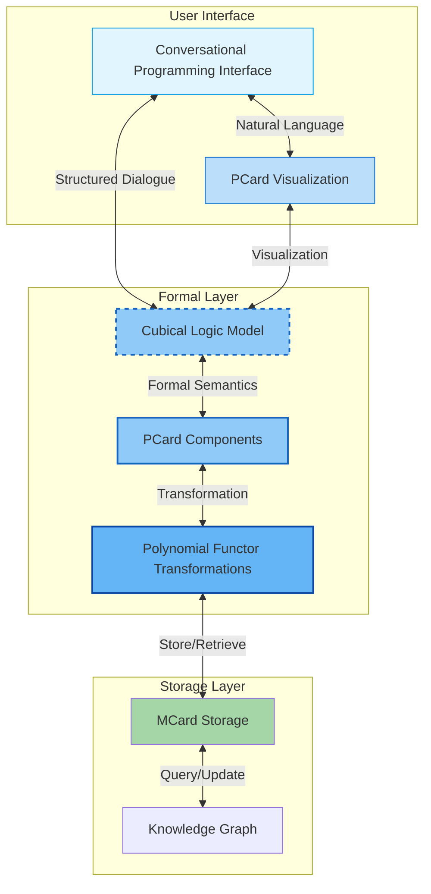
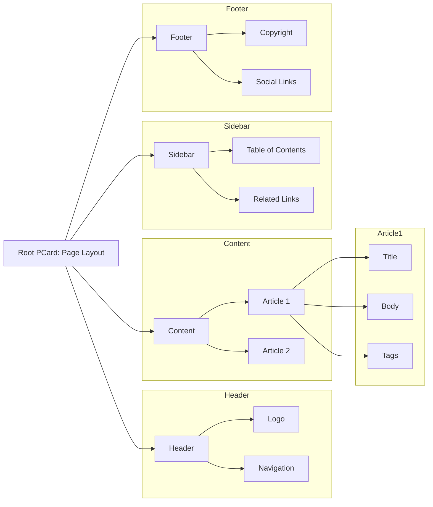

# 🧮 Specification: Polynomial Functor-Based Display Architecture for PKC

## 1. Overview

This specification defines a recursive, compositional UI model based on **[[Polynomial Functor]]**—formally grounded data structures capable of expressing **lattices** and **partial orders**. The core unit of representation is the **PCard ([[Polynomial Card]])**, a specialized implementation of [[MCard]] that composes and represents computable functions exclusively through **MCard hash values**, ensuring complete information integrity and preventing contamination. PCard constructs dependency graphs as polynomial functors, where each function component is referenced only by its cryptographic hash rather than direct content access. This hash-based composition serves as both a layout component and a semantic carrier in the PKC framework, specifically designed to support the **[[Cubical Logic Model]] (CLM)** as a programming interface for **[[Conversational Programming]]**. (Also see [[VCard]].)

> **Note**: Every PCard component is expressed as a polynomial expression using existing or newly created MCard hash values to represent collections of execution events. This creates a cryptographically guaranteed unique execution memory system that enables highly compressed learning about knowledge content.

PCard represents the recursive case in our polynomial functor framework, where MCard provides the linear base case. This duality creates a complete system for representing and manipulating information structures of arbitrary complexity. PCard is specifically designed for the browser environment, leveraging:
- **Execution Event Storage**: Every interaction and computation creates **Execution Event MCards** with cryptographic integrity
- **Recursive JSON/YAML** for flexible, schema-less content representation with execution traces
- **Web Components** for interactive visualization of polynomial functor transformations and their execution histories
- **Reactive Programming** for efficient UI updates during GASing operations with execution event feedback
- **Compressed Knowledge Accumulation**: Learning from execution patterns in a highly compressed, hash-verified manner

Working in concert with MCard's linear structures, PCard enables the GASing Learning System to store, process, and display information while maintaining mathematical rigor. This creates a "place value system" for information manipulation, where operations can be composed and optimized through polynomial functor semantics, and where users can interactively explore the effects of different transformations on their data structures.

This architecture provides a uniform, extensible foundation for **interactive web components**, while also being natively aligned with **[[Machine Learning]] (ML)** workflows—including representation learning, graph-based models, and structure-aware inference tasks. Also see [[Building PCards from Specifications]].

---

## 2. PCard and Conversational Programming

PCard serves as the visualization and interaction layer for the **[[Cubical Logic Model]] (CLM)**, which provides the formal foundation for **[[Conversational Programming]]**. This relationship is crucial for understanding PCard's role in the PKC ecosystem:

### 2.1 CLM as a Programming Interface

The Cubical Logic Model (CLM) serves as a formal programming interface for Conversational Programming, with PCard providing the interactive visualization layer:

1. **Three-Dimensional Representation**
   - **Abstract Specification**: PCard renders type signatures and interfaces
   - **Concrete Implementation**: Interactive code components with live previews
   - **Balanced Expectations**: Test cases and verification results visualization

2. **Interactive Development**
   - Real-time feedback on code changes
   - Visual representation of program states
   - Step-through debugging with CLM's formal semantics

3. **Type-Driven Development**
   - Visual type checking and inference
   - Interactive type hole exploration
   - Polymorphic function visualization

### 2.2 Integration with Conversational Programming

PCard enhances Conversational Programming by providing:

1. **Visual Feedback Loops**
   - Immediate visualization of code changes
   - Interactive exploration of program states
   - Visual diffing of program transformations

2. **Structured Editing**
   - Type-aware code completion
   - Refactoring tools with preview
   - Documentation integration

3. **Collaboration Features**
   - Shared editing interfaces
   - Annotated code discussions
   - Version control visualization

## 3. Motivation

Traditional UI architectures rely on ad hoc tree structures (e.g., DOM) and lack consistent mathematical semantics. The PCard model introduces a formal layer beneath such structures, where all visual and interactive components are represented as **polynomial functor terms**. This:

- Enables **consistency and recursion** across components.
    
- Maps naturally to **differentiable, compositional ML systems**.
    
- Supports **interpretable learning over hierarchical structures**.
    

---

## 3. Core Principles

### 3.1 Polynomial Representation of Computable Knowledge

The foundation of PCard is the representation of computable knowledge as polynomial functors: $F(X) = \sum_{i} A_i \times X^{B_i}$. This polynomial function serves as a formal model where each term $A_i \times X^{B_i}$ represents a distinct, executable component of knowledge, explicitly documented in MCard. The function $F(X)$ captures the complete computational behavior of the knowledge asset, with:

- Each $A_i$ encoding a specific computational aspect: abstract intent (declarative what), concrete implementation (procedural how), or balanced expectations (validation criteria)
- Each $B_i$ defining the computational structure and dependencies between these aspects
- The entire polynomial expression functioning as a content-addressable, executable specification in [[MCard]], which provides this polynomial card with a unique identity bound to its information content.

This functional representation makes the computational content of knowledge explicit and verifiable. When we compose these polynomial functions, we're creating precise, executable compositions where each term's contribution to the final computation is auditable and traceable.

### 3.2 Vector-Based Semantic Embeddings as Polynomial Place Value Systems

At the core of PCard's knowledge representation is the insight that **vector-based semantic embedding tokens are polynomial expressions** that function as sophisticated place value systems:

- **Dimensional Semantics**: Each dimension in the embedding space corresponds to a polynomial term with specific semantic significance
- **Coefficient Values**: Vector coefficients function as place values that encode meaning through their relative magnitudes and positions
- **Semantic Operations**: Similarity measures (dot products, cosine similarity) are polynomial operations that preserve meaning relationships
- **MCard Binding**: Each semantic representation is cryptographically tied to its source data and execution context through MCard hashes

### 3.3 Key Concepts

#### 3.3.1 Polynomial Functors

A **polynomial functor** is a categorical construct that defines data types as algebraic expressions over sums and products, forming the mathematical foundation for [[Why Arithmetize Representations|arithmetized knowledge representation]]. In PKC:

- Each node in the UI tree is a **term** in a polynomial
- Nesting corresponds to **composition of functors**
- Tree structures are interpreted as **lattices**, enabling joins, meets, and morphisms
- Function application becomes **polynomial evaluation**
- Composition becomes **polynomial multiplication**
- Sum types become **polynomial addition**
- Derivatives enable **symbolic program analysis**

#### 3.3.2 PCard (Recursive Polynomial Card)

A **PCard** is a structured, displayable object that implements the [[MCard]] interface while specializing in recursive polynomial-based layout and computation for browser environments. As the recursive counterpart to MCard's linear structure, PCard enables the representation of complex hierarchical data through nested polynomial functors. It serves as the interactive visualization component of the GASing Learning System, with the following key properties:

| Property | Description |
|----------|-------------|
| **Compositionality** | PCards can be nested recursively, forming a tree structure that can be represented using JSON or YAML. |
| **Functoriality** | A uniform transformation function can be lifted over all PCards, maintaining structural integrity. |
| **Mappability** | PCards support injective/extractive mapping from/to ML model inputs/outputs through their vector representations. |
| **Styling Consistency** | CSS (e.g., Tailwind) rules can apply predictably across the hierarchy. |
| **Content-Addressability** | Inherits MCard's content-addressable storage model using cryptographic hashes. |
| **Recursive Data Storage** | Uses JSON/YAML for flexible, schema-less content representation. |
| **Temporal Metadata** | Includes MCard's `g_time` for versioning and provenance tracking. |

### 3.3 The MCard-PCard Duality: Static Representation and Dynamic Evaluation

PCard and MCard form a powerful duality that underpins the entire PKC architecture, representing the fundamental distinction between **Static Representation of content** and **Dynamic Evaluation of Polynomial Expressions**:

#### MCard: Static Representation of Content
- **Immutable Data Tracking**: MCard provides cryptographically-hashed, immutable snapshots of knowledge content at specific points in time
- **Content-Addressable Storage**: Each MCard represents a static, verifiable state of polynomial expression coefficients and structure
- **Execution Event Records**: Captures and preserves static traces of computational behavior as immutable execution history
- **Polynomial Coefficient Storage**: Maintains the static mathematical representation of polynomial functors: $F(X) = \sum_{i} A_i \times X^{B_i}$

#### PCard: Dynamic Evaluation of Polynomial Expressions
- **Real-Time Computation**: Dynamically evaluates polynomial expressions by substituting values and computing results in real-time
- **Interactive Transformation**: Enables live manipulation and evaluation of polynomial functor compositions through user interaction
- **Behavioral Execution**: Transforms static polynomial representations into active, executable computational behaviors
- **Adaptive Processing**: Dynamically adjusts polynomial evaluation strategies based on context, user input, and execution patterns

### 3.4 GASing Learning System: MCard and PCard in Concert

Together, MCard and PCard form the foundation of the GASing Learning System, creating a seamless pipeline from data storage to user interaction:

1. **Unified Data Flow**:


2. **Symmetric Processing**:
   - **MCard → PCard**: Data flows from storage to presentation through polynomial functor transformations
   - **PCard → MCard**: User interactions update the underlying data model while maintaining mathematical consistency

3. **Performance Optimization**:
   - MCard handles bulk data operations and complex computations
   - PCard manages responsive UI updates and user interactions
   - Together they enable real-time manipulation of complex knowledge structures

4. **Learning System Integration**:
   - MCard serves as the "memory" of the learning system
   - PCard provides the "interface" for exploration and discovery
   - Their interaction enables the GASing system to adapt and evolve based on user engagement
   - **Unified Representation**: Both use the same polynomial functor foundation, enabling seamless data flow
   - **Bidirectional Transformation**: The system maintains consistency between MCard's linear representation and PCard's recursive structures through isomorphic transformations

2. **Polynomial Functor Processing**:

### 3.5 Architecture: CLM in the PCard Stack

The following diagram illustrates how PCard integrates with the Cubical Logic Model (CLM) and Conversational Programming in the overall architecture:



#### 3.5.1 Architecture Components

1. **User Interface Layer**
   - **Conversational Programming Interface**: Natural language interaction with the system
   - **PCard Visualization**: Interactive rendering of CLM constructs and program states

2. **Formal Layer**
   - **Cubical Logic Model (CLM)**: The formal foundation ensuring correctness and expressiveness
   - **PCard Components**: Interactive UI elements that render CLM structures
   - **Polynomial Functor Transformations**: Mathematical operations on the underlying data structures

3. **Storage Layer**
   - **MCard Storage**: Content-addressable storage for linear data structures
   - **Knowledge Graph**: Networked representation of relationships between concepts

The dashed border around the Formal Layer components indicates their role in maintaining the formal guarantees of the system while enabling rich user interactions.

#### Performance Considerations

- **Lazy Loading**: PCards can be partially loaded based on viewport visibility
- **Change Propagation**: Updates are batched and optimized to minimize re-renders
- **Differential Updates**: Only changed portions of the data structure are synchronized
- **Memory Management**: Unused PCard components are garbage collected while preserving MCard data

#### Error Handling and Validation

- **Schema Validation**: Ensures data integrity during MCard-PCard transformations
- **Recovery Mechanisms**: Automatic fallback to last valid state on transformation errors
- **Consistency Checks**: Periodic verification of MCard-PCard consistency
- **Conflict Resolution**: Strategies for handling concurrent modifications


#### Performance Optimization Techniques

1. **Memoization**: Cache expensive computations in PCard components
2. **Virtualization**: Only render visible PCard components
3. **Web Workers**: Offload heavy computations from the main thread
4. **Incremental Updates**: Apply changes in small, non-blocking batches

#### Security Considerations

- **Content Security Policy (CSP)**: Properly configured for dynamic content
- **Input Sanitization**: Prevent XSS and injection attacks
- **Access Control**: Fine-grained permissions for MCard access and modification
- **Audit Logging**: Track all transformations between MCard and PCard representations
   - **Shared Semantics**: Both implement the same mathematical structure, ensuring consistency across the stack
   - **Efficient Transformations**: Operations can be pushed to the most appropriate layer (browser or server)
   - **Learnable Representations**: The system as a whole enables efficient learning and adaptation of information structures

3. **Information Flow**:
   ```mermaid
   graph TD
   A[Database] <-->|MCard| B[Tensor Processing]
   B <-->|MCard-PCard| C[Browser]
   C <-->|User Interaction| D[PCard Visualization]
   D <-->|Polynomial Ops| E[Learnable Representations]
   ```

4. **Place Value System**:
   - Information is treated as "digits" in a polynomial number system
   - Operations can be composed and optimized using polynomial algebra
   - Enables arithmetic-like manipulation of complex information structures

1. **Specialization of MCard**:
   - PCard inherits MCard's core properties (content-addressability, immutability, temporal metadata)
   - Adds polynomial functor semantics for layout and computation
   - Implements MCard's vector-based knowledge representation

2. **Recursive Data Types**:
   - PCard uses JSON/YAML for content storage, allowing flexible, schema-less data structures
   - This approach minimizes the need for rigid type definitions
   - Enables dynamic composition and decomposition of content

3. **Display and Computation**:
   - PCard makes explicit the dual nature of cards as both display units and computational units
   - The polynomial structure enables efficient layout calculations
   - Supports semantic zooming across different levels of abstraction

4. **Reduced Domain Coupling**:
   - By using generic recursive data structures, PCard minimizes domain-specific knowledge in its core
   - Domain semantics are layered on top of the base polynomial structure
   - Enables greater reusability across different application domains

---

## 4. Architecture

### 4.1 Recursive Layout Representation

The entire UI layout is represented as a recursive polynomial functor. Consider the structure:



This tree forms a **[[lattice]]**, with a clear hierarchical ordering and well-defined joins (e.g., merging articles) or meets (e.g., intersecting sidebar + content dependencies).

---

## 5. Benefits for Machine Learning

### 5.1 Structural Supervision

- PCards serve as **supervision scaffolds** for structure-aware models (e.g., GNNs, Transformers over trees).
    
- The polynomial structure enables **[[semantic regularization]]** across layout levels.
    

### 5.2 Consistent Embedding Pipelines

- Each PCard can be encoded into an **embedding vector** with metadata, style, content, and role.
    
- Recursive mappings allow function lifting (fmap), suitable for building **interpretable vector hierarchies**.
    

### 5.3 Efficient Data Labeling

- Since layout is recursively defined and interpretable, **semi-supervised labeling** can propagate from root PCards downward.
    
- Enables **automatic weak labeling** via layout rules and CSS hints.
    

### 5.4 Generative Layout Models

- A sequence of PCard terms forms a structured generative model (e.g., **autoregressive layout synthesis**).
    
- Suitable for **diffusion models** over page structures, or **[[VAE-style latent traversals]]**.
    

---

## 6. Integration with ML Workflows

|Use Case|Description|
|---|---|
|**Representation Learning**|PCards can be encoded into graph/tree representations for training ML models.|
|**Graph Neural Networks**|The recursive structure maps directly to GNN architectures.|
|**Attention Mechanisms**|Polynomial coefficients can serve as attention weights in transformer models.|
|**Reinforcement Learning**|PCard interactions generate reward signals for RL training.|
|**Semi-Supervised Learning**|Layout semantics provide weak supervision signals.|
|**Transfer Learning**|Polynomial representations enable cross-domain knowledge transfer.|

## 7. Agentic Architecture Integration and Modern AI Systems

### 7.1 Model Context Protocol (MCP) Compatibility

The PCard architecture is designed for seamless integration with modern agentic systems through industry-standard protocols like **[[Model Context Protocol]]** (MCP). This integration leverages the polynomial functor foundation to create a theoretically sound and practically efficient interface for AI agents.

#### MCP Tool Interface Design

PCard components can be exposed as MCP tools, enabling LLMs and AI agents to interact with knowledge structures through standardized function calls:

```typescript
interface PCardMCPTool {
  name: string;
  description: string;
  inputSchema: {
    type: "object";
    properties: {
      // Polynomial functor parameters
      coefficients: { type: "array", items: { type: "number" } };
      exponents: { type: "array", items: { type: "integer" } };
      context_hash: { type: "string" }; // MCard reference
      operation: { 
        type: "string", 
        enum: ["evaluate", "compose", "differentiate", "integrate"]
      };
    };
  };
}
```

#### Function Call Architecture

The polynomial functor structure enables systematic function composition that aligns perfectly with MCP's tool-calling paradigm:

1. **Atomic Operations**: Each PCard function corresponds to a polynomial term
2. **Compositional Calls**: Complex operations are built through polynomial multiplication
3. **Semantic Preservation**: Function composition maintains semantic meaning through vector operations
4. **Error Propagation**: Polynomial derivatives enable systematic error analysis

### 7.2 LLM Integration Through Vectorized Embeddings

#### Place-Value System for Semantic Encoding

Following the principles established in **[[place-value notation]]**, PCard leverages polynomial functor structures to encode semantic information in a theoretically sound manner:

$$\text{Semantic}(concept) = \sum_{i=0}^{n} e_i \times p^i$$

Where:
- **$e_i$**: Embedding coefficients representing semantic dimensions
- **$p$**: Prime base ensuring collision resistance (as detailed in **[[Prime Numbers in Polynomial Hashing and Godel Numbering]]**)
- **$n$**: Dimensionality of the semantic space

This encoding provides several critical advantages:

1. **Compositional Semantics**: Meaning composition follows polynomial arithmetic
2. **Efficient Similarity**: Distance calculations leverage polynomial evaluation
3. **Hierarchical Organization**: Positional significance enables systematic knowledge organization
4. **Semantic Consistency**: Mathematical structure ensures consistent meaning preservation

#### Vector Embedding as Polynomial Expressions

Modern LLM embeddings can be interpreted as polynomial functor coefficients, enabling direct integration with PCard's mathematical framework:

```python
class SemanticPCard:
    def __init__(self, embedding_vector: np.ndarray, base_prime: int = 31):
        self.coefficients = embedding_vector
        self.base = base_prime
        self.polynomial_hash = self._compute_polynomial_hash()
    
    def _compute_polynomial_hash(self) -> int:
        """Convert embedding to polynomial hash using place-value structure"""
        return sum(
            coeff * (self.base ** i) 
            for i, coeff in enumerate(self.coefficients)
        ) % (2**31 - 1)
    
    def semantic_similarity(self, other: 'SemanticPCard') -> float:
        """Compute similarity using polynomial distance metrics"""
        return 1.0 - abs(self.polynomial_hash - other.polynomial_hash) / (2**31 - 1)
    
    def compose_semantics(self, other: 'SemanticPCard') -> 'SemanticPCard':
        """Semantic composition through polynomial multiplication"""
        composed_coeffs = np.convolve(self.coefficients, other.coefficients)
        return SemanticPCard(composed_coeffs, self.base)
```

### 7.3 Agentic Workflow Enhancement

#### Systematic Knowledge Accumulation

The polynomial functor architecture enables agentic systems to accumulate knowledge in a mathematically principled manner:

1. **Incremental Learning**: New knowledge is integrated through polynomial addition
2. **Knowledge Composition**: Complex concepts emerge through polynomial multiplication
3. **Semantic Refinement**: Polynomial derivatives enable gradient-based optimization
4. **Memory Compression**: Polynomial coefficients provide efficient knowledge encoding

#### Context-Aware Function Execution

PCard's integration with **[[Cubical Logic Model]]** enables context-aware function execution that maintains formal guarantees:

```python
class AgenticPCard:
    def __init__(self, abstract_spec: MCard, concrete_impl: MCard, balanced_exp: MCard):
        self.specification = abstract_spec
        self.implementation = concrete_impl
        self.expectations = balanced_exp
        self.execution_context = self._build_context()
    
    def execute_with_context(self, inputs: Dict, agent_context: Dict) -> ExecutionResult:
        """Execute function with full agentic context preservation"""
        # 1. Validate inputs against specification
        spec_validation = self._validate_against_spec(inputs)
        
        # 2. Execute with polynomial context tracking
        execution_events = []
        result = self._execute_implementation(inputs, execution_events)
        
        # 3. Verify against balanced expectations
        expectation_check = self._verify_expectations(result, execution_events)
        
        # 4. Generate execution event MCard
        execution_mcard = self._create_execution_mcard(
            inputs, result, execution_events, agent_context
        )
        
        return ExecutionResult(
            result=result,
            validation=spec_validation,
            verification=expectation_check,
            execution_trace=execution_mcard
        )
```

### 7.4 Theoretical Advantages for Information Storage and Retrieval

#### Complete Namespace Management

The polynomial functor approach provides theoretically complete namespace management through systematic encoding principles:

1. **Unique Identification**: Every knowledge element receives a unique polynomial fingerprint
2. **Hierarchical Organization**: Place-value structure enables systematic categorization
3. **Efficient Retrieval**: Polynomial evaluation enables logarithmic lookup times
4. **Semantic Consistency**: Mathematical structure ensures consistent meaning preservation

#### Formal Verification of AI Reasoning

The integration of PCard with **[[Godel Number]]** encoding and **[[Namespace]]** management enables formal verification of AI reasoning processes:

```python
class VerifiablePCard:
    def __init__(self, polynomial_spec: PolynomialFunctor):
        self.spec = polynomial_spec
        self.godel_encoding = self._compute_godel_number()
        self.namespace_position = self._assign_namespace_position()
    
    def verify_reasoning_chain(self, reasoning_steps: List[PCard]) -> bool:
        """Formally verify a chain of reasoning using polynomial composition"""
        composed_polynomial = self._compose_reasoning_chain(reasoning_steps)
        return self._verify_polynomial_consistency(composed_polynomial)
    
    def _compose_reasoning_chain(self, steps: List[PCard]) -> PolynomialFunctor:
        """Compose reasoning steps through polynomial multiplication"""
        result = PolynomialFunctor.identity()
        for step in steps:
            result = result.compose(step.polynomial_representation)
        return result
```

#### Storage Efficiency Through Mathematical Compression

The polynomial functor structure enables highly efficient storage through mathematical compression:

1. **Coefficient Compression**: Sparse polynomials require minimal storage
2. **Structural Sharing**: Common polynomial terms can be shared across PCards
3. **Incremental Updates**: Changes require only coefficient adjustments
4. **Lossless Compression**: Mathematical structure preserves all semantic information

### 7.5 Integration with Modern AI Architectures

#### Transformer Compatibility

PCard's polynomial structure aligns naturally with transformer architectures:

- **Attention Weights**: Polynomial coefficients serve as attention mechanisms
- **Positional Encoding**: Place-value structure provides systematic position encoding
- **Multi-Head Attention**: Different polynomial terms represent different attention heads
- **Layer Composition**: Transformer layers correspond to polynomial composition

#### Vector Database Integration

The polynomial encoding enables seamless integration with modern vector databases:

```python
class PCardVectorStore:
    def __init__(self, dimension: int, base_prime: int = 31):
        self.dimension = dimension
        self.base = base_prime
        self.polynomial_index = self._build_polynomial_index()
    
    def store_pcard(self, pcard: PCard) -> str:
        """Store PCard with polynomial indexing"""
        vector_embedding = pcard.to_vector_embedding()
        polynomial_hash = self._compute_polynomial_hash(vector_embedding)
        
        # Store with both vector and polynomial indices
        self.vector_store.add(vector_embedding, pcard.hash)
        self.polynomial_index[polynomial_hash] = pcard.hash
        
        return pcard.hash
    
    def semantic_search(self, query_vector: np.ndarray, k: int = 10) -> List[PCard]:
        """Search using both vector similarity and polynomial structure"""
        # 1. Vector similarity search
        vector_candidates = self.vector_store.search(query_vector, k * 2)
        
        # 2. Polynomial structure refinement
        query_poly_hash = self._compute_polynomial_hash(query_vector)
        poly_candidates = self._find_polynomial_neighbors(query_poly_hash)
        
        # 3. Combine and rank results
        return self._combine_search_results(vector_candidates, poly_candidates, k)
```

### 7.6 Practical Benefits for AI Systems

#### Enhanced Interpretability

The polynomial functor structure provides unprecedented interpretability for AI systems:

1. **Mathematical Transparency**: All operations have clear mathematical meaning
2. **Compositional Analysis**: Complex behaviors can be decomposed into simple polynomial terms
3. **Causal Tracing**: Polynomial derivatives enable systematic causal analysis
4. **Error Attribution**: Mathematical structure enables precise error localization

#### Improved Reliability

The formal mathematical foundation ensures system reliability:

1. **Type Safety**: Categorical structure prevents type errors
2. **Semantic Consistency**: Mathematical operations preserve meaning
3. **Formal Verification**: Polynomial properties enable automated verification
4. **Predictable Behavior**: Mathematical laws ensure consistent system behavior

#### Scalable Performance

The polynomial structure enables efficient scaling:

1. **Parallel Computation**: Independent polynomial terms can be computed in parallel
2. **Incremental Updates**: Changes require minimal recomputation
3. **Memory Efficiency**: Polynomial compression reduces memory requirements
4. **Cache Optimization**: Mathematical structure enables intelligent caching strategies

This integration of PCard with modern agentic architectures represents a significant advancement in AI system design, providing both theoretical soundness and practical efficiency for next-generation AI applications.

# References
```dataview 
Table title as Title, authors as Authors
where contains(subject, "PCard")
sort title, authors, modified
```