# PKC: Progressive Knowledge Container Implementation Guide

## Executive Summary

PKC (Progressive Knowledge Container) is a **modular, card-based web application** built on **Astro Islands Architecture** and **libP2P modular networking** that implements a triadic system for self-sovereign knowledge management and community learning. The system treats every piece of content as an atomic "Card" component, leveraging **MCard** as the universal storage foundation, **PCard** for compositional logic, and **VCard** for security boundaries and value exchange over distributed networks.

### Core Implementation Philosophy: Islands Architecture with Modular Networking

PKC adopts Astro's Islands Architecture paradigm enhanced with **libP2P modular networking** for universal connectivity:

- **Everything is a Card**: All content, components, and interactions are first stored as atomic MCards with IPFS-compatible content addressing
- **Hash-Based Composition**: PCards compose Astro Components and Hydrated HTML JSX components through cryptographic hash references
- **Selective Hydration**: Only interactive components are hydrated on the client, optimizing performance
- **Local-First Foundation**: All data resides in embedded databases with global P2P networking through libP2P and IPFS
- **Universal Connectivity**: libP2P enables seamless networking across any devices and network conditions
- **Distributed Content Addressing**: IPFS integration provides content-addressable storage that works across the global network

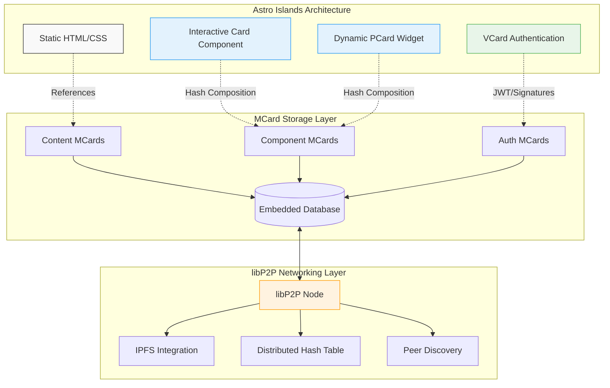

### Upgradable Architecture Pattern with Distributed Networking

PKC implements **upgradable smart contract design patterns** enhanced with **modular networking capabilities**, ensuring:

- **Continuous Evolution**: Software infrastructure evolves without breaking existing functionality
- **Version Compatibility**: Hash-based references maintain backward compatibility across network nodes
- **Modular Upgrades**: Individual cards and components can be upgraded independently across the P2P network
- **Global Integration**: Local-first data synchronizes with distributed systems through libP2P protocols
- **Universal Connectivity**: libP2P's modular networking enables operation across any network topology
- **Content Distribution**: IPFS provides efficient, decentralized content distribution and caching

### Networking-Enabled Value Exchange

The **modular networking foundation** is crucial for VCard's value-carrying capabilities:

- **Secure P2P Transactions**: libP2P's security model provides cryptographic guarantees for value exchange
- **Distributed Authentication**: JWT tokens and hash-based signatures work across P2P networks
- **Network-Agnostic Operation**: Value exchange works across any network configuration
- **Resilient Connectivity**: DHT-based peer discovery ensures robust network participation

The system serves as the foundational infrastructure for the Extreme Learning Process (XLP), combining decentralized Web5 architecture with formal computational structures and modular networking to create environments where individuals and communities maintain full control over their knowledge assets while leveraging advanced AI capabilities through modular, upgradable components that operate seamlessly across distributed networks.

### Core Implementation Philosophy: Islands Architecture

PKC adopts Astro's Islands Architecture paradigm where:

- **Everything is a Card**: All content, components, and interactions are first stored as atomic MCards
- **Hash-Based Composition**: PCards compose Astro Components and Hydrated HTML JSX components through cryptographic hash references
- **Selective Hydration**: Only interactive components are hydrated on the client, optimizing performance
- **Local-First Foundation**: All data resides in embedded databases with global API integration through upgradable patterns

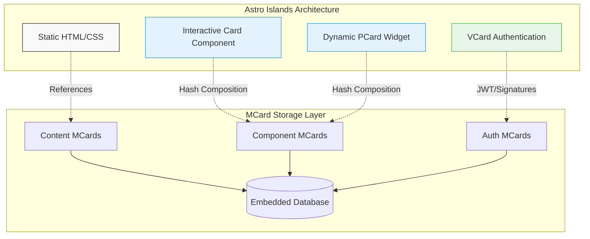

### Upgradable Architecture Pattern

PKC implements **upgradable smart contract design patterns** from functional configuration management, ensuring:

- **Continuous Evolution**: Software infrastructure evolves without breaking existing functionality
- **Version Compatibility**: Hash-based references maintain backward compatibility
- **Modular Upgrades**: Individual cards and components can be upgraded independently
- **Global Integration**: Local-first data synchronizes with legacy systems through standardized APIs

The system serves as the foundational infrastructure for the Extreme Learning Process (XLP), combining decentralized Web5 architecture with formal computational structures to create environments where individuals and communities maintain full control over their knowledge assets while leveraging advanced AI capabilities through modular, upgradable components.

### Core Implementation Philosophy

PKC implements a **resource-aware computational infrastructure** that adapts to available hardware and network conditions while maintaining mathematical rigor. The system is designed to:

- **Scale from personal to community use** through fractal architectural patterns
- **Operate offline-first** with eventual consistency across distributed nodes
- **Integrate with modern AI systems** while preserving data sovereignty
- **Support progressive enhancement** from simple document storage to complex knowledge networks

## 1. Triadic Architecture Overview: Card-Based Modular Web Implementation with Distributed Networking

PKC's implementation is organized around three complementary architectural planes that map directly to Astro Islands Architecture patterns, all built on a **libP2P modular networking foundation** that provides universal connectivity across any devices and networks. Each plane represents a different aspect of modular, card-based web development enhanced with distributed networking capabilities:

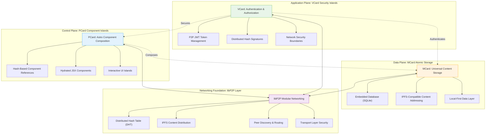

### 1.1 Card-Based Implementation Principles with Distributed Networking

Each plane operates as a modular layer in the Astro Islands Architecture, enhanced with libP2P networking capabilities:

- **Atomic Card Storage**: Every piece of content, component definition, and security token is first stored as an atomic MCard with IPFS-compatible content addressing
- **Hash-Based Composition**: PCards reference MCards through cryptographic hashes that work seamlessly across P2P networks
- **Selective Security Hydration**: VCards provide authentication islands that activate only when security validation is needed, with distributed authentication support
- **Upgradable Pattern Integration**: Components can evolve through versioned hash references without breaking existing functionality across network nodes
- **Universal Connectivity**: libP2P enables seamless operation across any network topology, from local networks to global internet
- **Content Distribution**: IPFS integration provides efficient, decentralized content distribution and caching

### 1.2 Astro Islands Mapping with P2P Networking

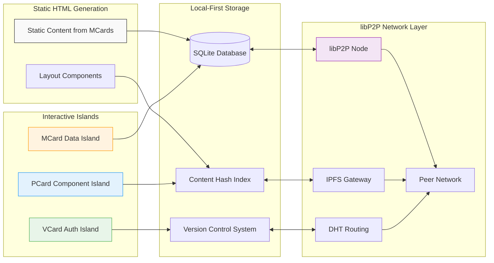

### 1.3 Modular Networking Foundation

**libP2P Integration Benefits:**
- **Transport Agnostic**: Works over TCP, WebSockets, WebRTC, and other transport protocols
- **Modular Security**: Pluggable security protocols including TLS, Noise, and Secio
- **Peer Discovery**: Automatic peer discovery through DHT, mDNS, and bootstrap nodes
- **Content Routing**: Efficient content discovery and routing through Kademlia DHT
- **Stream Multiplexing**: Multiple streams over single connections for efficient networking

**IPFS Content Addressing:**
- **Content-Addressable Storage**: MCard hashes are compatible with IPFS content identifiers (CIDs)
- **Distributed Caching**: Content automatically cached across network participants
- **Deduplication**: Identical content shares the same hash across the entire network
- **Offline Availability**: Content remains accessible through local cache when offline

This architecture ensures that:
- **Static content is pre-rendered** from MCard storage for optimal performance
- **Interactive components hydrate selectively** based on user interaction needs
- **Security boundaries are enforced** through VCard authentication islands with P2P security
- **All data remains local-first** with embedded database storage
- **Universal connectivity** is maintained through libP2P modular networking
- **Content distribution** is efficient and decentralized through IPFS integration

## 2. MCard: Universal Atomic Storage Foundation with IPFS Integration

**MCard** serves as the **universal storage foundation** for all content in PKC's Astro Islands Architecture, enhanced with **IPFS-compatible content addressing** and **libP2P networking integration**. Every piece of content—from static HTML to component definitions to authentication tokens—is first stored as an atomic MCard with cryptographic hashes that work seamlessly across distributed networks before being composed into Astro components.

### 2.1 Core Data Structure with IPFS Compatibility

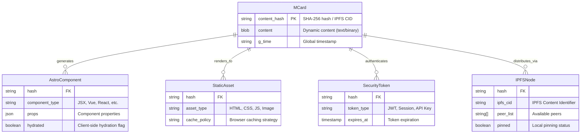

**Core Attributes:**
- `content_hash`: SHA-256 cryptographic hash serving as primary key, integrity verification, and IPFS-compatible content identifier
- `content`: Dynamic BLOB storage for any content type (text, binary, media, component definitions)
- `g_time`: Global timestamp for temporal ordering and versioning across distributed networks

**Computable Functions:**
- `content_type()`: Dynamically determines MIME type from content analysis
- `metadata()`: Extracts structured information from content as needed
- `to_astro_component()`: Converts MCard content to Astro component definition
- `to_static_asset()`: Renders MCard content as static HTML/CSS/JS
- `to_ipfs_cid()`: Generates IPFS-compatible Content Identifier for distributed storage
- `resolve_peers()`: Discovers peers hosting the same content through DHT

### 2.2 Embedded Database with libP2P Integration

PKC implements a **local-first architecture** using embedded databases enhanced with **libP2P networking** for distributed content discovery and synchronization:

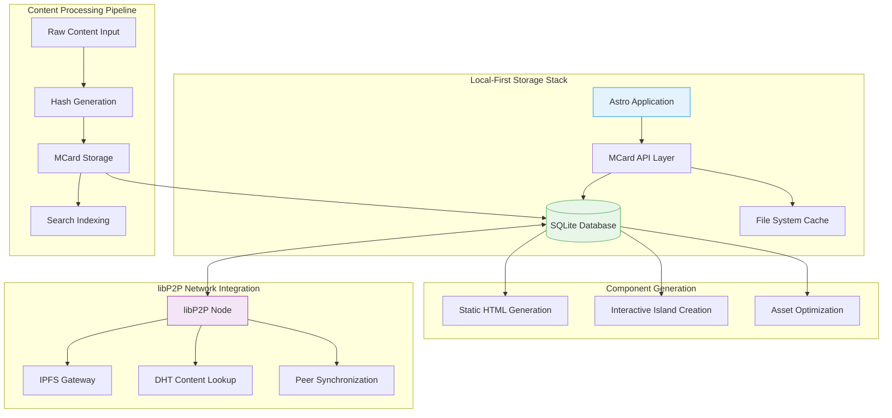

**Local-First Features with Distributed Capabilities:**
- **SQLite Embedded Database**: All MCard data stored locally for instant access
- **IPFS-Compatible Indexing**: Hash-based lookup with IPFS Content Identifier (CID) support
- **Offline-First Operation**: Full functionality without network connectivity
- **Distributed Content Discovery**: Automatic content discovery through DHT when online
- **Peer-to-Peer Synchronization**: Efficient sync with network peers through libP2P protocols
- **Content Pinning**: Strategic local caching of frequently accessed content

### 2.3 Astro Integration Patterns with Distributed Storage

**Everything-as-MCard Pattern with Network Distribution:**
1. **Content Creation**: All content (markdown, images, data) stored as MCards with IPFS CIDs
2. **Component Definition**: Astro component templates stored as MCards, discoverable via DHT
3. **Configuration**: Build settings and routing rules stored as MCards, synchronized across nodes
4. **Assets**: Static files and media stored as MCards with distributed caching optimization

**Hash-Based Composition with Network Resilience:**
```typescript
// Example: MCard to Astro Component mapping with P2P support
interface MCardToAstroMapping {
  mcard_hash: string;           // Local hash
  ipfs_cid?: string;           // IPFS Content Identifier
  component_path: string;
  props: Record<string, any>;
  hydration_strategy: 'load' | 'idle' | 'visible' | 'media';
  
  // Network availability
  network_availability: {
    local_available: boolean;
    peers_available: string[];   // List of peer IDs hosting this content
    last_seen: Date;
  };
}

// Astro component with network-aware content resolution
const BlogPost = ({ mcard_hash }: { mcard_hash: string }) => {
  const content = await MCard.resolveWithNetwork(mcard_hash, {
    prefer_local: true,
    fallback_to_peers: true,
    timeout_ms: 5000
  });
  return <article>{content.render()}</article>;
};
```

### 2.4 Upgradable Pattern Implementation with Distributed Versioning

**Network-Aware Version Management:**
- MCard hashes provide immutable references to specific content versions across the network
- Component upgrades create new MCards that are automatically distributed to interested peers
- DHT-based version discovery enables automatic updates when new versions are available
- Gradual migration through hash-based version resolution with network consensus

**Distributed Smart Contract-Inspired Upgrades:**
- **Proxy Pattern**: PCards act as proxies to current MCard versions, with network-wide version resolution
- **Registry Pattern**: Distributed registry maps component names to current MCard hashes across peers
- **Migration Scripts**: Automated tools for updating hash references across the distributed network
- **Consensus Mechanisms**: Network-wide agreement on canonical versions through DHT consensus

### 2.5 Content Distribution and Caching Strategy

**IPFS-Based Content Distribution:**
```typescript
interface ContentDistributionStrategy {
  // Local storage preferences
  local_storage: {
    pin_frequently_accessed: boolean;
    cache_size_limit: number;     // MB
    eviction_policy: 'lru' | 'lfu' | 'ttl';
  };
  
  // Network distribution
  network_distribution: {
    auto_announce: boolean;       // Announce new content to DHT
    replication_factor: number;   // Desired number of peer copies
    preferred_peers: string[];    // Preferred peer IDs for content
  };
  
  // Synchronization behavior
  sync_behavior: {
    sync_on_startup: boolean;
    periodic_sync_interval: number; // seconds
    conflict_resolution: 'timestamp' | 'hash' | 'manual';
  };
}
```

This enhanced MCard architecture ensures that:
- **Content is universally addressable** through IPFS-compatible hashing
- **Local-first operation** maintains performance and offline capability
- **Distributed discovery** enables content sharing across network participants
- **Automatic synchronization** keeps content up-to-date across peers
- **Network resilience** provides multiple sources for content availability

## 3. PCard: Conversational Programming Engine with Interactive Testing

**PCard** serves as the **Control Plane** that enables **Conversational Programming** and systematic knowledge accumulation of well-cataloged functions. Unlike traditional function composition systems, PCard creates an interactive testing environment similar to Conversational Programming or Vibe Coding, where users continuously explore and expand the behavior space of functions under test through incremental test case accumulation.

### 3.1 Conversational Programming Architecture

PCard transforms function development from a one-time activity into an **ongoing conversation with the code**, where each interaction builds upon previous knowledge while maintaining mathematical rigor through polynomial functor structures:

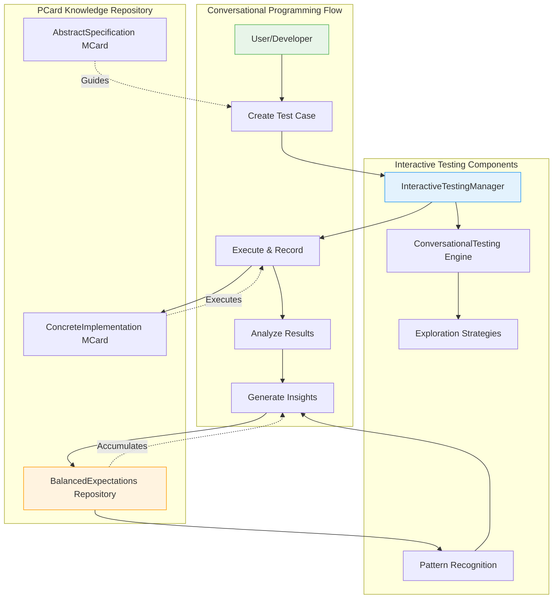

### 3.2 Interactive Testing Through Polynomial Functors

PCard's polynomial functor structure powers an interactive testing environment where:

- **Coefficients as Test Cases**: Each coefficient in the polynomial represents a distinct test case stored as an immutable MCard
- **Exponents as Execution Counts**: Each exponent captures the number of times a test case has been executed, creating natural accumulation
- **Interactive Evolution**: The polynomial grows through conversational exploration, with new test cases adding coefficients and repeated executions incrementing exponents
- **Persistent Context**: The PCard serves as a stable reference point that accumulates knowledge over time

### 3.3 Systematic Knowledge Accumulation

The hash-based retrieval system ensures comprehensive knowledge accumulation:

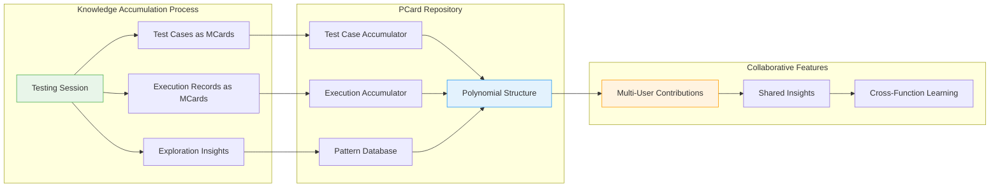

### 3.4 Integration with Astro Islands Architecture

PCard seamlessly integrates with Astro Islands for optimal web performance:

**Component Generation Process:**
1. **MCard Storage**: All PCard components are first stored as MCards with content-addressable hashing
2. **Astro Component Mapping**: Each PCard generates corresponding Astro components for web interfaces
3. **Selective Hydration**: Only interactive testing components are hydrated on the client
4. **Hash-Based Composition**: Components compose through cryptographic hash references

**Interactive Islands:**
- **Testing Interface Islands**: Interactive components for test case creation and execution
- **Visualization Islands**: Dynamic charts and graphs for performance analysis
- **Collaboration Islands**: Real-time collaborative testing interfaces
- **Pattern Recognition Islands**: Interactive pattern discovery and insight visualization

### 3.5 Conversational Programming Features

**Interactive Testing Manager:**
```typescript
// Example: Creating and executing test cases through conversation
class InteractiveTestingManager {
  async createAndAssociateTestCase(
    pcardHash: string,
    input: any,
    expectedOutput?: any
  ): Promise<string> {
    // Store test case as MCard
    const testCaseHash = await this.storeMCard(testCase);
    
    // Associate with PCard polynomial structure
    const pcard = await this.retrievePCard(pcardHash);
    pcard.validationRepository.polynomial.coefficients.push(testCaseHash);
    pcard.validationRepository.polynomial.exponents.push(1);
    
    return testCaseHash;
  }
}
```

**Conversational Testing Engine:**
- **Adaptive Exploration**: Testing strategies that evolve based on previous results
- **Boundary Discovery**: Automatic probing of edge cases and boundary conditions
- **Performance Profiling**: Real-time performance analysis and optimization suggestions
- **Collaborative Intelligence**: Multi-user contributions to the same function's knowledge base

### 3.6 Local-First Implementation with P2P Networking

PCard operates on a **local-first architecture** enhanced with **libP2P networking**:

**Local Storage:**
- All test cases and execution records stored in embedded databases
- Immediate access to testing history and insights
- Offline-capable testing and exploration

**P2P Synchronization:**
- Share test cases and insights across distributed networks
- Collaborative testing sessions with remote participants
- Knowledge reuse across similar functions in the network

**IPFS Integration:**
- Content-addressable storage for test cases and execution records
- Efficient distribution of testing insights and patterns
- Decentralized backup and recovery of testing knowledge

### 3.6.1 Diverse Execution Providers

PCard's Concrete Implementation dimension provides a **REPL-like execution wrapper** that can trigger diverse execution providers including:

- **Traditional Computational Functions**: Standard programming language functions and methods
- **LLM Inference Engines**: Large Language Model APIs and inference endpoints for natural language processing 
- **MCP Tool Providers**: Model Context Protocol tools and service providers
- **External API Services**: Third-party services with defined interfaces
- **Distributed Computing Resources**: Remote execution environments and compute services
- **Smart Contract Environments**: Blockchain and distributed ledger execution contexts
- **Embedded Systems**: IoT devices and hardware interfaces

This universal execution layer works by collecting test case data as input arguments and producing execution results for association with the PCard instance, creating a unified interface for interactive testing regardless of the underlying execution provider.

## 4. VCard: Formal Security Boundary Implementation

**VCard** implements **formal security boundaries** within PKC's Astro Islands Architecture, providing authentication and authorization through hash-based signatures and JWT tokens. VCards create secure authentication islands that protect sensitive components and data while maintaining the local-first, upgradable architecture patterns.

### 4.1 Security Islands Architecture

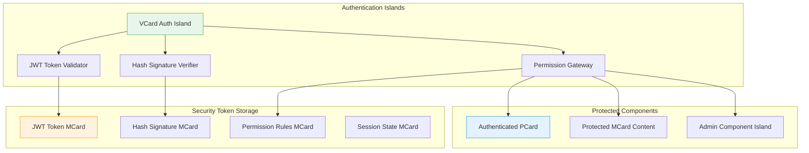

### 4.2 JWT-Based Authentication Pattern

**Local-First JWT Management:**
```typescript
interface VCardAuthSpec {
  // Core identification
  vcard_hash: string;
  auth_type: 'jwt' | 'signature' | 'session' | 'api_key';
  
  // JWT Configuration
  jwt_config: {
    issuer: string;
    audience: string;
    secret_mcard: string;      // Secret stored as MCard
    expiration: number;        // Token lifetime in seconds
    refresh_strategy: 'sliding' | 'absolute' | 'none';
  };
  
  // Hash-based signature verification
  signature_config: {
    algorithm: 'SHA-256' | 'SHA-512' | 'BLAKE3';
    public_key_mcard: string;  // Public key stored as MCard
    signature_mcard: string;   // Signature stored as MCard
  };
  
  // Permission mapping
  permissions: {
    [resource: string]: {
      mcard_patterns: string[];  // MCard hash patterns
      pcard_patterns: string[];  // PCard hash patterns
      actions: ('read' | 'write' | 'delete' | 'execute')[];
    };
  };
}
```

**Embedded Authentication Database:**
```typescript
interface AuthenticationStore {
  // Local JWT storage
  active_tokens: Map<string, {
    jwt: string;
    expires_at: Date;
    permissions: string[];
    user_hash: string;         // User identity MCard hash
  }>;
  
  // Session management
  sessions: Map<string, {
    session_id: string;
    vcard_hash: string;        // Auth VCard reference
    created_at: Date;
    last_accessed: Date;
    is_valid: boolean;
  }>;
  
  // Permission cache
  permission_cache: Map<string, {
    user_hash: string;
    resource_hash: string;
    allowed_actions: string[];
    cached_at: Date;
  }>;
}
```

### 4.3 Hash-Based Security Verification

**Content Integrity and Authentication:**
```typescript
class VCardSecurityEngine {
  // Verify content integrity using hash signatures
  static async verifyContentIntegrity(
    mcard_hash: string,
    signature_vcard: string
  ): Promise<boolean> {
    const content = await MCard.resolve(mcard_hash);
    const signature_spec = await VCard.resolve(signature_vcard);
    
    const computed_hash = await this.computeHash(content.content);
    const expected_hash = signature_spec.signature_config.signature_mcard;
    
    return computed_hash === expected_hash;
  }
  
  // JWT validation with local verification
  static async validateJWT(
    token: string,
    vcard_hash: string
  ): Promise<AuthResult> {
    const auth_spec = await VCard.resolve(vcard_hash);
    const secret = await MCard.resolve(auth_spec.jwt_config.secret_mcard);
    
    try {
      const payload = jwt.verify(token, secret.content);
      return { valid: true, payload, permissions: payload.permissions };
    } catch (error) {
      return { valid: false, error: error.message };
    }
  }
  
  // Permission-based component access control
  static async checkComponentAccess(
    user_hash: string,
    pcard_hash: string,
    action: string
  ): Promise<boolean> {
    const user_permissions = await this.getUserPermissions(user_hash);
    const component_requirements = await this.getComponentRequirements(pcard_hash);
    
    return this.evaluatePermissions(user_permissions, component_requirements, action);
  }
}
```

### 4.4 Secure Component Islands

**Authentication-Aware Component Rendering:**
```typescript
interface SecureIslandConfig {
  // Component security requirements
  auth_required: boolean;
  min_permission_level: 'read' | 'write' | 'admin';
  allowed_roles: string[];
  
  // Fallback behavior for unauthenticated users
  fallback_strategy: 'redirect' | 'hide' | 'show_login' | 'show_placeholder';
  fallback_component?: string;  // PCard hash for fallback
  
  // Security-aware hydration
  hydration_security: {
    encrypt_props: boolean;
    secure_transport_only: boolean;
    csrf_protection: boolean;
  };
}

// Astro component with VCard security integration
const SecureComponent = ({ 
  pcard_hash, 
  vcard_hash, 
  user_token 
}: SecureComponentProps) => {
  const [isAuthenticated, setIsAuthenticated] = useState(false);
  const [hasPermission, setHasPermission] = useState(false);
  
  useEffect(() => {
    VCardSecurityEngine.validateJWT(user_token, vcard_hash)
      .then(result => {
        setIsAuthenticated(result.valid);
        if (result.valid) {
          return VCardSecurityEngine.checkComponentAccess(
            result.payload.sub, 
            pcard_hash, 
            'read'
          );
        }
        return false;
      })
      .then(setHasPermission);
  }, [user_token, vcard_hash, pcard_hash]);
  
  if (!isAuthenticated || !hasPermission) {
    return <FallbackComponent />;
  }
  
  return <PCardRenderer hash={pcard_hash} />;
};
```

### 4.5 Upgradable Security Patterns

**Security Configuration Evolution:**
```typescript
interface SecurityUpgradePattern {
  // Version-compatible security policies
  security_versions: {
    [version: string]: {
      vcard_hash: string;
      compatibility_matrix: string[];
      migration_required: boolean;
      backward_compatible: boolean;
    };
  };
  
  // Gradual security migration
  migration_strategy: {
    rollout_percentage: number;
    canary_users: string[];     // User MCard hashes
    rollback_trigger: string;   // Conditions for automatic rollback
  };
  
  // Security audit trail
  audit_log: {
    change_hash: string;        // MCard hash of security change
    applied_at: Date;
    applied_by: string;         // User MCard hash
    previous_version: string;   // Previous VCard hash
    validation_results: string; // Validation MCard hash
  }[];
}
```

**Local-First Security with Global Integration:**
- **Embedded Security Database**: All authentication data stored locally in SQLite
- **Offline Authentication**: JWT validation works without network connectivity
- **Sync Security Policies**: Security configurations sync with remote systems through APIs
- **Upgradable Auth Patterns**: Security policies evolve using smart contract-inspired patterns

This architecture ensures that:
- **Security boundaries are formally defined** through hash-based verification
- **Authentication works offline** with local JWT validation
- **Permissions are granular** down to individual MCard and PCard access
- **Security policies are upgradable** without breaking existing functionality

## 5. Progressive Web App Implementation

PKC is implemented as a Progressive Web App (PWA) to ensure accessibility across devices and network conditions.

### 5.1 PWA Architecture

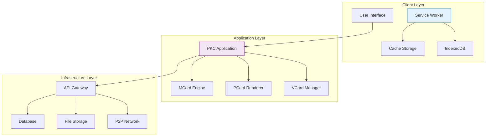

### 5.2 Offline-First Implementation

**Service Worker Strategy**
- Intelligent caching of MCard content
- Background synchronization when connectivity returns
- Progressive loading based on network conditions

**Local Storage Architecture**
- IndexedDB for structured data storage
- Cache API for static assets
- Conflict-free replication for distributed scenarios

**Sync Mechanisms**
- Event-driven synchronization
- Merkle tree-based conflict resolution
- Bandwidth-aware data transfer

## 6. Docker Deployment Architecture

PKC is designed for containerized deployment to ensure consistent operation across different environments.

### 6.1 Container Architecture

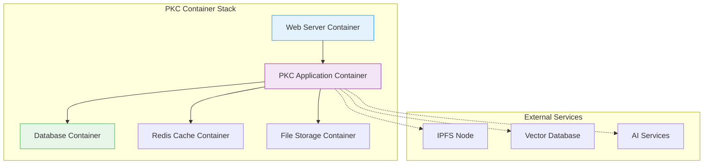

### 6.2 Deployment Configurations

**Development Environment**
- Single container with embedded database
- Hot reloading for rapid development
- Debug tools and logging

**Production Environment**
- Multi-container orchestration
- Load balancing and auto-scaling
- Monitoring and health checks

**Edge Deployment**
- Lightweight containers for resource-constrained environments
- Adaptive quality based on available resources
- Peer-to-peer networking capabilities

## 7. Integration with Modern AI Systems

PKC is designed to work seamlessly with contemporary AI architectures while maintaining user privacy and data sovereignty.

### 7.1 AI Integration Architecture

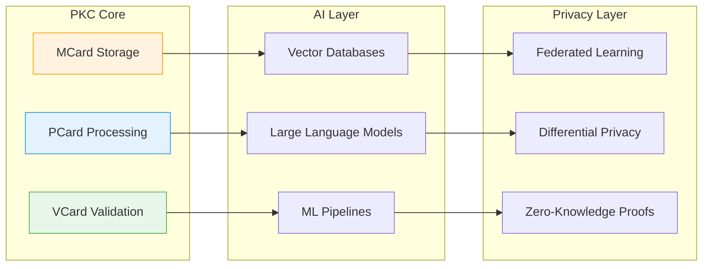

### 7.2 AI-Enhanced Features

**Semantic Search and Discovery**
- Vector embeddings for content similarity
- Hybrid search combining BM25 and semantic similarity
- Personalized recommendation systems

**Automated Knowledge Organization**
- AI-assisted tagging and categorization
- Automatic relationship discovery
- Content summarization and extraction

**Conversational Interfaces**
- Natural language interaction with knowledge base
- AI-powered query understanding
- Context-aware response generation

## 8. Community Learning Implementation

PKC serves as the infrastructure for community-scale learning initiatives through the Extreme Learning Process (XLP).

### 8.1 Learning Coordination Architecture

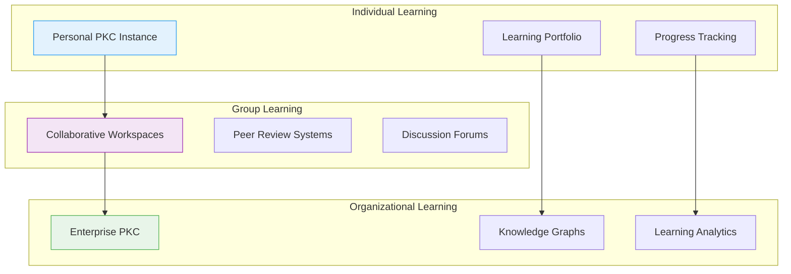

### 8.2 XLP Integration Features

**Four-Stage Learning Process Support**
- Early Success: Rapid prototyping and validation tools
- Fail Early Fail Safe: Version control and rollback mechanisms
- Convergence: Collaborative refinement and consensus building
- Demonstration: Portfolio generation and assessment tools

**Evidence-Based Learning**
- Immutable learning records through MCard storage
- Verifiable credentials and achievements
- Transparent assessment and feedback mechanisms

**Resource-Aware Adaptation**
- Dynamic content delivery based on available bandwidth
- Adaptive UI complexity based on device capabilities
- Intelligent caching and prefetching strategies

## 9. Security and Privacy Implementation

PKC implements comprehensive security measures while maintaining user privacy and data sovereignty.

### 9.1 Security Architecture

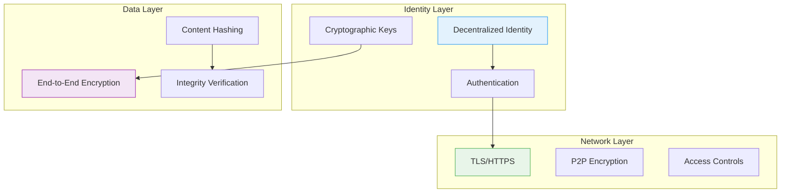

### 9.2 Privacy Features

**Self-Sovereign Data Control**
- Users maintain full control over their data
- Granular permissions for data sharing
- Revocable access controls

**Privacy-Preserving Analytics**
- Differential privacy for usage statistics
- Federated learning for model training
- Zero-knowledge proofs for verification

**Secure Multi-Party Computation**
- Collaborative analysis without data sharing
- Privacy-preserving consensus mechanisms
- Encrypted computation protocols

## 10. Development and Deployment Guide

### 10.1 Development Environment Setup

**Prerequisites**
- Docker 20.10+
- Node.js 18+
- Python 3.9+

**Quick Start**
```bash
# Clone repository
git clone https://github.com/xlp0/PKC.git
cd PKC

# Start development environment
docker-compose -f docker-compose.dev.yml up -d

# Install dependencies
npm install
pip install -r requirements.txt

# Start development server
npm run dev
```

### 10.2 Production Deployment

**Container Orchestration**
- Kubernetes manifests for scalable deployment
- Helm charts for configuration management
- Monitoring and logging integration

**Infrastructure Requirements**
- Minimum: 2 CPU cores, 4GB RAM, 20GB storage
- Recommended: 4 CPU cores, 8GB RAM, 100GB storage
- Network: HTTPS support, WebSocket capabilities

### 10.3 Configuration Management

**Environment Variables**
- Database connection strings
- API keys for external services
- Feature flags for progressive rollout

**Configuration Files**
- YAML-based configuration system
- Environment-specific overrides
- Runtime configuration updates

## 11. Future Roadmap

### 11.1 Short-Term Goals (3-6 months)
- Enhanced mobile PWA experience
- Improved AI integration capabilities
- Advanced search and discovery features

### 11.2 Medium-Term Goals (6-12 months)
- Cross-chain interoperability for VCards
- Advanced privacy-preserving features
- Enterprise-scale deployment options

### 11.3 Long-Term Vision (1-2 years)
- Quantum-resistant cryptographic implementations
- Advanced AI-human collaboration interfaces
- Global knowledge network federation

## Conclusion

PKC represents a new paradigm in knowledge management that combines the rigor of formal mathematics with the practicality of modern web technologies. Through its triadic architecture of MCard, PCard, and VCard, PKC provides a comprehensive platform for individuals and communities to create, share, and value knowledge while maintaining full sovereignty over their data.

The implementation as a Progressive Web App with Docker deployment ensures that PKC can operate across diverse environments and scale from personal use to community-wide initiatives. By integrating with modern AI systems while preserving privacy and data sovereignty, PKC enables the next generation of human-AI collaboration in knowledge work and learning.

As the foundational infrastructure for the Extreme Learning Process, PKC transforms how we think about education, research, and knowledge creation, making advanced computational capabilities accessible to all while ensuring that the benefits of AI serve to augment rather than replace human intelligence and creativity.

---

## References

### Core Architecture Documents
- [[MVP Cards for PKC]] - Triadic foundation and architectural principles
- [[MCard]] - Data plane implementation specification
- [[PCard]] - Control plane and UI component architecture
- [[VCard]] - Application plane and value exchange mechanisms
- [[PCard Architecture]] - Polynomial functor computational framework

### Related Concepts
- [[Extreme Learning Process]] - Community learning methodology
- [[Cubical Logic Model]] - Formal programming interface
- [[Progressive Web Apps]] - Modern web application architecture
- [[Self-Sovereign Identity]] - Decentralized identity management
- [[Polynomial Functors]] - Mathematical foundation for composition

### Implementation Resources
- [PKC GitHub Repository](https://github.com/xlp0/PKC)
- [PKC Documentation Site](https://pkc.pub)
- [Docker Hub Images](https://hub.docker.com/r/pkc/core)