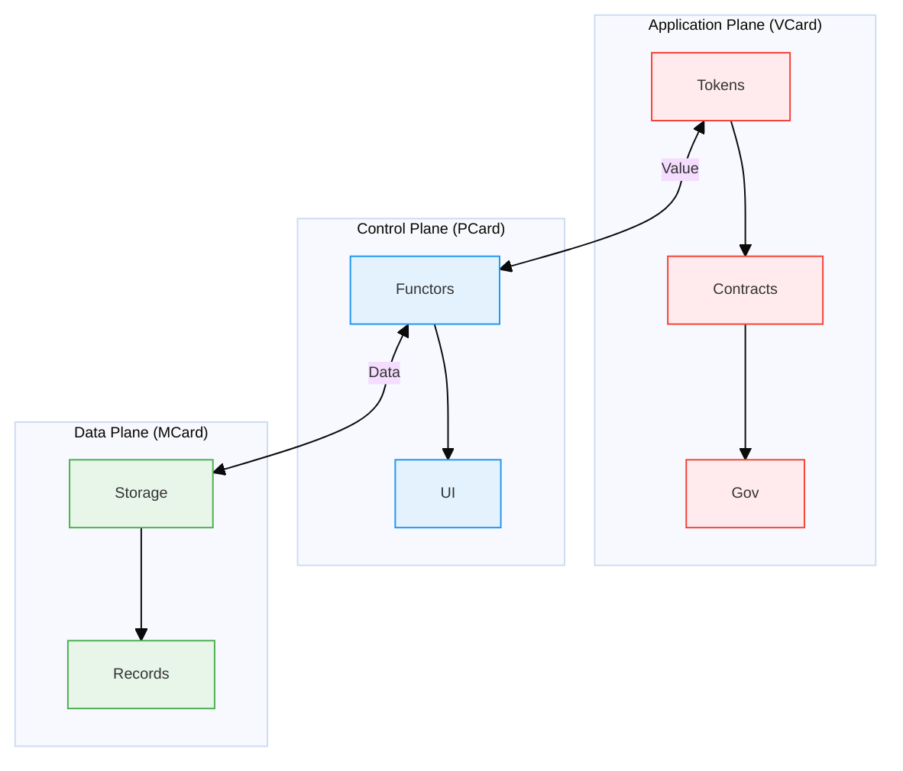

# PKC: The Polynomial Knowledge Platform

## Executive Summary
PKC is a revolutionary platform built on polynomial functor theory and computational trinitarianism, implementing a Web5-native [[Decentralized Web Node|Decentralized Web Node (DWN)]] architecture. At its core, PKC serves as a triadic computational framework where data, computation, and value are unified through three integrated planes of meaning:

1. **Data Plane (MCard)**: The foundation of physically meaningful, immutable knowledge units with cryptographic integrity
2. **Control Plane (PCard)**: The computational layer that transforms and mediates between physical data and social meaning
3. **Application Plane (VCard)**: The value layer where knowledge becomes socially meaningful through economic and cultural contexts

Built as the foundational infrastructure for the [[Extreme Learning Process]] (XLP), PKC combines decentralized Web5 architecture with the formal structures of the [[Cubical Logic Model]] (CLM), creating a self-sovereign environment where knowledge gains both physical verifiability and social significance.

### Core Architectural Principles

1. **Triadic Meaning Architecture**
   - **Physically Meaningful (MCard)**: Grounded in cryptographic hashes and immutable storage
   - **Mediated Meaning (PCard)**: Transformations that preserve physical meaning while enabling social interpretation
   - **Socially Meaningful (VCard)**: Embedded in cultural, economic, and contextual value systems

2. **Web5 Foundations**
   - **Decentralized Web Node**: Self-hosted node in the Web5 network
   - **Self-Sovereign Identity**: [[DID|Decentralized Identifiers]] for verifiable credentials
   - **Content-Addressable Storage**: Immutable, versioned knowledge assets with cryptographic integrity
   - **Value-Aware Networking**: Direct, encrypted communication with built-in economic primitives

### Platform Architecture
PKC's architecture is built on polynomial functor theory, providing a unified computational framework where:

1. **Polynomial Functor Foundation**
   - All data structures are represented as either linear (MCard) or recursive (PCard) polynomial functors
   - Enables type-safe transformations and compositions of knowledge units
   - Supports machine learning through tensor-compatible representations

2. **Content Navigation & Integration**
   - **MCard System**: Content-addressable storage for raw data in any format (JSON, YAML, media, etc.)
   - **PCard System**: Interactive exploration of structured content through polynomial functor interfaces
   - **MCP Functions**: Composable operations for data transformation and analysis

3. **Computational Capabilities**
   - **Type-Aware Processing**: Automatic content type detection and handling
   - **Functional Programming**: MCP-compatible functions for building complex data workflows
   - **ML Integration**: Native support for machine learning operations on polynomial structures

4. **CLM Integration**
   Implements the three-dimensional framework ([[Abstract Specification]], [[Concrete Implementation]], and [[Balanced Expectations]]) to create a verifiable, community-driven knowledge graph that enables:
   - Formal knowledge representation with cryptographic integrity
   - Privacy-preserving collaboration through fine-grained access controls
   - AI-enhanced learning with local processing and federated learning capabilities

### XLP Integration & Learning Ecosystem

PKC is specifically designed to support diverse learning modalities, from individual exploration to large-scale organizational learning. At its core is the integration with the [[Extreme Learning Process]] (XLP) methodology, which PKC implements through its decentralized architecture:

#### Core XLP Methodology
1. **Early Success** ([[Quick Win]])
   - Rapid deployment of learning nodes for immediate engagement
   - Structured bootcamp programs for quick onboarding
   - Peer-guided learning circles for collaborative growth

2. **Fail Early, Fail Safe**
   - Isolated testing environments with rollback capabilities
   - Safe spaces for experimentation and iteration
   - Project-based learning with built-in version control

3. **Convergence**
   - Federated knowledge synthesis across nodes and teams
   - Networked collaboration tools for distributed learning
   - Organizational learning dashboards and analytics

4. **Demonstration**
   - Verifiable presentation of learning outcomes
   - Portfolio development with cryptographic proof of skills
   - Community validation and peer review systems

#### Learning Modes
- **Self-Directed Learning**: Personalized learning paths with AI-assisted recommendations
- **Group Learning**: Collaborative workspaces with real-time co-editing and discussion
- **Organizational Learning**: Federated knowledge graphs for enterprise-wide learning
- **Bootcamp Programs**: Intensive, structured learning experiences with peer support

By transforming static educational content into dynamic, interconnected knowledge assets, PKC creates a living learning ecosystem where knowledge evolves through community interaction while respecting individual data sovereignty and institutional governance requirements. The platform's support for project-based learning and networked collaboration makes it ideal for everything from individual skill development to large-scale organizational transformation initiatives.

## Origins and Purpose

### Infrastructure for the Extreme Learning Process
PKC was originally conceived as the technical infrastructure to enable [[Literature/PKM/Tools/Open Source/Extreme Learning Process|Extreme Learning Process]] (XLP), providing the necessary computational foundation for community-based, student-centered learning. This infrastructure directly supports XLP's core principles:

- **Self-Directed Learning**: PKC's self-sovereign identity and data architecture enables learners to take ownership of their learning process
- **Collaborative Knowledge Building**: Content-addressable storage and selective sharing mechanisms allow seamless collaboration while maintaining individual attribution
- **Reflection and Iteration**: Version control and knowledge provenance support XLP's four-stage learning process
- **Personalization**: Resource-aware computing adapts to individual learning contexts and resource constraints

### Technical Foundation for Community Learning
As educational environments increasingly incorporate generative AI and advanced computing, PKC provides an essential infrastructure that protects student privacy while enabling powerful learning experiences:

- **Privacy-First Learning**: Local-first processing of sensitive student data with selective sharing
- **Learning Coordination**: Decentralized consensus mechanisms align with XLP's emphasis on shared responsibility
- **Evidence-Based Assessment**: Transparent, verifiable learning outcomes through content-addressable storage
- **Multi-Scale Learning**: Infrastructure that supports learning from individual to community scales

## Core Features

### 1. Resource-Aware Inference Engine
- **Evidence-Based Reasoning**: Automates the mechanical manipulation of locally stored statistical evidence
- **Computational Potentiality**: Treats knowledge as executable, versioned resources for coherent inference operations
- **Machine-Learnable Structure**: Implements vector embeddings and tensor representations for statistical evidence processing
- **Version-Controlled Evolution**: Tracks inference processes and knowledge refinement through transparent computation history
- **Adaptive Precision**: Dynamically adjusts representation fidelity and inference depth based on context and available resources

### 2. Self-Sovereign Architecture
- Local-first data ownership
- End-to-end encryption
- Verifiable credentials and decentralized identity

### 3. Fractal Knowledge Organization
- Scale-invariant knowledge representation
- Recursive composition of knowledge units
- Consistent interaction patterns across all scales

### 4. Personal and Community MLOps
- **Streamlined CI/CD Pipeline**: Simplified deployment of machine learning operations for individuals and communities
- **Localized Model Fine-Tuning**: Adaptation of general models to personal and community-specific contexts
- **Cost-Effective LLM Deployment**: Brings modern language technologies to individuals at significantly lower costs
- **Evidence Sovereignty**: Maintains ownership and provenance of data used for model training and inference
- **Collaborative Model Improvement**: Enables community-based model refinement while preserving privacy

## Polynomial Functor Foundation

PKC is built on the fundamental principle that all data can be computationally manipulated as [[polynomial functors]], creating a unified framework for knowledge representation and processing. This foundation is implemented through two complementary components:

### 1. MCard: The Physically Meaningful Data Plane

### 1.1 Core Structure: Immutable Knowledge Atoms
- **Content-Addressable Identity**: Cryptographic hash (SHA-256) serves as both identifier and integrity check
- **Immutable Storage**: Content cannot be altered, only referenced by new versions, ensuring data provenance
- **Temporal Metadata**: Global timestamps (Lamport clocks) for versioning and causal ordering
- **Vector Embeddings**: Native support for semantic similarity search and knowledge graph navigation
- **CRDT Foundation**: State-based Conflict-free Replicated Data Types (G-Set) for distributed consistency

### 1.2 Physical Meaning Implementation
- **Content-Addressable Storage**: SQLite BLOBs with SHA-256 hashing for cryptographic integrity
- **Hybrid Search Architecture**:
  - Exact matching via cryptographic hashes
  - Fuzzy search for human-readable content
  - Vector similarity for semantic relationships
- **Distributed Synchronization**: Gossip protocol for eventual consistency across nodes
- **Resource-Aware Processing**: Automatic optimization based on available computational resources

### 2. PCard: The Mediating Control Plane

### 2.1 Core Structure: Meaning Mediation
- **Polynomial Functor Composition**: Recursive structures that preserve type safety across transformations
- **Bidirectional Transformation**: Mediates between physical storage (MCard) and social meaning (VCard)
- **Adaptive UI Components**: Interface elements that respond to both data structure and user context
- **Dynamic Loading & Caching**: On-demand loading with intelligent prefetching based on usage patterns
- **Version-Aware Execution**: Maintains consistency across different versions of components and data

### 2.2 Mediation Implementation
- **Type-Theoretic Foundation**: Based on polynomial functors representing sum and product types
- **Computational Trinitarianism**: Unifies proof theory, category theory, and type theory in implementation
- **Reactive Architecture**: Event-driven updates with minimal re-rendering
- **Contextual Adaptation**: UI and processing adapt based on:
  - Device capabilities
  - Network conditions
  - User preferences
  - Social context
- **Formal Verification**: Integration with theorem provers for critical components

### 3. VCard: The Socially Meaningful Application Plane

#### 3.1 Core Structure: Value-Centric Knowledge
- **Tokenized Knowledge Units**: Represent knowledge as tradable assets with economic value
- **Smart Contract Integration**: Programmable rules for knowledge exchange and governance
- **Reputation Systems**: Track contributions and expertise within communities
- **Economic Primitives**: Built-in support for microtransactions and value exchange
- **Cultural Context**: Embed knowledge within specific social and cultural frameworks

#### 3.2 Social Meaning Implementation
- **Verifiable Credentials**: Standards-compliant attestations of knowledge and skills
- **Decentralized Identifiers (DIDs)**: Self-sovereign identity management
- **Token Economies**: Native support for knowledge-based incentive systems
- **Governance Mechanisms**: Community-driven decision making and knowledge validation
- **Privacy-Preserving Analytics**: Extract insights while protecting individual data

## 4. Architectural Integration: Bridging Physical and Social Meaning

The PKC framework creates a complete computational stack that bridges physical reality with social meaning through the integration of its three components:



### 4.1 Data Flow Architecture

The three-plane architecture enables sophisticated data flow patterns:

1. **Storage to Presentation (MCard → PCard)**
   - Linear data structures transformed into recursive UI components
   - Content-addressable references enable efficient lazy loading
   - Polynomial functor operations maintain mathematical consistency

2. **Presentation to Value (PCard → VCard)**
   - Interactive components generate value through user engagement
   - Computational capabilities packaged as tradable assets
   - UI interactions create measurable economic outcomes

3. **Value to Storage (VCard → MCard)**
   - Economic transactions generate new immutable records
   - Value exchanges create provenance trails
   - Social consensus mechanisms validate and secure knowledge

### The Polynomial Place Value System

PKC adapts the mathematical elegance of polynomial place value systems to create a universal framework for knowledge representation. This approach provides a consistent way to handle data at multiple levels of abstraction:

1. **MCard: Content-Addressable Foundation**
   - Acts as the atomic storage unit, preserving data in its raw form (JSON, YAML, XML, JPG, MP4, etc.)
   - Uses cryptographic hashes as unique identifiers, similar to how digits represent values in a number system
   - Maintains data integrity while remaining agnostic to content type

2. **PCard: Structural Representation**
   - Dynamically interprets and displays the internal structure of MCard content
   - Implements a polynomial functor interface that can navigate and transform nested data
   - Enables interactive exploration through layers of abstraction

3. **Type-Aware Processing**
   - Content type detection triggers appropriate processing pipelines
   - Supports industry-standard formats while maintaining a unified interface
   - Enables computational operations (ML, transformations) without modifying the original data

This architecture creates a "Super App" platform where:
- New data types require minimal additional development
- Existing tools and libraries can be integrated seamlessly
- The system remains flexible and extensible while preserving data integrity
- Users can work with complex data structures through a consistent, mathematically-grounded interface

This approach creates a common knowledge substrate that spans all domains, making the fundamental structures of computation visible and manipulable to users.

## Technical Specifications

### Computational Foundations
- **Framework**: Cubical Logic Model (CLM) for coherent inference from versioned evidence
- **Logic**: Linear Logic for precise resource accounting in statistical inference processes
- **Arithmetic Core**: GASing-inspired digit-wise processing for efficient manipulation of statistical evidence
- **Type System**: Homotopy Type Theory for managing knowledge evolution and inference paths
- **MLOps Pipeline**: Integrated CI/CD workflow for personal and community-scale model deployment
- **Functor Calculus**: Polynomial functor operations for knowledge composition and transformation

### Storage & Infrastructure
- **Evidence Store**: Immutable, content-addressable storage of statistical evidence with full provenance tracking
- **Distributed Storage**: IPFS and Decentralized Web Nodes for resilient evidence sharing while maintaining sovereignty
- **Containerization**: Docker and Kubernetes for reproducible inference environments and model deployment
- **Vector Database**: Optimized storage for efficient statistical evidence processing and retrieval
- **Local-First Processing**: Prioritizes on-device inference to preserve privacy and reduce dependency on cloud services

### Security & Identity
- **Authentication**: Self-Sovereign Identity (SSI)
- **Provenance**: Blockchain-based verification
- **Access Control**: Fine-grained permission system

## Use Cases

### Personal Knowledge Management
- Version-controlled notes and documents
- Personal knowledge graphs
- Cross-device synchronization

### Collaborative Research
- Verifiable knowledge sharing
- Collaborative annotation
- Citation management

### Educational Applications
- **Visual Polynomial Manipulation**: Interactive tools for exploring polynomial functor transformations
- **Structure-Aware Learning**: Understanding knowledge through its polynomial representation
- **Personalized Learning Paths**: Adaptive learning experiences that evolve based on individual progress and knowledge representation
- **Knowledge Verification & Assessment**: Automated validation of learning outcomes against versioned knowledge structures
- **Learning Analytics Dashboard**: Visual tracking of knowledge acquisition and skill development over time
- **Automated Knowledge Gap Analysis**: AI-powered identification of learning needs based on knowledge graph analysis

### Why This Matters
By revealing the polynomial functor foundation of all data, PKC helps users:
1. **See the Invisible**: Make the fundamental structures of computation visible
2. **Think Mathematically**: Understand knowledge through its algebraic properties
3. **Navigate Complexity**: Use polynomial operations to manage complex information
4. **Bridge Disciplines**: Apply the same conceptual framework across all domains

This approach transforms knowledge management from a passive activity into an active exploration of mathematical structures, empowering users to see and work with the fundamental building blocks of information.

## Getting Started

### System Requirements
- Docker 20.10+

### Installation
```bash
docker pull pkc/core:latest
docker-compose up -d
```

### Basic Usage
1. Initialize your knowledge base
2. Create and link knowledge units
3. Set up synchronization preferences

## Community & Support
- [Documentation](https://pkc.pub/docs)
- [GitHub Issues](https://github.com/xlp0/PKC/issues)
- Community Forum

## Roadmap
- [ ] Enhanced mobile support
- [ ] Advanced visualization tools
- [ ] Plugin marketplace

## License
Open Source (MIT License)

## About
PKC is developed by a global community of researchers, developers, and knowledge workers committed to creating ethical, user-controlled knowledge management solutions.

## Technical Deep Dive

### 1. Unified Fractal Arithmetic Engine

PKC's core innovation is its Unified Fractal Arithmetic Engine, directly inspired by the GASing methodology's place value system. This engine enables scale-adaptive knowledge processing through three integrated mathematical frameworks:

#### 1.1 Three-Sorted Algebraic Framework
- Content-hash-time triples for version-controlled knowledge, similar to GASing's digit-place-value triples
- Ensures logical correctness and computational integrity through position-sensitive knowledge representation
- Enables continuous refinement through versioning, treating knowledge evolution as a series of discrete, auditable steps

#### 1.2 Tensorized Automaton
- Implements universal function approximation using principles from GASing's digit-wise processing
- Resource-parameterized state spaces that adapt to available computational resources
- Scale-adaptive computation strategies inspired by GASing's multi-scale numerical processing
- Continuous model refinement through patterns of addition and transformation

#### 1.3 GASing Methodology Integration
- **Digit-Wise Knowledge Processing**: Breaks down complex knowledge structures into composable, atomic units
- **Place Value Knowledge Organization**: Organizes information in hierarchical, positional systems where context determines significance
- **Dynamic Computation-Lookup Trade-offs**: Balances real-time computation with pre-computed pattern recognition
- **Uniform Tensor-Based Representation**: Represents all knowledge in consistent numerical structures
- **Adaptive Precision Management**: Adjusts detail level based on context and available resources
- **Context-Sensitive Function Approximation**: Tailors knowledge processing to specific usage scenarios

### 2. Implementation Architecture

#### 2.1 Core Components
- **Decentralized Identifiers (DIDs)**: Self-sovereign identity management
- **Verifiable Credentials**: Standards-compliant attestations
- **Zero-Knowledge Proofs**: Privacy-preserving verification
- **Layer 2 Solutions**: Scalable, low-cost operations

#### 2.2 Computational Boundaries
- Knowledge Light Cones with SBTs
- Scale-free cognitive processing
- Self-organizing knowledge graphs
- Bioelectric-blockchain inspired coordination

#### 2.3 Performance Scaling
- **Personal Scale**: Individual knowledge fragments with privacy preservation
- **Project Scale**: Collaborative spaces with shared contexts
- **Public Scale**: Global networks with distributed computation

### 3. Educational Integration with XLP

PKC serves as the essential IT infrastructure to facilitate coordination among learning agents and agencies in the [[Literature/PKM/Tools/Open Source/Extreme Learning Process|Extreme Learning Process]] (XLP). This integration creates a technical foundation for XLP's student-centered approach:

#### 3.1 Supporting XLP's Four-Stage Learning Process
- **Early Success**: PKC's immediate feedback mechanisms and local execution support rapid prototyping of learning activities
- **Fail Early Fail Safe**: Content-addressable storage preserves all learning attempts, creating safe spaces for experimentation
- **Convergence**: Knowledge graph connections and bidirectional linking support the synthesis of ideas across domains
- **Demonstration**: Verifiable credentials and selective disclosure enable secure sharing of learning achievements

#### 3.2 Implementing XLP's Three-Tiered Content Structure
PKC's architecture aligns with XLP's content organization approach:
- **Design Thinking**: Abstract Specification dimension in CLM supports creative exploration (Grammar in Trivium)
- **Computational Thinking**: Concrete Implementation dimension enables formal expression (Logic in Trivium)
- **Systems Thinking**: Balanced Expectations dimension facilitates holistic evaluation (Rhetoric in Trivium)

#### 3.3 Adaptive Learning Paths
- Dynamic content adjustment based on learner progress through vector-based universal functions
- Granular knowledge unit tracking via content-addressable MCard storage
- Personalized learning experiences through local model fine-tuning

### 4. Advanced Features

#### 4.1 Entropy Management
- Dynamic resource allocation
- Information density optimization
- Performance tuning based on task complexity

#### 4.2 Unified Configuration
- Seamless system upgrades
- Cross-platform compatibility
- User-customizable workflows

### 5. Deployment Scenarios

PKC's scale-free architecture supports diverse deployment models:

- **Individual Use**: Personal knowledge management
- **Team Collaboration**: Shared knowledge spaces
- **Institutional Deployment**: Organization-wide knowledge infrastructure
- **Public Knowledge Networks**: Open collaboration platforms

## Getting Started (Expanded)

### Prerequisites
- Docker 20.10+
- 4GB RAM minimum (8GB recommended)
- 10GB free storage

### Quick Start Guide
1. **Installation**
   ```bash
   # Pull the latest PKC image
   docker pull pkc/core:latest
   
   # Start the PKC stack
   docker-compose up -d
   ```

2. **Initial Configuration**
   - Access the web interface at `http://localhost:3000`
   - Complete the setup wizard
   - Import or create your first knowledge base

3. **Basic Workflow**
   - Create and link knowledge units (MCards)
   - Set up synchronization preferences
   - Configure backup and versioning

### Advanced Configuration
- Custom storage backends
- Network configuration
- Security settings
- Integration with existing systems

## Community & Support (Expanded)

### Resources
- [Official Documentation](https://pkc.pub/docs)
- [API Reference](https://pkc.pub/api)
- [Tutorial Videos](https://pkc.pub/videos)

### Getting Help
- [GitHub Issues](https://github.com/xlp0/PKC/issues)
- Community Forum
- Email Support: support@pkc.pub

### Contributing
PKC is an open-source project. We welcome contributions through:
- Code contributions
- Documentation improvements
- Bug reports
- Feature requests

## Roadmap (Detailed)

### Short-term (Next 6 months)
- [ ] Enhanced mobile experience
- [ ] Advanced visualization tools
- [ ] Plugin marketplace
- [ ] Improved collaboration features

### Mid-term (6-12 months)
- [ ] AI-assisted knowledge organization
- [ ] Advanced search capabilities
- [ ] Enhanced security features

### Long-term (1+ years)
- [ ] Decentralized knowledge federation
- [ ] Advanced machine learning integration
- [ ] Cross-platform synchronization

## Technical Architecture: GASing-Inspired Knowledge Organization

PKC's architecture is fundamentally inspired by the GASing methodology's place value system approach, where digit-wise representation provides a powerful model for knowledge organization. Just as GASing treats numerical values as compositions of digit-wise modules with clear boundaries and interfaces, PKC organizes knowledge into modular, self-similar units that can be efficiently processed, combined, and transformed at multiple scales.

### Place Value System as Knowledge Architecture

- **Digit-Wise Knowledge Representation**: Knowledge is organized into discrete, atomic units (like digits in a number) that maintain their meaning across contexts while gaining additional significance through their position and relationships
- **Carry/Borrow as Knowledge Propagation**: Changes in one knowledge unit can trigger cascading updates to connected units, similar to how carry operations propagate through digit positions in arithmetic
- **Positional Significance**: The "place" of knowledge within the larger structure determines its scope and influence, creating a natural hierarchy without rigid constraints
- **Base-Independent Processing**: Knowledge can be represented at different levels of granularity (bases) depending on context and available cognitive or computational resources

### 1. Unified Fractal Arithmetic Engine

PKC's core innovation is its Unified Fractal Arithmetic Engine, directly inspired by the GASing methodology's place value system. This engine enables scale-adaptive knowledge processing through three integrated mathematical frameworks:

#### 1.1 Three-Sorted Algebraic Framework
- Content-hash-time triples for version-controlled knowledge, similar to GASing's digit-place-value triples
- Ensures logical correctness and computational integrity through position-sensitive knowledge representation
- Enables continuous refinement through versioning, treating knowledge evolution as a series of discrete, auditable steps

#### 1.2 Tensorized Automaton
- Implements universal function approximation using principles from GASing's digit-wise processing
- Resource-parameterized state spaces that adapt to available computational resources
- Scale-adaptive computation strategies inspired by GASing's multi-scale numerical processing
- Continuous model refinement through patterns of addition and transformation

#### 1.3 GASing Methodology Integration
- **Digit-Wise Knowledge Processing**: Breaks down complex knowledge structures into composable, atomic units
- **Place Value Knowledge Organization**: Organizes information in hierarchical, positional systems where context determines significance
- **Dynamic Computation-Lookup Trade-offs**: Balances real-time computation with pre-computed pattern recognition
- **Uniform Tensor-Based Representation**: Represents all knowledge in consistent numerical structures
- **Adaptive Precision Management**: Adjusts detail level based on context and available resources
- **Context-Sensitive Function Approximation**: Tailors knowledge processing to specific usage scenarios

### 2. Cognitive Boundaries and Knowledge Light Cones

Inspired by Michael Levin's work on *The Computational Boundary of a Self*, PKC implements computational analogs of biological cognitive boundaries:

- **Knowledge Light Cones with SBTs**: Defines computational boundaries for each PKC instance
- **Scale-Free Cognition**: Maintains consistent processing patterns across different scales
- **Self-Organizing Knowledge Graphs**: Version-controlled units that maintain coherence and access control

### 3. Implementation Architecture

#### 3.1 Core Components
- **Decentralized Identifiers (DIDs)**: Self-sovereign identity management
- **Verifiable Credentials**: Standards-compliant attestations
- **Zero-Knowledge Proofs**: Privacy-preserving verification
- **[[Layer 2]] Solutions**: Scalable, low-cost operations

#### 3.2 Performance Scaling
- **Personal Scale**: Individual knowledge fragments with privacy preservation
- **Project Scale**: Collaborative spaces with shared contexts
- **Public Scale**: Global networks with distributed computation

## License & Legal

### Open Source
PKC is released under the MIT License, allowing for both personal and commercial use.

### Data Privacy
- End-to-end encryption
- Local-first architecture
- GDPR compliant

### Trademarks
PKC and the PKC logo are trademarks of the PKC Project.

## Advanced Implementation Details

### 1. Inference MLOps & Evidence Management

PKC implements a streamlined MLOps pipeline to make advanced inference technologies accessible to individuals and communities:

1. **Personal Model Registry**: Local repository of fine-tuned models adapted to personal evidence collections
2. **Simplified CI/CD for Inference**: Automated workflows for testing and deploying inference pipelines
3. **Cost-Optimized LLM Integration**: Efficient API and deployment patterns for accessing LLM capabilities at reduced costs
4. **Local Evidence Fine-Tuning**: Tools for adapting general models to personal contexts using local evidence
5. **Collaborative Inference**: Community-based model improvement while maintaining evidence sovereignty

### 2. Account Abstraction & Identity

PKC's identity management system is built on:

1. **Decentralized Identifiers (DIDs)**: Self-sovereign identifiers for PKC instances and users
2. **Verifiable Credentials**: Standards-compliant attestations of identity and permissions
3. **Zero-Knowledge Proofs**: For privacy-preserving verification of access rights
4. **Layer 2 Solutions**: For scalable, low-cost operations

### 2. Semantic Zooming & Context Adaptation

PKC's architecture enables "semantic zooming" capabilities that are fundamental to context-adaptive computation:

- **Dynamic Precision Adjustment**: Automatically adjusts computational precision based on available resources
- **Context-Aware Processing**: Optimizes knowledge representation for specific use cases
- **Resource-Efficient Retrieval**: Balances computation and lookup operations based on local resource availability

### 3. Evidence-Based Inference & Learning

PKC implements a sophisticated approach to evidence manipulation and inference that bridges human reasoning and computational statistics:

- **Automated Evidence Processing**: Mechanically processes locally stored evidence to derive insights through statistical inference
- **Version-Controlled Evidence Base**: Every piece of evidence is stored with complete version history, enabling transparent inference audit trails
- **Statistical Learning Structures**: Content is automatically processed into vector embeddings and knowledge graphs for efficient statistical analysis
- **GASing-Aligned Arithmetic Operations**: Leverages fundamental arithmetic operations as the basis for all inference and reasoning processes
- **Learning Feedback Loops**: User interactions continuously refine inference models through explicit feedback mechanisms
- **Content-Addressable Evidence**: Ensures data integrity through cryptographic hashing while enabling efficient retrieval for inference
- **Temporal Inference Graphs**: Maintains explicit versioning of both evidence and derived insights
- **Computational Evidence Units**: Treats evidence as executable resources that can be verified, combined and transformed through arithmetic operations

- **Fractal State Management**: Self-similar state containers that maintain consistency across scales, as detailed in [[Fractal Dimension]]

- **Entropy-Aware Processing**: Dynamic resource allocation based on information density and [[semantic zooming]] requirements

- **Bidirectional Transformation**: Seamless conversion between natural language and executable code within the [[MCard]] framework

- **Context Preservation**: Maintaining conversation history and state across sessions using fractal addressing

  

### Implementation Features

  

**Fractal Knowledge Representation:**

  

PKC's knowledge graph implements fractal patterns for efficient storage and retrieval:

  

- **Self-Similar Structures**: Knowledge fragments that mirror patterns at different scales

- **Entropy-Based Indexing**: Optimized search and retrieval using information density

- **Adaptive Resolution**: Dynamic detail levels based on context and requirements

  

PKC serves as the data and computation layer for [[Conversational Programming]] environments, providing:

  

- **Fractal State Management**: Self-similar state containers that maintain consistency across conversational turns

- **Entropy-Aware Processing**: Dynamic resource allocation based on the information density of the conversation

- **Bidirectional Transformation**: Seamless conversion between natural language and executable code

- **Context Preservation**: Maintaining conversation history and state across sessions

  

## Technical Architecture

  

### Self-Sovereign Data Architecture

  

PKC's distributed architecture ensures true data sovereignty while enabling secure collaboration:

  

- **Local-First Operation**: Full functionality without external dependencies

- **Federated Identity**: [[Self-Sovereign Identity]] using [[DID]] standards

- **Content-Addressable Storage**: Immutable, verifiable knowledge artifacts

- **Zero-Knowledge Collaboration**: Secure sharing without compromising privacy

  

### Technical Implementation Stack

PKC's implementation centers around creating machine-learnable, versioned knowledge representations through a sophisticated technical stack:

### Core Components
- **Knowledge Graph Engine**: Maintains semantic relationships between versioned knowledge units
- **Vector Embedding Service**: Automatically generates and updates numerical representations of content
- **Version Control System**: Tracks all changes with cryptographic integrity
- **Learning Feedback Loop**: Continuously improves representations based on usage patterns

PKC combines the [[Cubical Logic Model]] with distributed systems and machine learning technologies to create a living knowledge ecosystem:

  

**Infrastructure Layer:**

- **Containerization**: [[Docker]] and [[Kubernetes]] for isolated, reproducible environments that maintain [[Experimental-Operational Symmetry]]

- **Decentralized Web**: [[OPFS]], [[IPFS]], [[Decentralized Web Nodes]], and [[Peer-to-Peer]] protocols for distributed storage with content-addressable semantics

- **Entropy-Optimized Database**: Content-addressable storage with [[Fractal Indexing]] that aligns with CLM's three-dimensional structure

  

**Application Layer:**

- **Conversational AI**: Deep integration with [[LLM]]s that understand and operate within the CLM framework

- **Unified Configuration Management**: Centralized governance ensuring consistency, security, and coherence across all PKC instances

  

### Cubical Logic Model Integration

  

This architecture enables **fractal scaling**, where the system maintains consistent behavior across all levels of operation. The CLM's three dimensions provide a unified framework for managing the complexity:

  

1. **Abstract Specification**: Natural language intents and requirements

2. **Concrete Implementation**: Executable code and data transformations  

3. **Balanced Expectations**: Validation, testing, and feedback mechanisms

  

The system's [[Entropy and Fractal|entropy management]] ensures optimal resource allocation by dynamically adjusting computational resources based on the information density and complexity of the current task, as defined by the CLM's Balanced Expectations.

  

This approach allows for convenient and rapid deployment of knowledge, even in regions and societies with limited existing infrastructure. By facilitating effective learning and knowledge acquisition, PKC reduces time to recovery in the event of disasters or infrastructure failures, thereby ensuring the preservation and accessibility of valuable knowledge assets.

  

See [[Cubical Logic Model]].

![[CubicalLogicModel.png]]

  

![[Logic Model for PKC#The Logic Model]]

  

## Functional Requirements

  

[[PKC]] must fulfill the following requirements:

  

1. Provide the means to enable [[Personalized Data Sovereignty]] in terms of enabling data collectors and owners to share selected data content without the intrusion of privacy and breach of ownership boundaries.

  

2. Adopt scalable [[Identity|identity provision]] technologies, such as [[DID]] and [[Open Source GIS]] APIs to associate data content correctness with the data provider's using [[Physical Meaning of Data]] and [[Social Meaning of Data|Social Meaning of Data]].

  

3. Enable personalized data refinement, storage, retrieval, presentation, backup, and transaction with adequate data security measures.

  

4. Adopt and adapt to existing data formats and media presentation capabilities using Open Source tools and Open Source data content

  

5. Provide systematic usage instructions and continuous content knowledge refinement process using open source tools such as [[AI]]/[[LLM|Large Language Models]], and [[CICD]].

  

6. Adopt a [[Reproducible]] data storage and manipulation platform using Open Source platforms, such as [[NixOS]], [[Docker]], and [[Kubernetes]].

  

7. Provide a highly available [[System of Record]] ([[SoR]]) to guarantee the integrity and accessibility of data assets under all circumstances, ensuring data sovereignty for individuals and organizations regardless of their economic status or resource availability.

  

## Unified Configuration Management Strategy

  

The implementation of a [[Unified Configuration Management]] ([[UCM]]) strategy is critical in organizing data assets and computational resources in a way that supports these complex decisions. The proliferation of generative AI, which allows for more effective and context-sensitive knowledge management, has contributed significantly to the shift toward a **unified** approach in [[configuration management]]. See [[Why Unified Configuration Management Matters]].

  

PKC actively practices the principle of [[Unified Configuration Management]] to fully harness the potential of data and computing resource management in the [[Generative AI]] era. This deliberate approach underscores PKC's dedication to creating a seamless, efficient, and secure framework for data management, aligning with the advanced requirements of contemporary AI-driven environments.

  

### Key Benefits

  

1. **Centralized Governance:** PKC recognizes the complexity and diversity of data management needs across various domains and scales. A Unified Configuration Management system serves as a centralized mechanism to govern configurations, ensuring consistency, security, and coherence across all instances of PKC. This centralized governance model simplifies the management of data assets, making it easier for users to maintain the integrity and sovereignty of their data.

2. **Enhanced Security and Compliance:** By implementing a Unified Configuration Management framework, PKC strengthens its security-first moto. This framework ensures that all PKC instances adhere to the highest security standards, safeguarding data sovereignty and enhancing the overall security posture. It also facilitates compliance with regulatory requirements by providing a standardized method for configuring and managing security policies.

3. **Operational Efficiency:** The approach streamlines operations by enabling the efficient deployment and management of PKC instances across different environments. It reduces the complexity involved in configuring and updating PKC, thereby lowering operational costs and improving system reliability.

4. **Sustainable Scalability:** As PKC aims to be scale-free, the [[Unified Configuration Management]] approach ensures that scalability does not compromise the system's integrity or performance. It allows for seamless expansion or reduction based on the community's size or the individual's needs, without sacrificing the local-first principle or security commitments.

5. **Interoperability and Flexibility:** This approach fosters interoperability between different PKC instances and external systems. It enables a flexible and adaptable infrastructure that can evolve with technological advancements and user requirements. By maintaining a unified configuration standard, PKC ensures that its platform remains at the forefront of technological innovation, catering to a broad spectrum of knowledge domains and user needs.

  

In essence, PKC's adoption of a [[Unified Configuration Management]] approach is grounded in the requirements of making knowledge management [[Upgradability|upgradable]]. It aims to provide a robust, secure, and user-friendly platform that not only respects the data sovereignty of individuals and small organizations but also sets a new standard in data management and collaboration.

  

## Architecture Diagrams

  

### Overall System Architecture

  

A matrix-based approach to visualize the overall architecture of [[PKC]] is shown as follows:

  

![[SoG_with_SDN.png]]

[Go to the interactive Canvas](SoG_with_SDN.canvas)

  

### The Architecture Diagram of PKC

  

![[PKC_Architecture.excalidraw|800]]

[Go to Excalidraw](PKC_Architecture.excalidraw)

  

This diagram represents the different components and functionalities of PKC, including data sovereignty, identity provision, data management, adaptation, usage instructions, and reproducibility. Each component is represented as a subgraph with its corresponding elements.

  

### Process Diagram for PKC

  

Certainly! Here is a process diagram using Mermaid syntax that illustrates how PKC processes data:

  

![[PKC_workflow.excalidraw|800]]

[Go to Excalidraw version of this diagram](PKC_workflow.excalidraw)

  

This process diagram outlines the sequential steps involved in the data processing within PKC. It starts with data collection, followed by data validation and cleaning. The processed data is then stored, encrypted, and backed up. When needed, the data is retrieved, decrypted, and managed through organization, indexing, version control, and metadata application. The processed and managed data is presented through visualization, report generation, and data sharing. Finally, data transactions are facilitated through access control, data sharing, and collaboration.

  

## Related Technologies and Integration

  

PKC integrates with and builds upon:

- **Storage Technologies**: Network Attached Storage (NAS), IPFS, Decentralized Web Nodes

- **Security**: Blockchain, Smart Contracts, End-to-End Encryption

- **Development**: Git, CI/CD, Docker, Kubernetes

- **AI/ML**: Large Language Models, Conversational AI

- **Identity**: DID, Self-Sovereign Identity

- **Methodologies**: XLP (Extreme Learning Process), Science of Governance (SoG)

- **Knowledge Management**: Zettlekasten Workflow, Personal Knowledge Management tools

  

## Future Directions

  

Ongoing research and development focuses on:

  

1. **Fractal Neural Networks**: Leveraging self-similar patterns in neural architectures

2. **Entropy-Optimized Learning**: Adaptive models responding to information density  

3. **Quantum-Resistant Cryptography**: Future-proofing self-sovereign identity

4. **Decentralized Federated Learning**: Collaborative AI while preserving privacy

  

## Collective Knowledge Management Through PKC

While PKC emphasizes personal data sovereignty and local-first principles, it also provides sophisticated infrastructure for collective knowledge management that respects individual boundaries and intellectual property. This capability is especially important in an era of increasingly powerful but potentially intrusive cloud services.

### Collaborative Knowledge Work with Data Sovereignty

1. **Community Knowledge Networks**: PKC enables communities to form knowledge networks where each individual maintains sovereignty over their contributions while participating in collective intelligence

2. **Decentralized Verification**: Knowledge claims can be verified through distributed consensus mechanisms without requiring centralized authority or exposing private evidence

3. **Federated Learning Patterns**: Communities can collectively improve models and inference capabilities while maintaining privacy of training data

4. **Progressive Knowledge Containers**: Shared knowledge evolves through structured, versioned collaboration rather than static content repositories

5. **Self-Sovereign Identity Integration**: Cryptographic verification of contribution authorship and selective disclosure of credentials without surrendering privacy

### Interface with Conversational Programming through Cubical Logic Model

PKC provides the essential infrastructure layer for implementing [[Conversational programming|Conversational Programming]] in practice, bridging formal theory with practical implementation through the [[Cubical Logic Model]] (CLM):

1. **Natural Language Interface with Formal Foundations**: PKC implements the three-dimensional CLM framework where:
   - **Abstract Specification** dimension supports natural language expression of user intent
   - **Concrete Implementation** dimension manages executable code and data transformations
   - **Balanced Expectations** dimension handles verification and correctness guarantees

2. **Speech Act Theory in Practice**: PKC's implementation of the CLM-BDD-MCard framework creates concrete mechanisms for the linguistic theory concepts in Conversational Programming:
   - Storing and processing locutionary acts (what is said) as MCard content
   - Mapping illocutionary acts (what is meant) through vector-based universal functions
   - Tracking perlocutionary acts (what is achieved) through the verification layer

3. **Bidirectional Lens Implementation**: The theoretical lenses described in Conversational Programming are implemented in PKC as:
   - Get operations that transform user intents to formal specifications
   - Put operations that update implementations based on refined specifications
   - Round-trip consistency guarantees through cryptographic validation

4. **Privacy-Preserving Verification**: PKC enables the formal verification needs of Conversational Programming while preserving user privacy through:
   - Local execution of verification steps
   - Selective disclosure of verification evidence
   - Zero-knowledge proofs for validation without revealing implementation details

This interface between PKC and Conversational Programming creates a powerful symbiotic relationship: Conversational Programming provides the theoretical foundations and formal guarantees for natural language interfaces, while PKC provides the practical infrastructure that implements these theories while protecting user privacy and data sovereignty.

## Conclusion: From Infrastructure to Learning Ecosystem

PKC represents a fundamental shift from passive knowledge storage to active, community-based learning infrastructure that operates locally while leveraging advanced computational techniques. As the technical foundation for [[Literature/PKM/Tools/Open Source/Extreme Learning Process|Extreme Learning Process]] (XLP), PKC creates an architecture where learning becomes transparent, verifiable, and community-driven while preserving individual data sovereignty.

### Key Innovations Supporting XLP and Community Learning

1. **Technical Infrastructure for Learning Coordination**: PKC provides the essential IT infrastructure that facilitates coordination among learning agents and agencies in the XLP framework, enabling multi-scale learning activities that span from individual to community levels

2. **Democratized Learning Technology**: By bringing modern computational capabilities to educational settings through streamlined infrastructure, PKC reduces costs and technical barriers while increasing relevance through local context adaptation

3. **Implementation of XLP's Four-Stage Process**: The system's architecture directly supports XLP's learning stages (Early Success, Fail Early Fail Safe, Convergence, and Demonstration) through its version control, content-addressable storage, and verification mechanisms

4. **Learning Evidence Processing**: Knowledge is processed in modular, self-contained units that maintain their integrity while participating in larger learning structures, enabling transparent verification of each educational achievement

5. **Version-Controlled Learning**: Both evidence and derived insights evolve through discrete, traceable steps, creating auditable learning trails that can be verified through fundamental operations aligned with XLP's emphasis on reflection

6. **Resource-Aware Learning**: The system dynamically adjusts learning resources and content precision based on available infrastructure, following GASing's principles of adaptive computation and lookup trade-offs

7. **Community MLOps for Education**: By adapting software development workflow patterns to community learning deployment, PKC enables continuous improvement of educational capabilities without surrendering data sovereignty

This approach transforms education into evidence-based computation that becomes more personalized and relevant with use. By treating learning as a form of evidence-processing grounded in local communities—where knowledge patterns combine and transform according to well-defined rules—PKC provides learners and educational communities with powerful computational capabilities previously available only to large organizations.

At its core, PKC demonstrates that when the principles of XLP, GASing, and CLM are combined in a unified infrastructure, they create a powerful instrument for augmenting human learning, supporting collaborative knowledge building, and enabling machine intelligence to serve as a true extension of community knowledge rather than a replacement for human judgment.

Unlike traditional educational technology or learning management systems, PKC functions as a comprehensive learning infrastructure through its ability to self-adapt to proper performance requirements across different educational contexts with scale-specific configurations. By implementing this approach, PKC enables individuals and learning communities to maintain control over their knowledge assets while dynamically optimizing how that knowledge is processed and applied.

The platform's integration with modern software development practices (CI/CD), machine learning operations (MLOps), and self-administered workflows demonstrates its potential to transform not just how we manage knowledge, but how computational capabilities support community learning. Through its local-first, version-controlled approach to representing learned content, PKC ensures that the benefits of advanced AI function approximation remain accessible to all learning communities, regardless of economic status or technical expertise, while continuously refining its capabilities through interaction with evolving knowledge repositories.

---
# References
```dataview 
Table title as Title, authors as Authors
where contains(subject, "PKC") or contains(subject, "Personal Knowledge Container") or contains(subject, "Conversational Programming")
sort title, authors, modified
```