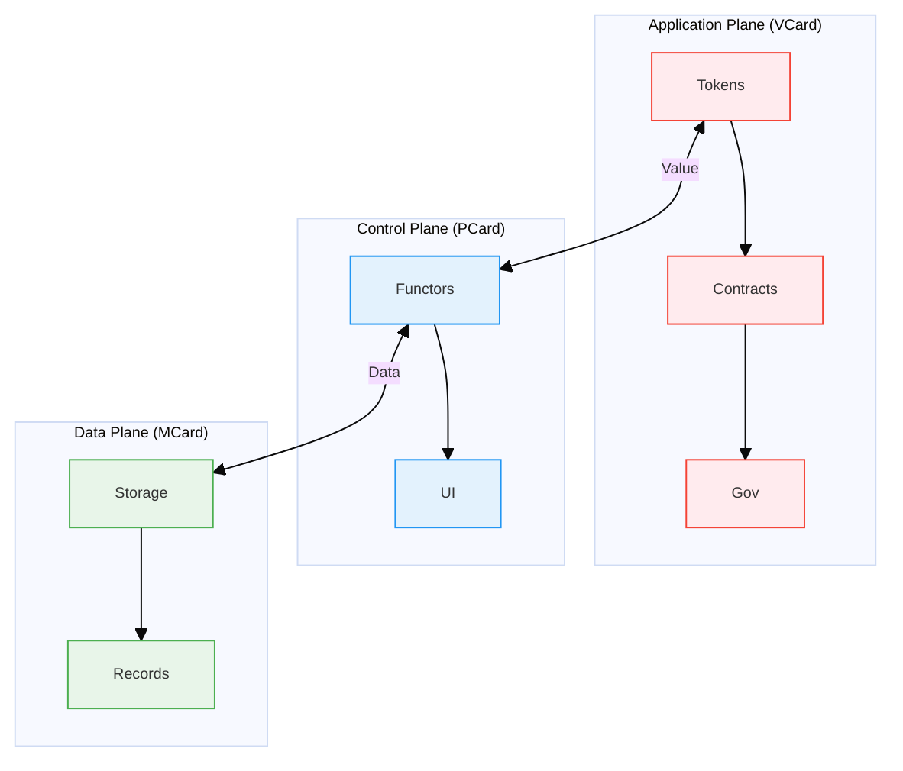

# VCard: Value-Carrying Card for the Application Plane

## 1. Overview

**VCard** (Value-Carrying Card) represents the **[[Application Plane]]** in the [[SDN]]-inspired architecture of the **Progressive Knowledge Container ([[PKC]])** system. As the third component of the MCard-PCard-VCard triad, VCard is fundamentally built upon **[[MCard]]** as its data storage foundation and leverages **[[PCard]]**'s hash-based execution mechanism for secure transactions of MCards between sovereign data owners. VCard introduces the concept of **explicit value representation and transfer** within the knowledge ecosystem, functioning as a form of currency in a networked marketplace where **each transaction involves the exchange of MCard hash references** rather than direct content access, ensuring complete information integrity and preventing contamination. Also see [[PCard]] and [[MCard]]. 

### 1.1 Sovereign Value Exchange

VCard is specifically designed as a data structure to capture and formalize value exchanges between two sovereign data owners. It serves as the digital representation of transactions where:

1. **Sovereign Value Exchange** - Each transaction represents a meaningful exchange of value between independent parties who maintain full ownership and control of their data assets.

2. **Social-Operational Duality** - Every VCard transaction encodes both:
   - **Social meaning**: The relationship context and trust implications between parties
   - **Operational meaning**: The practical effects and resource transfers being executed

3. **Accountable Transaction Records** - VCards create immutable, verifiable records that:
   - Document exactly what value was exchanged
   - Establish clear ownership and provenance
   - Create auditable history for all participants

### 1.2 Value Production Modes

Inspired by [[Carliss Baldwin]]'s work on modularity and value creation, VCard embodies three fundamental modes of value production:

1. **Value Seeking**: Actively searching for and creating new sources of value
2. **Value Seeing**: Recognizing and validating potential value in existing structures
3. **Value Delivery**: Facilitating the transfer and realization of value across the network

Following the classification according to Software-Defined Networking (SDN) principles, the PKC architecture is organized into three planes:

| Plane                  | Component | Role                   | Core Function                                           |
|------------------------|-----------|------------------------|------------------------------------------------------------|
| **Data Plane**         | [[MCard]]     | Atomic data storage    | Content-addressable storage, immutable records             |
| **Control Plane**      | [[PCard]]     | Hash-based execution   | Polynomial functor composition using MCard hash references |
| **Application Plane**  | [[VCard]] | Value transaction      | MCard hash exchange between sovereign data owners          |

## 2. Core Concept: Value as a First-Class Citizen

Value in the PKC ecosystem is fundamentally grounded in the mathematical principles of [[Why Arithmetize Representations|arithmetization]], which provides a rigorous foundation for representing and transferring value. This approach ensures that all value exchanges are:

- **Computable**: Expressible through formal mathematical structures
- **Compositional**: Can be combined and decomposed systematically
- **Verifiable**: Subject to formal verification of properties
- **Interoperable**: Can be exchanged across different systems and contexts

This mathematical foundation, based on polynomial functors and category theory, enables the creation of a robust value representation system that scales from individual knowledge artifacts to complex economic networks.

### 2.1 Value in Modular Systems

A **VCard** tokenizes a **modular unit of value** within the PKC ecosystem. Each VCard functions as a self-contained module that can be composed and recombined with others, following the principles of modular design:

- **Encapsulation**: Each VCard encapsulates its value proposition and rules of engagement
- **Standardized Interfaces**: Well-defined interaction protocols enable seamless value exchange
- **Independence**: VCards can be developed, transferred, and valued independently
- **Composability**: Multiple VCards can be combined to create complex value propositions

### 2.2 Value Creation Modes

#### Value Seeking
VCards enable active exploration of value creation opportunities by:
- Representing potential value propositions as transferable **MCard hash tokens**
- Capturing and preserving the context of value discovery through **immutable MCard storage**
- Enabling combinatorial innovation through **PCard's modular hash-based recombination**

#### Value Seeing
VCards make value visible and verifiable by:
- Providing a standardized format for value representation using **MCard hash references**
- Enabling transparent tracking of value attribution through **cryptographic hash validation**
- Supporting validation through network consensus based on **PCard's polynomial functor verification**

#### Value Delivery
VCards facilitate efficient value transfer through:
- **Content-addressable MCard hash references** to value objects
- Smart contract-like conditions for value exchange using **PCard's execution mechanisms**
- Provenance tracking for value flow analysis through **MCard's immutable audit trails**

### 2.3 Dimensions of Value in VCard

In the context of VCard, "Value" is a multi-dimensional concept that emerges from the interaction of modular components within a networked system. Building on Baldwin's modular clusters, we identify several dimensions of value:

1. **Modular Value**
   - **Encapsulated Functionality**: Self-contained units of capability
   - **Interface Clarity**: Well-defined interaction boundaries
   - **Composition Potential**: Ability to combine with other value modules

2. **Network Value**
   - **Connectivity**: Position within the network of value exchanges
   - **Liquidity**: Ease of transfer and exchange
   - **Metcalfe's Law**: Value increases with network participation

3. **Temporal Value**
   - **Provenance**: Historical record of value creation and transfer
   - **Future Potential**: Option value and growth potential
   - **Decay Functions**: Time-based value adjustments

4. **Contextual Value**
   - **Situational Relevance**: Value in specific contexts or use cases
   - **Complementarity**: Value when combined with other modules
   - **Scarcity**: Limited availability or exclusivity

### 2.4 VCard as a Currency in Networked Marketplaces

VCards function as a form of currency within the PKC ecosystem, enabling value exchange across the network. This is achieved through:

1. **Content-Addressable Value Units**
   - Each VCard is uniquely identified by its content hash (from [[MCard]])
   - Value is tied to verifiable content and computation
   - Enables trustless exchange through cryptographic verification

2. **Value Flow Architecture**
   ```mermaid
   %%{init: {"flowchart": {"htmlLabels": true, "curve": "basis", "diagramPadding": 5}, "theme": "base", "themeVariables": {"fontSize": "11px", "fontFamily": "arial", "nodeSpacing": 7, "rankSpacing": 7}}}%%
   graph LR
       A[Value Seeking] -->|Discovery| B[VCard Creation]
       B -->|Validation| C[Value Seeing]
       C -->|Exchange| D[Value Delivery]
       D -->|Feedback| A
       
       subgraph "Networked Marketplace"
           E[MCard Storage] <-->|Content Addressing| B
           B <-->|Rendering| F[PCard UI]
           F <-->|Interaction| G[Users]
       end
   ```

3. **Value Transfer Mechanisms**
   - **Atomic Swaps**: Trustless exchange of VCards
   - **Fractional Ownership**: Dividing value units
   - **Conditional Transfers**: Smart contract-like execution

### 2.5 Key Properties

Each VCard inherits MCard's properties and enhances them with value-specific attributes:

| Property | Description | Value Production Mode |
|----------|-------------|----------------------|
| **Value Type** | Nature of value (token, right, access, etc.) | Seeing |
| **Ownership** | Current holder(s) with cryptographic proof | Delivery |
| **Transfer Rules** | Conditions and constraints for transfer | Seeking/Delivery |
| **Value Function** | Algorithm or reference for value calculation | Seeing |
| **Modular Interface** | Standardized interaction points | All modes |
| **Provenance** | Complete history of value transformations | Seeing |
| **Network Effects** | Dependencies and complements | Seeking |
| **Temporal Bounds** | Validity period and conditions | Delivery |

## 3. Architecture: VCard in the PKC Stack



## 4. Implementation Details

### 4.1 VCard Structure

```typescript
interface VCard extends PCard {
  // Core MCard properties which are all inherited by PCard
  hash: string;           // Content-addressable hash
  content: any;         // Value representation
  g_time: string;       // Global timestamp
  
  // VCard-specific properties
  valueType: 'token' | 'right' | 'access' | 'reputation' | 'custom';
  owner: string;        // Current owner's public key/identity
  transferable: boolean; // Can this VCard be transferred?
  
  // Value determination
  valueFunction?: string; // Code or reference to calculate dynamic value
  metadata?: {
    supply?: number;      // For fungible tokens
    decimals?: number;    // Precision for decimal values
    properties?: Record<string, any>; // Custom properties
  };
  
  // Transfer rules (smart contract-like conditions)
  transferRules?: {
    allowedRecipients?: string[];
    conditions?: string;  // Code/expression that must evaluate to true
    fees?: Array<{
      type: 'fixed' | 'percentage';
      amount: number;
      recipient: string;  // Who receives the fee
    }>;
  };
  
  // History and provenance
  history: Array<{
    timestamp: string;
    event: 'mint' | 'transfer' | 'burn' | 'update';
    from?: string;
    to?: string;
    txHash: string;
  }>;
}
```

### 4.2 Value Types and Examples

1. **Fungible Tokens**
   - Represent interchangeable units of value (e.g., cryptocurrency, points)
   - Example: `{ valueType: 'token', metadata: { supply: 1000, decimals: 18 } }`

2. **Non-Fungible Tokens (NFTs)**
   - Unique digital assets with distinct properties
   - Example: `{ valueType: 'token', metadata: { unique: true, properties: { /* asset details */ } }`

3. **Access Rights**
   - Grant permissions or access to resources
   - Example: `{ valueType: 'access', content: { resource: 'premium-content', level: 'gold' } }`

4. **Reputation/Points**
   - Represent social capital or contribution metrics
   - Example: `{ valueType: 'reputation', metadata: { community: 'open-source', score: 42 } }`

## 5. Integration with MCard and PCard

### 5.1 MCard Integration: Content-Addressable Value Foundation

VCards leverage [[MCard]]'s content-addressable scheme and [[PCard]]'s compositional mechanism to assess value:

1. **Immutable Value Records**
   - Each VCard is stored as an MCard with a unique content hash
   - Value transactions create new MCards, preserving historical states
   - Enables verifiable audit trails of value transfers

2. **Value Composition**
   - VCards can reference other MCards as value components
   - Enables complex value structures through rules of composition defined by [[PCard]]
   - Supports Baldwin's concept of modular clusters through nested references

3. **Efficient Value Lookup**
   - Content addressing enables fast value resolution
   - Deduplication of identical value representations
   - Distributed storage of value objects across the network

### 5.2 PCard Integration: Value Interaction Layer

PCards provide the interface for value interactions, enabling:

1. **Value Visualization**
   - Interactive dashboards for value tracking
   - Network graphs showing value relationships
   - Temporal visualization of value flows

2. **Value Operations**
   - Intuitive interfaces for value transfer
   - Composition tools for creating value bundles
   - Simulation environments for value scenario testing

3. **Value Discovery**
   - Search and discovery of value opportunities
   - Recommendation systems for value combinations
   - Marketplace interfaces for value exchange

## 6. Use Cases: Value in Action

### 6.1 Value Seeking Applications
1. **Idea Markets**
   - VCards represent innovative (new and unique within context) concepts or solutions
   - Value seekers can pick unique ideas with [[MCard]]'s content-addressable mechanism
   - Network effects amplify valuable contributions

2. **Research Funding**
   - Modular funding of research components
   - Transparent allocation of resources
   - Traceable impact measurement

### 6.2 Value Seeing Applications
1. **Reputation Systems**
   - Portable reputation VCards across platforms
   - Verifiable credentials for skills and achievements
   - Context-aware reputation scoring through [[PCard]]'s computational rules

2. **Asset Tokenization**
   - Fractional ownership of physical/digital assets
   - Transparent valuation mechanisms
   - Secondary markets for asset trading

### 6.3 Value Delivery Applications
1. **Smart Contracts**
   - Self-executing agreements as VCards
   - Automated value transfer on conditions
   - Multi-party coordination mechanisms

2. **Decentralized Autonomous Organizations (DAOs)**
   - Governance rights as transferable VCards
   - Transparent decision-making processes
   - Aligned incentive structures

### 6.4 Cross-Cutting Applications
1. **Knowledge Economy**
   - VCards as units of knowledge contribution
   - Micro-payments for content consumption
   - Collaborative value creation networks

2. **Supply Chain Value Tracking**
   - End-to-end value flow visualization
   - Fair value distribution across participants
   - Real-time value adjustment mechanisms

## 7. Security Considerations

1. **Ownership Verification**
   - Cryptographic signatures for all transfers
   - Secure key management

2. **Value Manipulation**
   - Protection against double-spending
   - Clear rules for value creation/destruction

3. **Privacy**
   - Selective disclosure of value information
   - Zero-knowledge proofs where appropriate

## 8. Future Directions

1. **Cross-Chain Interoperability**
   - Bridge VCards between different blockchain networks ([[cross-chain swaps]])

2. **Advanced Value Functions**
   - More sophisticated value calculation mechanisms
   - Oracles for real-world data integration

3. **Regulatory Compliance**
   - Built-in KYC/AML capabilities
   - Jurisdiction-specific rule engines

## 9. References

```dataview 
Table title as Title, authors as Authors
where contains(subject, "VCard") or contains(subject, "MCard") or contains(subject, "PCard")
sort title, authors, modified
```

## 10. See Also

- [[MCard]] - The Data Plane component
- [[PCard]] - The Control Plane component
- [[Progressive Knowledge Container]] - The overarching framework
- [[Token Economy]] - Economic models for value exchange
- [[Smart Contracts]] - For implementing transfer rules