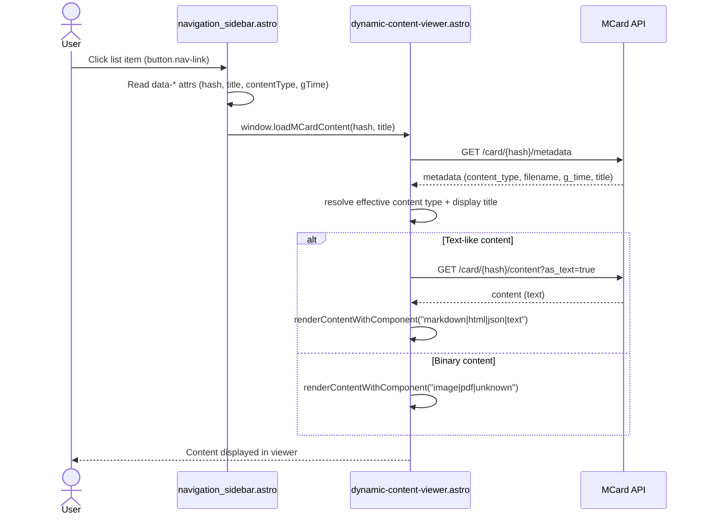

# Navigation → Viewer Selection Flow

This document explains how `src/components/layout/functional/navigation_sidebar.astro` selects an MCard item and how it informs `src/components/layout/functional/dynamic-content-viewer.astro` to render the selected content.

The components communicate directly via a global function: `window.loadMCardContent(hash, title)`. Redux is no longer used for this flow.

## Components involved

- __Navigation sidebar__: `src/components/layout/functional/navigation_sidebar.astro`
- __Content viewer__: `src/components/layout/functional/dynamic-content-viewer.astro`
- __Shared utils__: `src/utils/content-type-utils.ts`

## How selection works in the navigation sidebar

- __Item buttons__: Built in `renderPage()` with button data attributes: `data-hash`, `data-title`, `data-content-type`, `data-g-time`.
  - Code: `renderPage()` generates `<button class="nav-link" ...>` entries with attributes.
- __Click handler__: `setupSelectionHandlers()` attaches listeners to `.nav-link`.
  - Reads attributes from the clicked button.
  - Applies highlight classes for visual feedback.
  - __Directly triggers content load__:
    ```js
    if (typeof window.loadMCardContent === 'function') {
      window.loadMCardContent(hash, title || 'MCard Content');
    }
    ```
- __Data loading__: `loadMCardData()` and `performSearch()` fetch from the MCard API and normalize titles/types using `content-type-utils` so the sidebar and viewer stay consistent.
- __Runtime env__: MCard API base URL is sourced from `window.RUNTIME_ENV.PUBLIC_MCARD_API_URL` with a short-lived updater that reloads data when the URL changes.

## How the content viewer reacts

- __Direct invocation__: The viewer exposes `window.loadMCardContent(hash, title)` which the sidebar calls.
  - Debounces duplicate requests for the same `hash`.
  - Manages its own loading/error UI states.
- __Loading pipeline__: `window.loadMCardContent(hash, title)`
  - Gets API base URL (same runtime mechanism).
  - Fetches metadata: `GET /card/{hash}/metadata`.
  - Resolves effective content type and computes a unified display title using `content-type-utils`.
  - Chooses a renderer based on content type and fetches content accordingly:
    - Text-like types: `GET /card/{hash}/content?as_text=true`
    - Binary types (image/pdf/etc.): direct URL used by renderer
  - Renders via `renderContentWithComponent()` and initializes renderer-specific logic (Markdown/HTML/JSON/Text/Image/PDF).

## Data contract between sidebar and viewer

The viewer requires a `hash` and optionally a `title`:
```ts
loadMCardContent(hash: string, title?: string): Promise<void>
```
`title` enhances the header display if provided by the sidebar.

## Resilience and readiness

- __Runtime env updates__: Both check for changes to `window.RUNTIME_ENV.PUBLIC_MCARD_API_URL` during the first ~10 seconds and react accordingly.
 - __Runtime env readiness__: The viewer waits for `window.RUNTIME_ENV` and handles default/localhost overrides.

## Sequence diagram



## Key references (code locations)

- __Sidebar item render__: `navigation_sidebar.astro` → `renderPage()`
- __Sidebar click→load__: `navigation_sidebar.astro` → `setupSelectionHandlers()` calls `window.loadMCardContent()`
- __Viewer load__: `dynamic-content-viewer.astro` → `window.loadMCardContent()`
- __Renderer init__: `dynamic-content-viewer.astro` → `renderContentWithComponent()` and `initialize*Renderer()` functions
- __Shared utilities__: `src/utils/content-type-utils.ts`

## Notes

- The API base URL should be provided at runtime via `PUBLIC_MCARD_API_URL` (client-safe), per environment variable rules.
- All card content and metadata are retrieved from the MCard API, per MCard data access rules.
