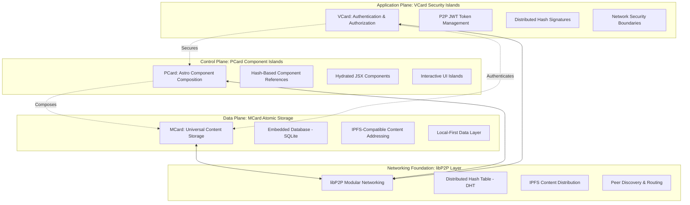

# PKC - Progressive Knowledge Container

[](https://opensource.org/licenses/MIT)
[](https://astro.build)
[](https://libp2p.io)
[](https://ipfs.io)

> A modular, card-based web application for self-sovereign knowledge management and community learning, built on Astro Islands Architecture with libP2P distributed networking.

## 🌟 Overview

PKC (Progressive Knowledge Container) implements a **triadic architecture** that treats every piece of content as an atomic "Card" component. Built with **Astro Islands Architecture** and enhanced with **libP2P modular networking**, PKC provides universal connectivity across any devices and networks while maintaining local-first operation.

### Core Architecture

- **MCard**: Universal atomic storage foundation with IPFS-compatible content addressing
- **PCard**: Astro component composition engine with hash-based references
- **VCard**: Security boundaries and value exchange layer with distributed authentication
- **libP2P Networking**: Modular networking foundation enabling universal connectivity



## 🚀 Quick Start

### Prerequisites

- Node.js 18+ 
- npm or yarn
- Docker (for deployment)

### Installation

```bash
# Clone the repository
git clone https://github.com/githubhenrykoo/PKC.git
cd PKC

# Install dependencies
npm install

# Start development server
npm run dev
```

### Development

```bash
# Start development server with hot reload
npm run dev

# Build for production
npm run build

# Preview production build
npm run preview

# Run tests
npm run test
```

## 🏗️ Architecture

### Astro Islands Architecture with Distributed Networking

PKC leverages Astro's Islands Architecture enhanced with libP2P networking:

- **Static HTML Generation**: Pre-rendered content from MCard storage
- **Selective Hydration**: Interactive components hydrate only when needed
- **Hash-Based Composition**: Components reference each other through cryptographic hashes
- **Local-First Storage**: Embedded SQLite database with P2P synchronization
- **Universal Connectivity**: libP2P enables operation across any network topology

### Key Features

- 🏝️ **Islands Architecture**: Optimal performance with selective hydration
- 🔗 **Content Addressing**: IPFS-compatible hashing for universal content identification
- 🌐 **Distributed Networking**: libP2P for peer-to-peer connectivity and content distribution
- 🔒 **Security Boundaries**: VCard authentication with JWT and hash-based signatures
- 📱 **Progressive Web App**: Full PWA support with offline capabilities
- 🔄 **Upgradable Patterns**: Smart contract-inspired upgrade mechanisms
- 🗃️ **Local-First**: Embedded database with distributed synchronization

## 📁 Project Structure

```
PKC/
├── src/
│   ├── components/          # Astro components (PCard implementations)
│   ├── pages/              # Astro pages and routing
│   ├── layouts/            # Page layouts
│   ├── lib/                # Core libraries
│   │   ├── mcard/          # MCard storage implementation
│   │   ├── pcard/          # PCard composition engine
│   │   ├── vcard/          # VCard security layer
│   │   └── networking/     # libP2P integration
│   └── styles/             # Global styles
├── docs/                   # Documentation
│   ├── PKC.md             # Complete implementation guide
│   ├── MCard.md           # MCard specification
│   ├── PCard.md           # PCard specification
│   └── VCard.md           # VCard specification
├── public/                 # Static assets
├── docker/                 # Docker configuration
└── tests/                  # Test suites
```

## 🛠️ Technology Stack

### Core Framework
- **[Astro](https://astro.build)** - Islands Architecture web framework
- **[TypeScript](https://www.typescriptlang.org)** - Type-safe development
- **[Tailwind CSS](https://tailwindcss.com)** - Utility-first styling
- **[Shadcn/ui](https://ui.shadcn.com)** - Component library

### Networking & Storage
- **[libP2P](https://libp2p.io)** - Modular networking stack
- **[IPFS](https://ipfs.io)** - Distributed content addressing
- **[SQLite](https://sqlite.org)** - Embedded database
- **[Anime.js](https://animejs.com)** - Animation library

### Development & Deployment
- **[Docker](https://docker.com)** - Containerized deployment
- **[PWA](https://web.dev/progressive-web-apps/)** - Progressive Web App features
- **[Vite](https://vitejs.dev)** - Build tooling

## 📖 Documentation

- **[PKC.md](./Docs/PKC.md)** - Complete implementation guide and architecture overview
- **[MCard.md](./Docs/MCard.md)** - Universal atomic storage specification
- **[PCard.md](./Docs/PCard.md)** - Component composition engine details
- **[VCard.md](./Docs/VCard.md)** - Security and value exchange layer
- **[MVP Cards for PKC.md](./Docs/MVP%20Cards%20for%20PKC.md)** - MVP implementation strategy

## 🌐 Deployment

### Docker Deployment

```bash
# Build Docker image
docker build -t pkc .

# Run container
docker run -p 3000:3000 pkc
```

### Environment Variables

Create a `.env` file with the following variables:

```env
# libP2P Configuration
LIBP2P_BOOTSTRAP_PEERS=
LIBP2P_LISTEN_ADDRESSES=

# IPFS Configuration
IPFS_API_URL=
IPFS_GATEWAY_URL=

# Database Configuration
DATABASE_PATH=./data/pkc.db

# Security Configuration
JWT_SECRET=your-jwt-secret-key
HASH_ALGORITHM=SHA-256
```

## 🤝 Contributing

We welcome contributions! Please see our [Contributing Guidelines](CONTRIBUTING.md) for details.

### Development Workflow

1. Fork the repository
2. Create a feature branch (`git checkout -b feature/amazing-feature`)
3. Make your changes following our coding standards
4. Ensure tests pass (`npm run test`)
5. Commit your changes (`git commit -m 'Add amazing feature'`)
6. Push to the branch (`git push origin feature/amazing-feature`)
7. Open a Pull Request

## 📄 License

This project is licensed under the MIT License - see the [LICENSE](LICENSE) file for details.

## 🙏 Acknowledgments

- [Astro](https://astro.build) for the Islands Architecture framework
- [libP2P](https://libp2p.io) for modular networking capabilities
- [IPFS](https://ipfs.io) for distributed content addressing
- The open-source community for continuous inspiration and support

## 📞 Support

- **Documentation**: [docs/PKC.md](./docs/PKC.md)
- **Issues**: [GitHub Issues](https://github.com/xlp0/PKC/issues)
- **Discussions**: [GitHub Discussions](https://github.com/xlp0/PKC/discussions)
- **Website**: [pkc.pub](https://pkc.pub)

---

Built with ❤️ using Astro Islands Architecture and libP2P modular networking.
