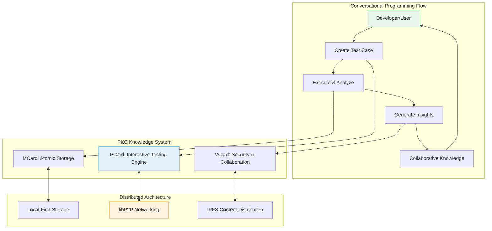

# PKC - Progressive Knowledge Container

[](https://opensource.org/licenses/MIT)
[](https://astro.build)
[](https://libp2p.io)
[](https://ipfs.io)

> **A revolutionary interactive knowledge management platform** that enables interactive testing, systematic knowledge accumulation, and collaborative function development through mathematically rigorous polynomial functor structure.

## 🌟 What is PKC?

**PKC (Progressive Knowledge Container)** transforms how we develop, test, and understand software functions by creating an **interactive testing environment** where code becomes a living repository of knowledge. Unlike traditional development approaches, PKC enables **Conversational Programming** - an ongoing dialogue with your code that builds comprehensive understanding through incremental exploration.

### Core Innovation: Conversational Programming

PKC revolutionizes software development by treating function testing as an **interactive conversation**:

- **Interactive Exploration**: Continuously probe functions with new test cases and input combinations
- **Knowledge Accumulation**: Each test case and execution becomes part of a growing knowledge base
- **Collaborative Intelligence**: Multiple developers contribute insights to the same function's understanding
- **Mathematical Rigor**: Polynomial functor structures ensure formal correctness and compositionality
- **Pattern Recognition**: Automatic discovery of optimization opportunities and edge cases



## 🏗️ Triadic Architecture

PKC implements a sophisticated **triadic architecture** where every component works together to enable conversational programming:

### 🗃️ MCard: Universal Atomic Storage
**The Data Plane** - Immutable, content-addressable storage for all knowledge artifacts:
- Test cases, execution records, and insights stored as atomic MCards
- IPFS-compatible hashing ensures universal content identification
- Local-first embedded database with distributed synchronization
- Complete execution history preserved for knowledge continuity

### 🧠 PCard: Conversational Programming Engine  
**The Control Plane** - Interactive testing environment powered by polynomial functors:
- **Interactive Testing Manager**: Create and execute test cases through conversation
- **Knowledge Accumulation System**: Systematic collection of testing insights
- **Pattern Recognition Engine**: Automatic optimization and edge case discovery
- **Collaborative Intelligence**: Multi-user contributions to function knowledge
- **Polynomial Structure**: Mathematical rigor through functor algebra
- **Universal Execution Layer**: REPL-like wrapper supporting diverse execution providers including:
  - Traditional functions
  - LLM inference engines
  - MCP tool providers
  - External APIs and distributed computing resources

#### Flux-to-Flow (Control Plane Coordination)
- See the Flux-to-Flow design: [Docs/flux2flow_state-management.md](./Docs/flux2flow_state-management.md)
- PocketFlow bus (`src/pocketflow/bus.ts`) and topics (`src/pocketflow/events.ts`) coordinate UI/data flows
- Panels/places align with `src/layouts/AppShell.astro` and `src/layouts/MainLayout.astro`
- Event-first, hash-first payloads; reducers subscribe to events; selectors remain for derived views

### 🔐 VCard: Security & Collaboration Layer
**The Application Plane** - Secure boundaries for collaborative knowledge sharing:
- Distributed authentication with JWT and hash-based signatures
- Formal security boundaries for multi-user collaboration
- Value exchange mechanisms for knowledge contributions
- Network security integration with libP2P protocols

## 🚀 Quick Start

### Prerequisites
- Node.js 18+
- npm or yarn  
- Docker (for deployment)

### Installation

```bash
# Clone the repository
git clone https://github.com/githubhenrykoo/PKC.git
cd PKC

# Install dependencies
npm install

# (Optional but recommended) Fetch local rendering libraries for offline use
npm run fetch:render-libs

# Start development server
npm run dev
```

### Your First Conversational Programming Session

```bash
# Start PKC development environment
npm run dev

# Navigate to http://localhost:4321
# Create your first PCard function
# Begin interactive testing through the web interface
# Watch as your function accumulates knowledge through conversation
```

## 💡 Key Features

### 🗣️ Conversational Programming
- **Interactive Testing Environment**: Test functions through natural conversation
- **Incremental Knowledge Building**: Each interaction adds to function understanding
- **Real-time Feedback**: Immediate insights on function behavior and performance
- **Adaptive Exploration**: Testing strategies that evolve based on results

### 🧮 Mathematical Foundation
- **Polynomial Functor Structures**: Formal mathematical guarantees of correctness
- **Compositional Logic**: Functions compose predictably through functor algebra
- **Curry-Howard-Lambek Correspondence**: Unified approach to proofs and programs
- **Contract Upgradability**: Safe evolution through proxy pattern implementation

### 🎛️ State & Agents
- **Flux-to-Flow (flux2flow)**: Event-first coordination with PocketFlow bus; reducers become listeners
- **Agents**: Composable event-driven workers for Auth, Theme, Selection, Data, Networking, DevTools
- **Redux DevTools**: Kept for Redux-managed slices (e.g., authentication)

### 🌐 Distributed Architecture
- **Local-First Operation**: Full functionality without network connectivity
- **libP2P Networking**: Universal connectivity across any network topology
- **IPFS Integration**: Efficient content distribution and backup
- **Collaborative Synchronization**: Share knowledge across distributed teams

### 🏝️ Modern Web Architecture
- **Astro Islands**: Optimal performance with selective hydration
- **Progressive Web App**: Full offline capabilities and native-like experience
- **Component-Based Design**: Modular, reusable interface components
- **Hash-Based Composition**: Cryptographically secure component references
  - **PocketFlow Bus**: Minimal pub/sub backbone to coordinate islands and panels

## 🆕 What's New (Aug 2025)

The UI and utilities were refactored to reduce duplication, improve consistency, and centralize content-type logic.

- **Centralized content-type utilities**
  - Introduced `loadContentTypeUtils()` loader in `src/utils/load-content-type-utils.ts` for dynamic, unified access to:
    - `inferContentTypeFromFilename()`, `getTypeLabel()`, `getTypeIconSvg()`, `getTypePillHTML()`
    - `resolveEffectiveContentType()`, `getRendererTypeFromContentType()`, `generateDisplayTitle()`
  - Consumers updated:
    - `src/components/layout/functional/navigation_sidebar.astro`
    - `src/components/layout/functional/dynamic-content-viewer.astro`

- **Reusable SSR UI components**
  - `src/components/ui/type-badge.astro` — SSR content-type pill/badge
  - `src/components/ui/nav-item.astro` — SSR navigation list item with icon + badge
  - `src/components/ui/pagination-controls.astro` — Encapsulated pagination UI (Prev/Next + count)

- **Shared list utilities**
  - `src/utils/list-format.ts` now provides:
    - `debounce()` for input handling
    - `paginate(items, page, pageSize)` to unify page slicing
    - `formatNavItemHTML()` for client-side fallback HTML composition
  - Sidebar updated to prefer shared helpers with safe local fallbacks

- **Navigation Sidebar updates**
  - SSR rendering with `<NavItem />` for each list entry
  - `<PaginationControls />` replaces inline pagination markup
  - Client script keeps existing selectors/IDs (`#prev-page`, `#next-page`, `#item-count`)
  - Uses `paginate()` for non-search paging

- **Dynamic Content Viewer**
  - Uses `loadContentTypeUtils()` to compute header icon and pill consistently

These changes standardize UI and logic across components, reduce duplication, and make later extensions (e.g., timestamps, more metadata) straightforward.

## 📁 Project Structure

```
PKC/
├── src/
│   ├── components/            # UI components (Astro islands)
│   │   └── ui/
│   │       ├── type-badge.astro           # SSR content-type badge
│   │       ├── nav-item.astro             # SSR navigation list item
│   │       └── pagination-controls.astro  # SSR pagination controls
│   ├── context/               # App contexts (e.g., theme)
│   ├── hooks/                 # React/Preact hooks (file upload, card content)
│   ├── layouts/               # Astro layouts
│   ├── utils/
│   │   ├── content-type-utils.ts          # Content-type helpers
│   │   ├── load-content-type-utils.ts     # Standardized dynamic loader with fallbacks
│   │   └── list-format.ts                 # debounce, paginate, formatNavItemHTML
│   └── (services, store, etc.)
├── Docs/                      # Architecture & specs (PKC, MCard, PCard, VCard, RAG)
│   ├── Agents.md              # Agent taxonomy and contracts
│   └── flux2flow_state-management.md  # Flux-to-Flow design for state coordination
├── public/                    # Static assets (icons, images, manifest)
├── docker-compose.yml         # One-step deployment of all services
├── Dockerfile                 # Multi-stage build for pkc-app image
├── package.json               # Scripts & dependencies
└── exmaple.env                # Sample environment variables
```

## 🛠️ Technology Stack

### Core Framework
- **[Astro](https://astro.build)** - Islands Architecture for optimal performance
- **[TypeScript](https://www.typescriptlang.org)** - Type-safe conversational programming
- **[Tailwind CSS](https://tailwindcss.com)** - Utility-first styling system
- **[Shadcn/ui](https://ui.shadcn.com)** - Beautiful, accessible component library

### Conversational Programming
- **Polynomial Functors** - Mathematical foundation for function composition
- **Interactive Testing Managers** - Real-time test case execution and analysis
- **Knowledge Accumulation Systems** - Systematic insight collection and organization
- **Pattern Recognition Engines** - Automatic optimization discovery

### Networking & Storage
- **[libP2P](https://libp2p.io)** - Modular networking for universal connectivity
- **[IPFS](https://ipfs.io)** - Distributed content addressing and storage
- **[SQLite](https://sqlite.org)** - Local-first embedded database
- **Content-Addressable Hashing** - Cryptographic integrity and deduplication

### Animation & Interaction
- **[Anime.js](https://animejs.com)** - Smooth, performant animations
- **Progressive Enhancement** - Graceful degradation across devices
- **Responsive Design** - Optimized for all screen sizes

### Coordination & State
- **PocketFlow bus**: `src/pocketflow/bus.ts` with canonical topics in `src/pocketflow/events.ts`
- **Flux-to-Flow bridge**: see [Docs/flux2flow_state-management.md](./Docs/flux2flow_state-management.md)
- **Agents**: see [Docs/Agents.md](./Docs/Agents.md)

## 🔢 Versions

- **MCard library (Python)**: 0.1.22 (detected in local virtualenv)
- **MCard service image**: `henry768/mcard-service:latest`
- **Local RAG image**: `henry768/local-rag:main`
- **PKC app image**: `henry768/pkc:latest_RAG_test`

You can verify the MCard service at `http://localhost:49384/v1/status` once Docker Compose is running.

## 📖 Documentation

### Core Documentation
- **[PKC.md](./Docs/PKC.md)** - Complete implementation guide and architecture
- **[PCard.md](./Docs/PCard.md)** - Conversational programming engine specification
- **[PCard Architecture.md](./Docs/PCard%20Architecture.md)** - Detailed architectural patterns
 - **[flux2flow_state-management.md](./Docs/flux2flow_state-management.md)** - Event-first state design
 - **[Agents.md](./Docs/Agents.md)** - Agent taxonomy and event contracts

### Component Documentation  
- **[MCard.md](./Docs/MCard.md)** - Universal atomic storage system
- **[VCard.md](./Docs/VCard.md)** - Security and collaboration framework
- **[MVP Cards for PKC.md](./Docs/MVP%20Cards%20for%20PKC.md)** - Implementation strategy

### UI/Utils References
- `src/components/layout/functional/navigation_sidebar.astro`
- `src/components/layout/functional/dynamic-content-viewer.astro`
- `src/components/ui/type-badge.astro`
- `src/components/ui/nav-item.astro`
- `src/components/ui/pagination-controls.astro`
- `src/utils/content-type-utils.ts`
- `src/utils/load-content-type-utils.ts`
- `src/utils/list-format.ts`

## 🌐 Deployment

### Docker Compose (recommended)

This repository follows our Docker Build & Deployment Rules:

- Pre-built images only in `docker-compose.yml` (no build directives)
- One-step deployment using Docker Compose
 - Environment variables loaded from `.env` (client uses only `PUBLIC_*` at runtime)

```
# 1) Create your environment file from the example
cp exmaple.env .env

# 2) Start the stack
docker compose up -d

# 3) Check logs (optional)
docker compose logs -f

# 4) Stop the stack
docker compose down
```

### Services & Ports

- **PKC App**: http://localhost:4321
- **MCard Service**: http://localhost:49384/v1
- **Local RAG API**: http://localhost:28302/api/v1
- **Ollama**: http://localhost:11434

### Environment Configuration

- Use `.env` (see `exmaple.env`) as the single source of truth.
- Client-side variables must use the `PUBLIC_` prefix (see `.windsurf/rules/environment-variables.md`).

Key variables you may want to set:

- `MCARD_BASE_URL` (e.g., `http://mcard-service:49384/v1` in Docker)
- `OLLAMA_BASE_URL` (e.g., `http://ollama:11434`)
- `LOG_LEVEL`, `NODE_ENV`, and any `PUBLIC_*` variables for client UI

## 🤝 Contributing

PKC thrives on collaborative knowledge building! Here's how you can contribute:

### Development Contributions
1. **Fork the repository**
2. **Create a feature branch**: `git checkout -b feature/conversational-enhancement`
3. **Add your conversational programming improvements**
4. **Write comprehensive tests for your interactive features**
5. **Submit a pull request with detailed explanation**

### Knowledge Contributions
- **Share testing patterns** and exploration strategies
- **Contribute function knowledge** through interactive testing sessions
- **Document optimization insights** discovered through conversational programming
- **Report edge cases** and boundary conditions found during exploration

### Documentation Improvements
- **Enhance conversational programming guides**
- **Add interactive testing examples**
- **Improve architectural explanations**
- **Translate documentation** for global accessibility

## 📄 License

This project is licensed under the MIT License - see the [LICENSE](LICENSE) file for details.

## 🙏 Acknowledgments

- **Astro Team** - For the revolutionary Islands Architecture
- **libP2P Community** - For modular networking foundations  
- **IPFS Project** - For distributed content addressing
- **Polynomial Functor Research** - For mathematical foundations of compositional programming
- **Conversational Programming Pioneers** - For inspiring interactive development paradigms

---

**Start your conversational programming journey today!** Transform how you understand and develop software through interactive exploration and systematic knowledge accumulation.

```bash
npm install
npm run dev
# Begin conversing with your code at http://localhost:4321

```
